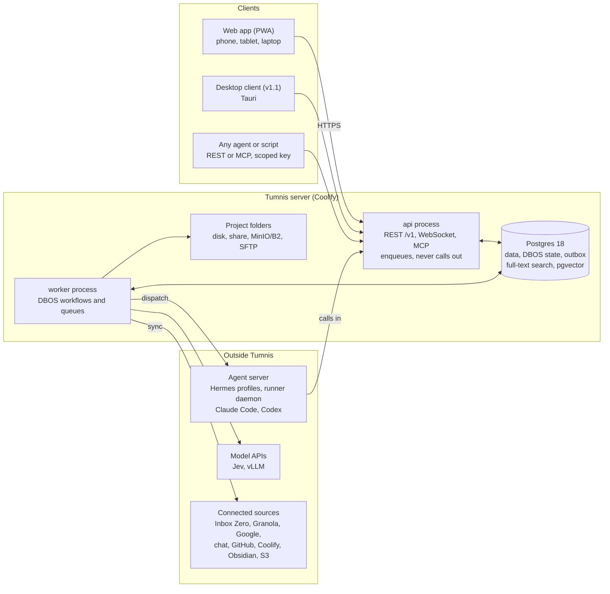
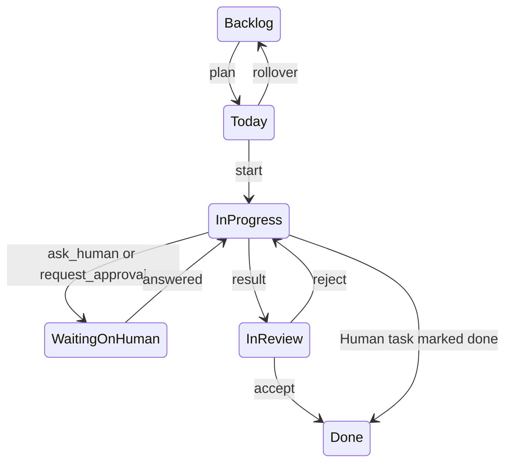

# Tumnis Guide Architecture

Status: draft v1, September 27, 2026 · Owner: Scott Jordan

How Tumnis Guide is built to meet the PRD: a modular Python monolith on Postgres, a React PWA, and Hermes agents reached through one agent surface.

## System overview

Tumnis is one deployable app with two server processes sharing one Postgres, plus a small runner daemon on the agent server. The api answers people and agents and only writes and enqueues; the worker runs every job that talks to the outside world, as durable DBOS workflows.



Every client reaches the api over HTTPS on the private network. Hermes profiles call the MCP server and the runner daemon dials in over WebSocket, so the agent server never needs an inbound port. The worker is the only process that calls out: it dispatches runs, syncs sources, asks Jev and vLLM, and reads and writes project folders. The api serves project files to the browser but never fetches from outside inside a request.

**Principles** (each traces to a PRD decision)

1. **Modular monolith.** Three processes (api, worker, daemon) and fifteen modules that talk through small public interfaces and outbox events (PRD decision 9).
2. **Postgres for everything.** App data, DBOS workflow state, the outbox, full-text search and pgvector live in one cluster, so one pgBackRest stanza backs up all of it (decision 10, REL-1).
3. **The api never calls out inside a request.** It writes, enqueues and returns. Latency stays predictable, and an outside outage cannot hang a page.
4. **Durable by default.** Anything that takes more than one step or waits (an agent run, an approval, a sync, an extraction) is a DBOS workflow, so a restart resumes it from the last finished step instead of starting over.
5. **Adapters at every edge.** Hermes, Jev, vLLM, each connector and each storage backend sit behind an interface with a timeout, a circuit breaker and a test fake.
6. **Agent-agnostic surface.** REST and MCP are the whole agent surface; Hermes-specific code lives only in its AgentAdapter (FR-14.10).
7. **Multi-tenant data, single-tenant product.** Every row carries `workspace_id` and row-level security is on from the first migration (decision 12).
8. **Contracts are generated, not hand-kept.** OpenAPI and JSON Schemas come from the code; the TypeScript client, TanStack Query hooks and zod schemas are generated from them.

## Deployment

One container image and one compose file run everything on the Tumnis host; Coolify builds it from GitHub and deploys `main` after CI passes. The runner daemon is the only piece installed elsewhere.

**Containers in the compose file**

| Container | Image and command | Job | Notes |
| --- | --- | --- | --- |
| `migrate` | `tumnis migrate` (Alembic) | Runs expand-phase migrations, then exits | api and worker start only after it succeeds (REL-4) |
| `api` | `tumnis api` (FastAPI on uvicorn) | `/v1` REST, `/mcp` (Streamable HTTP), `/ws`, the built React bundle, health and `/metrics` | Stateless; 1 replica self-hosted, more in hosted mode with the Redis cache backend |
| `worker` | `tumnis worker` | Launches DBOS; runs every queue except `extract`, plus schedules and outbox drain | All outbound calls happen here |
| `worker-extract` | `tumnis worker --queues extract` | Docling extraction and OCR only, via `DBOS.listen_queues` | Separate container with its own memory limit, so a 300-page PDF cannot starve dispatch or syncs |
| `postgres` | Postgres 18 with pgvector and pgBackRest | All data and DBOS state | WAL archiving to pgBackRest; data volume on encrypted disk (SEC-9) |
| `pgbouncer` | PgBouncer, transaction pooling | Pools app queries (PERF-1) | DBOS and the `LISTEN` connection go direct to Postgres, because `LISTEN/NOTIFY` needs a session-level connection |
| `clamd` | ClamAV daemon | Scans every upload and every file found in a project folder (SEC-10) | Signature updates on its own schedule |
| `redis` (optional) | Valkey or Redis | Shared cache backend | Off by default; on in hosted mode with more than one api replica |

**Change from the PRD.** The PRD has Postgres as a Coolify-managed database with Coolify's scheduled backups. Coolify backs up PostgreSQL with `pg_dump`, which cannot meet the 15-minute recovery point in REL-1. Postgres therefore runs in the compose file with pgBackRest and WAL archiving; Coolify still deploys it, and its dump backups can stay on as a second, independent copy. See ADR-0006.

**Hosts**

| Host | Runs | Reached by |
| --- | --- | --- |
| Tumnis host (Coolify on Proxmox) | The compose file above | Clients over the VPN or Tailscale; no public exposure in self-hosted mode (FR-9.1) |
| Agent server (Hermes VM or LXC) | Hermes master and project profiles, Claude Code, Codex, and `tumnis-daemon` as a systemd service under a dedicated unprivileged user (SEC-8) | Daemon dials out to `/ws/runner` with a device token; Hermes MCP-server profiles are called outbound by the worker |
| MinIO (homelab) | Default storage backend for project folders | Worker and api over S3 with a scoped key |
| Backblaze B2 | Off-site pgBackRest repository and folder backups | pgBackRest and the backup job, with a key that can write but not delete |
| Mac (P1) | A second `tumnis-daemon` | Same protocol over the VPN |

**Configuration.** Environment variables hold deployment-level settings only: database and PgBouncer URLs, `DEPLOYMENT_MODE`, the path to the master key file, the OpenTelemetry endpoint, cache backend and storage defaults. Everything per workspace (connector credentials, provider keys, thresholds, working hours, focus levels) lives in Postgres, encrypted with the workspace's data key (Hosted readiness). The master key is a root-owned file mounted read-only into api and worker, never a Coolify variable (SEC-6).

**Health.** `/health/live` answers if the process is up; `/health/ready` checks Postgres, the DBOS system tables and each enabled module, and reports per module so a failing connector shows as degraded instead of taking the app down. Coolify routes traffic only to ready containers.

**Releases.** Semantic versions with a changelog. A deploy runs `migrate` (expand only), then rolls api and worker. Rollback is redeploying the previous image, which works because migrations stay backward compatible for one release (REL-4). DBOS workflows started by the old version finish on workers of the same application version; the architecture keeps the old worker draining during a rollout (see Events and workflows).

## Module map

Fifteen modules sit on one shared core. A module owns its tables and is reached only through its public `api.py` or its events; import-linter contracts fail CI when one module imports another's internals.

**Shared core** (`tumnis/core`, not a module, importable by all): database sessions and the workspace context that sets row-level security per transaction, the outbox and event bus, the cache interface, envelope encryption for secrets, the audit log writer, the adapter base (timeout, circuit breaker, retry, fake), settings, schema registry and ID generation.

| Module | Owns (main tables) | Public interface (examples) | Emits | Calls |
| --- | --- | --- | --- | --- |
| `auth` | workspaces, users, memberships, sessions, api\_keys, device\_tokens | `authenticate`, `check_scope`, `issue_task_token` | `key.created`, `key.revoked`, `auth.failed` | core only |
| `projects` | projects, project\_policies, project\_links (people, domains, repos) | `get_project`, `get_policy`, `list_projects` | `project.created`, `project.archived`, `policy.changed` | core only (`agents` provisions the profile on `project.created`) |
| `tasks` | tasks, task\_comments, task\_context\_items, results, board\_columns, recurrence\_rules, review\_items | `create_task`, `update_status`, `post_result`, `review_queue` | `task.created`, `task.status_changed`, `result.posted`, `human.decided` | `projects`, `decisions`, `knowledge` (packet passages) |
| `planning` | daily\_plans, plan\_items, working\_hours | `build_plan`, `validate_plan` | `plan.published` | `tasks`, `calendar`, `agents` (master) |
| `agents` | agent\_profiles, runners, runs, run\_events, delegations, approvals, questions | `dispatch`, `delegate_task`, `wait_for_task`, `request_approval`, `ask_human`, `cancel` | `run.started`, `run.finished`, `approval.requested`, `question.asked` | `tasks`, `projects`, `knowledge`, `integrations` (packet context) |
| `focus` | focus\_sessions, focus\_events, focus\_responses | `emit_event`, `record_response` | `focus.event` | `tasks`, `calendar`, `decisions` |
| `decisions` | decision\_log, thresholds, provider\_configs | `decide(question, state)`, `speak`, `generate`, `embed` | `decision.made` | core only (Jev, vLLM and speech adapters) |
| `search` | search\_index (one tsvector table fed by events) | `search(query, scope)` | none | none (subscribes to events) |
| `knowledge` | documents, document\_versions, chunks, embeddings, storage\_locations, folder\_files | `add_document`, `search_knowledge`, `get_document`, `passages_for(task)` | `document.added`, `document.changed` | `decisions` (embeddings) |
| `integrations` | connections, people, messages, threads, notes, artifacts, context\_items, sync\_state, raw\_payloads | `ingest_items`, `get_context_item`, `draft_reply`, connector registry | `items.ingested`, `proposal.posted` | `decisions` (match, actionability); `agents` starts the proposal run on `items.ingested` |
| `calendar` | calendar\_accounts, events (canonical Event), free\_blocks | `free_blocks(day)` | `calendar.synced` | `integrations` (Connection records) |
| `github` | pr\_status (on Artifact), webhook\_deliveries | `pr_status(artifact)` | `artifact.updated` | `integrations` |
| `coolify` | app\_links, deployment\_status | `deployments(project)` | `artifact.updated` | `integrations` |
| `notifications` | notifications, push\_subscriptions, delivery\_attempts | `notify(event)` | `notification.sent` | `focus` (level), `agents` (master for Discord) |
| `usage` | usage\_counters | `record`, `report` | none | none (subscribes to events) |

**Inside a module** every module has the same shape, so an agent writing code always knows where things go:

```
tumnis/modules/tasks/
  api.py         public functions and DTOs (the only import other modules may use)
  router.py      REST endpoints under /v1
  mcp.py         MCP tools, each a thin call into api.py
  models.py      SQLAlchemy tables owned by this module
  rules.py       pure functions, no I/O (unit-tested)
  workflows.py   DBOS workflows and steps
  events.py      event payload schemas and subscribers
  adapters/      outside dependencies, each with a fake
  migrations/    this module's Alembic revisions
  tests/
```

**Repository layout**

| Path | Holds |
| --- | --- |
| `backend/tumnis/core`, `backend/tumnis/modules/*` | The Python app |
| `frontend/` | React PWA; `src/api/` is generated by openapi-ts and never edited by hand |
| `daemon/` | `tumnis-daemon` package and its systemd unit |
| `profiles/` | Hermes master and project template profiles, skills and their test harness |
| `schemas/` | Versioned JSON Schemas (canonical entities, task packet, result, digest, runner protocol) |
| `deploy/` | Compose file, Dockerfiles, pgBackRest and PgBouncer config |
| `docs/` | PRD, this architecture doc, `adr/` decision records |
| `AGENTS.md`, `CLAUDE.md` | Rules for coding agents: module boundaries, stack choices, where ADRs live |

**Boundary rules** (checked in CI by import-linter)

1. A module imports another module only through `tumnis.modules.<name>.api`; everything else in a module is protected.
2. No module reads or writes another module's tables. Cross-module reads go through `api.py`; cross-module reactions go through events.
3. `rules.py` imports nothing that does I/O.
4. The dependency graph between modules has no cycles; `search` and `usage` only subscribe.

## Data model

Every tenant-owned row carries the same base columns and is fenced by row-level security, so isolation does not depend on remembering a `WHERE` clause. Entities follow the PRD's canonical model (FR-14) and live as SQLAlchemy tables with matching Pydantic models; the OpenAPI spec and the JSON Schemas are generated from the Pydantic side, never written by hand.

**Base columns on every tenant table**

| Column | Type | Rule |
| --- | --- | --- |
| `id` | `uuid`, default `uuidv7()` | Time-ordered, so new rows land at the end of the index; never a sequential integer in any URL |
| `workspace_id` | `uuid`, not null | First column of every composite index and unique key |
| `created_at`, `updated_at` | `timestamptz` | Stored in UTC; shown in the workspace timezone (REL-6) |
| `version` | `integer` | Incremented on every update; writes must send the version they read, a stale one returns 409 with the current row (REL-2) |
| `deleted_at` | `timestamptz`, null | Trash: set on delete, purged by a scheduled workflow after the retention window |
| `created_by` | actor reference | A user, an API key (agent or script) or `system`; feeds the audit log and Activity view |

**Row-level security.** The app connects as a role that owns no tables and has no `BYPASSRLS`. Every request and every workflow step opens a transaction and runs `set_config('app.workspace_id', <id>, true)`; each table's policy compares `workspace_id` with that setting. Because the setting is transaction-local, it is safe behind PgBouncer's transaction pooling. Migrations run as a separate owner role. A test in the authorization suite proves one workspace cannot read, update or delete another's rows through any endpoint or MCP tool.

**Canonical entities (FR-14)**

| Entity | Key fields | Unique on | Notes |
| --- | --- | --- | --- |
| Connection | kind, provider, owner, status, sync cursor, encrypted credentials | workspace, provider, account | One per connected account |
| Person | names, emails, domains | workspace, primary email | Used for project matching |
| Message, Thread | participants, subject, sent\_at, body\_text, sanitized HTML, labels, provider URL | workspace, connection, external\_id | Upserted, so a re-sync never duplicates (FR-14.3) |
| Note | title, start, end, attendees, body\_text, action items, event link | workspace, connection, external\_id | Granola meeting notes |
| Event | start, end, attendees, busy, title | workspace, connection, external\_id | Owned by `calendar` |
| Artifact | kind (PR, deployment, doc link), URL, state, checks | workspace, connection, external\_id | Updated by `github` and `coolify` |
| Document | title, kind (text, file, link, synced), trust, storage location and path, content hash, source revision | workspace, id; synced items also on connection and external\_id | Chunks and embeddings in child tables owned by `knowledge` |
| ContextItem | target type and id, taint, added\_by | workspace, owner (task, proposal, result), target | The only way tasks link to outside records (FR-14.2) |

Each canonical record also keeps `connection_id`, `external_id`, `provider_url`, `fetched_at` and a pointer to its raw provider payload. Raw payloads sit in a separate `raw_payloads` table stored as JSONB with LZ4 TOAST compression, so records can be re-normalized when a mapper improves without bloating the hot tables.

**Taint.** Message, Thread, Note, synced Document and upload rows carry `tainted` and `source`. Taint propagates: a task or proposal created from a tainted ContextItem is tainted, and a task packet is tainted if anything in it is. The `agents` module refuses gated actions on tainted runs, and the scheduler refuses to run tainted tasks unattended (SAF-1, FR-4.5).

**Tasks** follow FR-3.1: title, project, label (Human, AI or Hybrid), status, priority, due date, `estimate_minutes` (null for AI-only), first action, acceptance criteria, parent, assigned agent, `board_rank` (a fractional ordering key, so a drag rewrites one row) and `rollover_count`. Statuses and their allowed transitions are in Events and workflows.

**Idempotency.** An `idempotency_keys` table stores workspace, key, route, request hash and response for 24 hours. A retry with the same key and body returns the stored response; the same key with a different body is rejected (REL-2).

**Schemas.** Canonical entities, the task packet, results, digests and runner messages are Pydantic models. A build step writes their JSON Schemas to `schemas/` with a `schema_version`, and CI fails if the committed schemas differ from what the code produces (FR-14.7).

## Events and workflows

Modules react to each other through outbox events, and every process that takes more than one step or waits on something is a DBOS workflow. Together they give at-least-once delivery between modules and exactly-once completion of each workflow step, even across restarts and deploys.

**Task states.** The state machine lives in `tasks/rules.py` as a pure transition table, so every rule is unit-tested; the kanban columns (FR-3.2) are a per-project view over these statuses.



A task can also start straight from Backlog. `rollover` runs at day close in the workspace timezone (FR-3.6). Reject returns the task to the project agent with the human's feedback as a comment (FR-5.8). Any status can move to Backlog or trash by a human; agents can only make the transitions shown, and the server rejects anything else with 409.

**How an event travels**

1. A module changes its rows and inserts an `outbox` row in the same transaction, then fires `NOTIFY outbox`. The state change and the event commit together or not at all.
2. The worker's outbox relay wakes on the notify (and polls every few seconds as a backstop), claims rows with `FOR UPDATE SKIP LOCKED`, and for each subscriber enqueues a DBOS workflow whose deduplication ID is `event_id:subscriber`. A crash between enqueue and marking the row sent just enqueues a duplicate that DBOS drops.
3. Each subscriber runs in its own workflow, so a failing subscriber retries with backoff and then lands in the dead-letter view (REL-3) without touching any other.

**Event catalogue** (payloads are versioned schemas in `schemas/events/`)

| Event | Emitted by | Key payload | Subscribers |
| --- | --- | --- | --- |
| `task.created` | tasks | task id, project, label, source, taint | search, usage, agents (estimate and first action), notifications |
| `task.status_changed` | tasks | from, to, actor | planning (Today), focus, search, notifications, projection refresh |
| `result.posted` | tasks | task, run, summary, links | notifications, planning, digest cursor |
| `human.decided` | tasks | item kind, decision, reason | agents (resume waits), digest, decisions (threshold outcomes) |
| `run.started`, `run.finished` | agents | run, status, duration, cost | tasks, usage, notifications, focus (activity signal) |
| `approval.requested`, `question.asked` | agents | run, prompt, policy rule | tasks (review queue), notifications |
| `items.ingested` | integrations | connection, item ids | decisions (match, actionability), search, agents (proposal run) |
| `proposal.posted` | integrations | proposal, context items, taint | tasks (review queue), notifications |
| `document.added`, `document.changed` | knowledge | document, version, trust | search, digest cursor |
| `plan.published` | planning | day, task ids, reasons | notifications, focus |
| `focus.event` | focus | kind (block\_start, not\_started and so on), task | notifications, agents (master speaks) |
| `policy.changed`, `key.created`, `key.revoked` | projects, auth | before and after | audit log, cache invalidation |

**Workflow map**

| Workflow | Started by | Queue and limits | What it waits on |
| --- | --- | --- | --- |
| `dispatch_run` | Run button, unattended window, `delegate_task`, proposal or stuck | `runs`, partitioned by project, 2 at a time per project (SAF-5); workflow timeout = the project's max run time | `DBOS.recv` for the result or cancel; streams run events to Postgres as they arrive |
| `delegate_task` | Master calls `delegate_task` | Starts a child `dispatch_run` with workflow ID = delegation ID | Nothing; returns the delegation ID |
| `wait_for_task` (tool) | Master calls `wait_for_task` | None (a read) | `DBOS.get_event` on the child's status with a 10-minute timeout; returns `done`, `waiting_on_human` or `still_running` (decision 6) |
| `approval` and `question` | `request_approval`, `ask_human` | `human`, no concurrency limit | `DBOS.recv` for the human's decision, with no deadline; the MCP call long-polls up to 10 minutes and returns `pending` plus an ID the agent re-sends |
| `connector_sync` | Schedule per connection | `sync`, rate limit per provider | Nothing; saves the cursor after each page so a crash resumes mid-sync |
| `triage_item` | `items.ingested` | `decisions`, rate limited to Jev's 1,200 per minute | Nothing; routes to review or starts a proposal run (FR-14.8) |
| `extract_document` | Upload, synced file, folder change | `extract`, run only by `worker-extract`, 1 to 2 at a time | Nothing; ClamAV, Docling, chunking, indexing as separate steps |
| `folder_sync` | Schedule per location (15 minutes) or file events on server disk | `sync` | Nothing |
| `planner_tick` | Schedule every 5 minutes | Singleton | Checks which workspaces are due for the morning plan in their own timezone, so DST never shifts a plan; enqueues `build_plan` for each |
| `focus_session` | A task enters In progress with focus on | `focus` | Durable sleep until the next focus event is due; cancelled when the task leaves In progress |
| Housekeeping | Schedules | `maintenance` | Rollover at day close, recurrence, trash purge, archive compression, idempotency-key expiry, backup freshness check |

**Deploys and old workflows.** DBOS recovers a workflow only on a process running the same application version. A rollout therefore keeps one worker on the previous version until its in-flight workflows finish, and long human waits (approvals, questions) store only IDs and plain data so a new version can pick up the answer through a fresh workflow if the old worker has gone.

## Agent surface and contracts

REST and MCP are two doors onto the same module functions: every MCP tool is a thin wrapper over a module's `api.py` and has a REST twin, so an agent without MCP loses nothing (FR-14.10). Outbound, the only agent-specific code is the Hermes AgentAdapter.

**Doors**

| Door | Path | Built with | Auth |
| --- | --- | --- | --- |
| REST | `/v1/...` | FastAPI routers per module; OpenAPI generated from code (SAAS-1) | Session cookie plus CSRF for the web app; `Authorization: Bearer` API key for tools |
| MCP | `/mcp` (Streamable HTTP) | Official MCP Python SDK, mounted into the FastAPI app with `streamable_http_app()` and its session manager entered in the app lifespan | API key, or a per-task token for a running agent |
| MCP over stdio | `tumnis mcp-stdio` | A small shim that forwards stdio to `/mcp` with the caller's key | Same as MCP |
| Runner | `/ws/runner` | WebSocket with the runner protocol below | Device token |
| Browser live updates | `/ws` | WebSocket fed by `LISTEN/NOTIFY` | Session cookie |

**Tools, REST twins and scopes** (scopes from FR-14.10; admin actions such as settings and keys are session-only and never reachable with an API key)

| Scope | MCP tools | REST twins (examples) |
| --- | --- | --- |
| `tasks:read` | `list_tasks`, `get_task_packet`, `get_project_context`, `search`, `get_project_digest`, `get_workspace_digest` | `GET /v1/tasks`, `GET /v1/tasks/{id}/packet`, `GET /v1/search` |
| `tasks:write` | `create_task`, `update_task_status`, `update_estimate`, `post_result`, `ask_human`, `request_approval` | `POST /v1/tasks`, `PATCH /v1/tasks/{id}`, `POST /v1/runs/{id}/result` |
| `context:read` | `get_context_item`, `search_knowledge`, `get_document` | `GET /v1/context-items/{id}`, `GET /v1/knowledge/search` |
| `knowledge:write` | `add_document` | `POST /v1/knowledge/documents` |
| `drafts:write` | `draft_reply` | `POST /v1/context-items/{id}/draft-reply` |
| `delegate` | `delegate_task`, `wait_for_task` (master only) | `POST /v1/delegations`, `GET /v1/delegations/{id}/wait` |
| `ingest` | `ingest_items` | `POST /v1/ingest` |

A key can also be limited to named projects. `delegate` is only granted to the master's key.

**Rules every write follows**

1. An idempotency key (`Idempotency-Key` header, or `idempotency_key` argument in MCP) and, for updates, the `version` the caller read (REL-2).
2. `schema_version` on every payload; the server accepts the current and previous version for one release (FR-14.7, REL-4).
3. Cursor pagination on every list (PERF-1) and rate limits per key (SEC-5).
4. A running agent uses the **task token** delivered in its packet, scoped to that task's project and valid until the run ends, instead of the profile's long-lived key. A leaked task token dies with the run.

**Task packet assembly.** `agents` builds the packet from `tasks`, `projects`, `knowledge` (brief plus the top passages, capped by size) and `integrations` (linked context items), following the PRD contract. Untrusted text never sits inline with instructions; each item is wrapped in a delimited block that names its source and says it is data:

```
<untrusted-data source="email" item="ctx_..." from="client@example.com">
...message text...
</untrusted-data>
```

The packet's `tainted` flag is true if any block is untrusted, and the server enforces what that flag forbids (SAF-1).

**AgentAdapter** (FR-14.6). Hermes is the only v1 implementation, with two transports: an MCP-server endpoint the worker calls, or the runner daemon.

```python
class AgentAdapter(Protocol):
    def capabilities(self) -> AgentCapabilities: ...
    async def dispatch(self, packet: TaskPacket) -> RunHandle: ...
    def stream(self, run: RunHandle) -> AsyncIterator[RunEvent]: ...
    async def cancel(self, run: RunHandle) -> None: ...
    async def health(self) -> Health: ...
```

**Runner protocol.** JSON messages over `/ws/runner`, each with `schema_version`, `message_id` and `correlation_id`: `register` (runner name, host, Hermes version, profiles), `heartbeat` (every 15 seconds), `run` (packet, profile, workdir policy), `stream` (log line, tool call, file touched), `cancel`, `upload_artifact` (small text artifacts only; Tumnis stores text and links, FR-5.8) and `result`. The daemon reconnects with backoff and replays unacknowledged `stream` and `result` messages, which the server dedupes by `message_id`. A runner that misses three heartbeats is marked offline and its running runs fail cleanly with the log so far (PRD runners).

**Connector contract** (FR-14.5)

```python
class Connector(Protocol):
    kind: ConnectorKind            # email, notes, chat, calendar, code, deploy, knowledge
    capabilities: set[Capability]  # poll, webhook, read, write
    async def sync(self, cursor: Cursor | None) -> SyncPage: ...   # items + next cursor
    def map(self, raw: RawItem) -> list[CanonicalRecord]: ...      # pure, fixture-tested
    async def health(self) -> Health: ...
```

`map` is pure, so each connector's contract test is a folder of recorded provider payloads and the canonical records they must produce.

## Knowledge and storage

Files live in project folders; Postgres holds everything needed to search and cite them. That split means search and task packets keep working while a share or bucket is offline, and a folder can be browsed or backed up without Tumnis (FR-15.7, FR-15.12).

**Storage interface.** One protocol, three backends, chosen per location. Paths are always relative to a location's root.

```python
class StorageBackend(Protocol):
    async def stat(self, path: str) -> FileStat | None: ...          # size, mtime, etag or hash
    async def list(self, prefix: str, cursor: str | None) -> Page[FileStat]: ...
    async def read(self, path: str) -> AsyncIterator[bytes]: ...
    async def write(self, path: str, data: AsyncIterator[bytes],
                    if_match: str | None) -> FileStat: ...          # refuses if the file changed
    async def move(self, src: str, dst: str) -> None: ...
    async def delete(self, path: str) -> None: ...
    async def health(self) -> Health: ...                           # includes the marker check
```

| Backend | For | Change detection | Write safety |
| --- | --- | --- | --- |
| Server path | Server disk, or an SMB or NFS share mounted on the host | File-system events on local disk; a scan every 15 minutes on shares, because events are unreliable over SMB and NFS | Hash compared just before an atomic temp-file-and-rename write; `.tumnis-root` marker must exist or the location goes offline |
| S3-compatible | MinIO, Backblaze B2, AWS S3 | List the prefix and compare ETag and last-modified; optional MinIO bucket notifications to a signed webhook | Conditional `If-Match` put where the provider supports it; otherwise a HEAD check just before the put, with any race caught as a conflict on the next scan |
| SFTP | Any SSH host, key auth only, pinned host key | Scan every 15 minutes | Size, mtime and hash compared before an upload to a temp name and a rename |

Every backend confines paths to its root (no `..`, no symlinks followed out) and passes its host through the SSRF guard (SEC-5).

**Sync engine.** `folder_files` records, per location and path: size, mtime, content hash, ETag, origin (`tumnis` or `external`), the linked Document and the version last synced. Each `folder_sync` run compares a fresh listing with that table:

| Change seen | Action |
| --- | --- |
| New file | Create a Document (tainted until trusted per FR-15.5) and enqueue `extract_document` |
| Changed outside only | New document version, re-extract; unchanged hash is skipped |
| Changed in Tumnis only | Write through with the recorded hash or ETag as the precondition |
| Changed in both since last sync | Keep both: the outside copy is saved as `name (conflict YYYY-MM-DD).ext`, and a review item asks which wins |
| Deleted outside | Document to trash in Tumnis; nothing is deleted anywhere else |
| Deleted in Tumnis | Tumnis-made file: moved to `.tumnis/trash/` in the folder; external file: removed from the index only, unless the user confirms deleting it at the source |

In existing folders Tumnis writes only inside its `Tumnis/` subfolder. Text entries are saved to `notes/` as Markdown with a `tumnis_id` frontmatter key, which is how a note keeps its identity through renames made outside Tumnis.

**Extraction pipeline** (`extract_document`, run by `worker-extract`; each numbered line is a DBOS step, so a crash resumes at the step that failed)

1. Read the bytes from the storage backend, streaming.
2. Scan with ClamAV (`clamd`). Infected files are quarantined and never extracted.
3. Sniff the type from content, not the extension, against the allow-list, and enforce the 50 MB limit (SEC-10).
4. Route: Markdown and plain text are read directly; DOCX, XLSX, PPTX and HTML go through Docling's standard pipeline without OCR; PDFs use Docling layout and table structure, with OCR only when a page has no text layer.
5. Pages Docling cannot read cleanly (scans, handwriting, low confidence) go to Docling's vision-model pipeline, pointed at the vLLM cluster through its OpenAI-compatible API.
6. Store the Docling document JSON (compressed) and the Markdown export as the Document's extracted form.
7. Chunk with Docling's HybridChunker, which keeps headings and page provenance and sizes chunks to the embedding model's tokenizer.
8. Write chunks with heading path and page numbers, update the `tsvector`, and in phase 3 compute embeddings through the Embeddings slot.
9. Emit `document.added` or `document.changed`.

**Search and passages.** Chunks carry a `tsvector` with a GIN index from phase 1. Phase 3 adds pgvector embeddings with an HNSW index and merges the two result lists by reciprocal rank fusion. `passages_for(task)` queries with the task's title, goal and acceptance criteria, always includes the brief, and stops at the packet's size cap. Every passage keeps document, heading path and page, so agents can cite "document X, page 4" (FR-15.2).

## Security

Every request passes three independent checks in order: who you are (session, API key, task token or device token), what you may do (scopes and project limits), and which rows you can touch (row-level security). A bug in one layer is caught by the next.

**Credentials**

| Credential | Used by | Stored as | Lifetime |
| --- | --- | --- | --- |
| Password | The human | argon2id hash | Until changed; TOTP or passkey second factor required (SEC-1) |
| Session | Web app, desktop client | Random ID in an HttpOnly, Secure, SameSite=Lax cookie; row in `sessions` | 30 days idle; "sign out other devices" revokes all |
| API key | Hermes profiles, scripts | `tmn_<prefix>_<secret>`: prefix in clear for lookup, secret as HMAC-SHA256 with a server pepper | Optional expiry; shown once; rotation and last-use tracked (SEC-2) |
| Task token | A running agent | Hashed, bound to run, project and a subset of the key's scopes | Ends with the run |
| Device token | Runner daemon | Hashed, bound to one runner | Rotated on re-register |

API keys use a keyed hash rather than argon2id because they are long random secrets checked on every request; argon2id's cost protects low-entropy passwords, which keys are not. Key lookups are cached and dropped through `LISTEN/NOTIFY` on revoke, so a revoked key stops working within a second (PRD Caching).

**Taint and gates** (SAF-1, FR-5.6)

| Rule | Enforced where |
| --- | --- |
| Messages, threads, notes, uploads, shared Google Docs, S3 linked files and web clippings are tainted at ingest | `integrations` and `knowledge` set `tainted` on write |
| Anything created from a tainted item inherits taint | `tasks` on create; packet builder ORs every block |
| Tainted tasks never run unattended | `planning` and the unattended scheduler refuse them |
| Gated actions need `request_approval` and a human yes | `agents`: the approval workflow; the run-log audit flags any gated action with no approval |
| On a tainted run, every allowed action is treated as gated | `agents` returns `approval_required` from the policy check |
| Kill switch and per-project pause | Checked at dispatch and before each run step; flipping it cancels running runs through the adapter (SAF-4) |
| Runaway limits | Queue partition limit (2 runs per project), workflow timeout (60 minutes), counters on tasks created and delegation depth per run (SAF-5) |

**Audit log** (SEC-3). One append-only table. The app role has `INSERT` and `SELECT` only; no role the app uses can update or delete it. Each row also stores the hash of the previous row, so a gap or an edit made directly in the database shows up when the chain is verified.

| Column | Holds |
| --- | --- |
| `id`, `workspace_id`, `occurred_at` | uuidv7, tenant, UTC time |
| `actor_type`, `actor_id` | user, api\_key, task\_token, device, system |
| `action` | For example `auth.login_failed`, `key.revoked`, `policy.changed`, `approval.granted`, `agent.gated_action`, `killswitch.on`, `data.purged` |
| `target_type`, `target_id` | What was acted on |
| `source_ip`, `user_agent`, `correlation_id` | Where it came from; links to the OpenTelemetry trace |
| `reason` | Required for approvals, rejections and purges |
| `details` | Redacted JSON: before and after for settings and policy changes, never tokens or message bodies |
| `prev_hash`, `hash` | SHA-256 chain for tamper evidence |

**Secrets** (SEC-6). Envelope encryption: each workspace has a data key; secrets are encrypted with AES-256-GCM under it and stored with a key version. Data keys are wrapped by the deployment master key, a root-owned file mounted read-only. Rotation re-wraps data keys without touching the secrets they protect.

**Outbound calls** (SEC-5). The SSRF guard resolves the host, rejects loopback, link-local and cloud metadata addresses (and private ranges in hosted mode unless allow-listed), then connects to the address it checked, so a DNS answer that changes between check and connect cannot redirect the call.

**Rendering** (SEC-4). Email and chat HTML is sanitized with an allow-list on ingest and again before display; remote images are proxied or blocked. Responses carry a strict Content-Security-Policy with no inline scripts, frame protection, Referrer-Policy and HSTS. Logs pass through a redaction filter that drops tokens, message bodies and prompts (SEC-6).

## Frontend

The React PWA keeps state in four places, each with one owner: the URL (where you are), the TanStack Query cache (server data), XState (what exists only on this device) and IndexedDB (what must survive being offline). Nothing is stored twice.

**Build.** Vite, React and TypeScript, served as static files by the api. Routes are code-split, and the editor bundle loads only on screens that edit text, which keeps the initial JavaScript under the 200 KB budget (PERF-2). The Tauri client (v1.1) loads the same bundle.

**Routing** (TanStack Router). Search params are typed and validated with zod, so a deep link from a Discord message or a push notification always opens a valid screen.

| Route | Search params |
| --- | --- |
| `/` (dashboard) | `focus` (today's level override) |
| `/projects/$projectId` | `view` (tasks, board, calendar, inbox, activity), `task` (open drawer), `filter` |
| `/review` | `kind`, `item` |
| `/search` | `q`, `scope` |
| `/settings/$section` | none |

Each route's loader prefetches its queries, so a screen renders with data on first paint instead of a spinner.

**Server data** (TanStack Query with hooks generated by openapi-ts). A shared fetch wrapper adds the idempotency key and the `version` on every write. The `/ws` socket sends small `{entity, id}` messages and the client invalidates the matching queries; queries use a long `staleTime` because the socket, not a timer, says when data changed. Writes are optimistic with snapshot and rollback; a 409 rolls back and shows the current record.

**Device state** (XState)

| Piece | Kind | States or contents |
| --- | --- | --- |
| UI store | XState Store | Open panels, right rail section, command palette, drag in progress, per-project last view |
| `focusSession` | Machine | idle, blockPending, active (timer), checkIn, snoozed, stuck; events from the server's `focus.event` and the user's one-tap replies (FR-10) |
| `voiceMode` | Machine | off, speaking, listening (v1.1), with a queue so two messages never talk over each other |
| `offlineQueue` | Machine | idle, queued, syncing, conflict, done; persists items in IndexedDB (FR-3.10) |

Machines are tested by sending events and asserting states, with no rendering. View preferences persist to `localStorage` inside try/catch; nothing the server owns is ever copied into a store.

**Offline and install.** A service worker (vite-plugin-pwa on Workbox) caches the app shell and static assets. Quick-adds made offline go to IndexedDB with their idempotency keys and replay when the app regains a connection; the replay also runs on app open, because Safari does not support the Background Sync API. Browser push (P1) uses Web Push with VAPID keys.

**Editor** (Tiptap, MIT core). One editor component for the brief, knowledge-base text entries, task descriptions and agent draft review.

| Concern | Rule |
| --- | --- |
| Extensions | StarterKit, TaskList and TaskItem, Link, Mention with two triggers (`@` for tasks and people, `#` for documents), a slash menu built on `@tiptap/suggestion`, and the Markdown extension |
| Stored form | Markdown is the stored form. Frontmatter is split off before the editor loads the body and re-attached unchanged on save |
| Mentions | Serialized as readable links: `[Send invoice](tumnis://task/<id>)`, `[Brand guide](tumnis://doc/<id>)` |
| Checklist to task | "Make task" on a checklist item calls `create_task` and replaces the line with a task mention |
| Canonical style | `-` bullets, `**` bold, `#` headings, one blank line between blocks; a file changes format at most once, on its first edit |
| Save | Only when the serialized Markdown differs from what was loaded; opening a note never writes it |
| Safety net | A round-trip fixture suite (load, save, compare) runs in CI; the Tiptap version is pinned and upgraded only through Renovate with that suite green |

**Kanban.** dnd-kit for mouse, touch and keyboard drag; card order uses fractional ordering keys, so a move writes one `board_rank`. The board is laid out from task statuses and the subtask card threshold on every render (FR-3.4).

## Caching, observability, backup and recovery

**Caching.** One interface (`get`, `set`, `invalidate` by key or tag, TTL) with an in-process backend by default and Redis when configured. Every key starts with the workspace ID. Every cache has a written invalidation rule and a test that a write is visible on the next read.

| Cache | Where | Invalidated by |
| --- | --- | --- |
| App shell and static assets | Service worker | New build hash |
| API responses | ETag on every GET; unchanged data returns 304 | The row's `version` is part of the ETag |
| Connector data | Synced into Postgres by the worker | The next sync; nothing waits on a provider |
| Jev decisions | Cache interface, 24 hours, keyed by a hash of question and input | TTL, threshold change or model version change |
| Dashboard projections (health, Today, review order) | Tables the worker updates from events | The events that change them |
| Hot lookups (project typeahead, settings, API keys) | Cache interface | `LISTEN/NOTIFY` on write, so every process drops the entry within a second |

**Observability** (REL-5)

| Signal | How | Where it goes |
| --- | --- | --- |
| Traces | OpenTelemetry in api, worker and daemon. The trace context rides in the HTTP request, is stored on the outbox row, carried into the DBOS workflow, and sent to the daemon and Hermes as the packet's `correlation_id` | An OTel collector, then a trace store (Grafana Tempo or Jaeger; see open questions) |
| Metrics | `/metrics` in Prometheus format: queue depth per queue, workflows by status, runs by status, decisions by outcome, sync age per connection, cache hit rates, request latency (FR-12.3) | The homelab's existing Prometheus |
| Errors | Sentry-compatible SDK | Self-hosted GlitchTip |
| Logs | Structured JSON through a redaction filter (no tokens, bodies or prompts) with the trace ID on every line | Container logs, shipped by whatever the homelab already runs |

Alerts: queue depth and dead-letter growth, failed runs, connector sync age over its cadence, extraction backlog, backup failure or a missing WAL segment, certificate expiry, and the audit hash chain failing verification.

**Backup and recovery** (REL-1: 15-minute recovery point, 1-hour recovery time)

| Piece | Setting |
| --- | --- |
| WAL archiving | `archive_mode = on`, `archive_command` pushes through pgBackRest; `archive_timeout = 60s` so a quiet database still ships a segment every minute, well inside the 15-minute recovery point |
| Repository 1 | Local disk on a separate volume; fast restores; full weekly, differential daily, incremental every 6 hours; pgBackRest expires old backups here |
| Repository 2 | Backblaze B2 through its S3 API, pgBackRest encryption on, with a key that can write but not delete. pgBackRest never expires this repository; a B2 lifecycle rule removes files older than 35 days, which covers a 28-day recovery window plus the weekly full each backup chain depends on |
| Project folders | Tumnis-made folders are copied to B2 nightly with `rclone copy`, which never deletes at the destination; bucket versioning keeps earlier file versions |
| DBOS state | Lives in the same Postgres cluster, so every backup includes in-flight workflows |
| Restore drill | Quarterly script: restore repository 2 to a scratch container at a chosen time, run the migration check and smoke tests, record the measured recovery time in the audit log. A failed drill is a failed build of the drill job |

The first drill must also confirm pgBackRest runs cleanly with a no-delete key on B2 (open question 3).

## Testing and CI

The PRD's test layers (Quality and testing) run from the first commit; this section is the harness that makes them possible. The key design choice is that every adapter ships with a fake, so the whole app can run with no network, no Hermes and no Jev, and preview deployments use exactly that mode (REL-7).

**Harnesses and fixtures**

| Piece | What it is | Used by |
| --- | --- | --- |
| Adapter fakes | `adapters/fake.py` beside every real adapter (Hermes, Jev, vLLM, speech, each connector, each storage backend, ClamAV); selected by config `TUMNIS_ADAPTERS=fake` | Unit, integration, end to end, previews |
| Seed set | `fixtures/seed/`: three projects, thirty tasks, one day of calendar, a few documents; loaded by `tumnis seed` | Integration, end to end, screenshots, previews (PRD rule 5) |
| Recordings | `modules/<m>/tests/recordings/`: real provider payloads, scrubbed, with the canonical records each must map to | Connector contract tests |
| Disposable services | Postgres 18 with pgvector, MinIO, an SFTP server and `clamd`, started per test session | Integration tests |
| Fake Hermes runner | A daemon double that accepts packets and replays scripted run events and results | Dispatch, delegation and wait tests; end to end |
| Mock Tumnis MCP server | Built from the real tool schemas, returning seed data | Hermes skill tests in `profiles/` |
| Hostile content set | Emails, chat messages, notes and documents carrying injection attempts | SAF-6 regression suite against the skill harness and the packet builder |
| Round-trip set | Markdown notes covering every editor construct | Tiptap load-and-save test |
| Extraction set | PDFs (text, scanned, tables, multi-column), DOCX, XLSX, PPTX with expected chunks and pages | Docling pipeline regression |
| Folder-sync set | Scripted outside edits, renames, conflicts and a dropped mount | `folder_sync` tests |

**CI pipeline** (GitHub Actions; every job is required on pull requests, and a red build blocks merge)

| Job | Runs | Budget |
| --- | --- | --- |
| Lint | Ruff, the Python type checker, import-linter boundaries, the frontend linter, TypeScript `tsc` | 2 min |
| Unit (two parallel jobs: `unit` runs pytest, `unit-frontend` runs Vitest; Scott decision 96) | pytest on `rules.py` and pure code (no network or database); Vitest on components and XState machines | 4 min each |
| Contract | Regenerate OpenAPI, JSON Schemas and the openapi-ts client; fail on any diff from what is committed; schema tests for every tool, endpoint and runner message | 3 min |
| Daemon | The runner daemon's own Ruff, type checker and pytest, including its contract test against `schemas/runner/v1/` | 3 min |
| Integration (two parallel jobs, `integration-a` and `integration-b`, split by module; every test runs in exactly one) | pytest with the disposable services; task state machine, DBOS workflows (dispatch, delegate and wait, approvals, sync, extraction, folder sync), RLS isolation suite, query-count assertions | 15 min each |
| End to end | Playwright runs journeys J1 to J8 at phone (390 px) and laptop (1280 px) widths against the seeded app with fakes | 10 min |
| Skills | Hermes template and master skills against the mock MCP server, plus the hostile content set | 5 min |
| Security | pip-audit, npm audit, Trivy on the image, Semgrep, gitleaks; CycloneDX SBOM on release (SEC-7) | 5 min |
| Performance | k6 against the seeded app (fails on a 20% regression), Lighthouse CI at phone width, bundle budget | 5 min |

Nightly, the end-to-end suite also runs against the real agent server with a test workspace. Quarterly, the restore drill runs as its own workflow. `main` deploys through Coolify only after the pipeline is green, and every pull request gets a Coolify preview on the seed set with fakes.

**Rules for code, human or agent**

1. A bug fix starts with a failing test named after the issue.
2. Every rule goes in `rules.py` as a pure function with unit tests; coverage gates at 80% on rules and the MCP layer, and uncovered lines in planner, focus, threshold and state-machine rules fail the build.
3. A new module arrives with its own tests, fakes and import-linter contract, or it does not merge.
4. DBOS workflows are tested by killing the worker mid-workflow in the integration suite and asserting the workflow resumes at the right step and finishes once.

## Stack and libraries

This is the one place that names libraries; the PRD states requirements and points here. Status says who decided: **PRD** (a product constraint), **Scott** (chosen September 27, 2026) or **Proposed** (my default, needs your OK before it gets an ADR).

**Backend and data**

| Area | Choice | Role | Status | ADR |
| --- | --- | --- | --- | --- |
| Language and web | Python, FastAPI (async) on uvicorn | api process | PRD (uvicorn proposed) | 0001 |
| Database | PostgreSQL 18 with pgvector | All data, search, vectors | PRD | 0001 |
| IDs | Native `uuidv7()` | Primary keys | Scott | 0005 |
| Workflows and queues | DBOS Transact | Durable workflows, queues, schedules, messages between workflows | Scott | 0002, 0011 |
| ORM and migrations | SQLAlchemy 2 (async) and Alembic | Tables, transactions, expand-then-contract migrations | Proposed |  |
| Models and schemas | Pydantic 2 | API models, JSON Schemas, settings | Proposed |  |
| MCP | Official MCP Python SDK (v2) | `/mcp` Streamable HTTP server | Proposed |  |
| Pooling | PgBouncer (transaction mode) | App connection pooling | PRD |  |
| Backups | pgBackRest | WAL archiving, point-in-time recovery, local and B2 repositories | Scott | 0006 |
| Extraction | Docling | Layout, tables, OCR, chunking; vision-model fallback on vLLM | Scott | 0007 |
| Malware scan | ClamAV (`clamd`) | Upload and folder-file scanning | PRD |  |
| Storage clients | S3 client (aioboto3), SFTP (asyncssh), file events (watchfiles) | Storage backends | Proposed |  |
| Security primitives | argon2-cffi, pyotp, py\_webauthn, cryptography, nh3 | Passwords, TOTP, passkeys, envelope encryption, HTML sanitizing | Proposed | 0010 |
| Module boundaries | import-linter | Enforces the module map in CI | Proposed | 0001 |
| Decisions and models | Jev (TypeSafe AI), vLLM, Piper or Kokoro, whisper.cpp | Provider slots (FR-11) | PRD |  |
| Cache backend | In-process; Valkey or Redis optional | Cache interface | PRD |  |

**Frontend**

| Area | Choice | Role | Status | ADR |
| --- | --- | --- | --- | --- |
| Framework | React, TypeScript, Vite | The PWA | PRD (Vite proposed) |  |
| Routing | TanStack Router | Typed routes and search params | Scott | 0004 |
| Server data | TanStack Query | Cache, refetch, optimistic updates | Scott | 0004 |
| API client | @hey-api/openapi-ts | Generated client, Query hooks and zod schemas | Scott | 0003 |
| Device state | XState and XState Store | UI state and the focus, voice and offline machines | Scott | 0004 |
| Forms | React Hook Form with generated zod schemas | Settings, task edit, quick-add | Scott | 0004 |
| Editor | Tiptap (MIT core) with its Markdown extension | Brief, notes, descriptions, draft review | Scott | 0008 |
| Drag and drop | dnd-kit with fractional ordering keys | Kanban on mouse, touch, keyboard | Proposed |  |
| PWA | vite-plugin-pwa (Workbox), Web Push with VAPID | Offline shell, push | Proposed |  |
| Components and styling | Tailwind CSS v4 on our own tokens (Mosaic-style look), self-hosted Inter, hand-written menus and drawer (Radix primitives when needed), Chart.js through a lazy import | Buttons, dialogs, layout, charts | Scott | 0012 |
| Desktop (v1.1) | Tauri | Thin client | PRD |  |

**Tooling and operations**

| Area | Choice | Status |
| --- | --- | --- |
| Python packaging, lint, format | uv, Ruff | Proposed |
| Tests | pytest, testcontainers, Vitest, Testing Library, MSW, Playwright, k6, Lighthouse CI | PRD (testcontainers and MSW proposed) |
| Supply chain | Renovate, pip-audit, npm audit, Trivy, Semgrep, gitleaks, CycloneDX | PRD |
| Observability | OpenTelemetry, Prometheus, GlitchTip, structured logs (structlog) | PRD (structlog proposed) |
| CI and deploy | GitHub Actions, Coolify | PRD |
| Folder backups | rclone (`copy`, never `sync`) | Proposed |

Every version is pinned in a lockfile (`uv.lock`, `package-lock.json`) and upgraded through Renovate with the full pipeline green (SEC-7).

## Decision records

Each decision below becomes one short file in `docs/adr/` when the repo is scaffolded, so coding agents read the reasoning instead of re-deciding. This table is the index; the files carry the full context.

| ADR | Decision | Status | Main alternative rejected, and why | Consequence to live with |
| --- | --- | --- | --- | --- |
| 0001 | Modular monolith on one Postgres, module boundaries enforced by import-linter | Accepted (PRD decisions 9, 10) | Microservices: many deploys and datastores for one operator | Boundaries hold only while the lint rule stays required in CI |
| 0002 | DBOS Transact for workflows, queues and schedules | Accepted | Procrastinate (single-step jobs only); Temporal (a separate cluster to run) | Workflow code must be deterministic between steps; old workflows need a worker on their version during deploys |
| 0003 | Generate the TypeScript client, Query hooks and zod schemas with openapi-ts | Accepted | Hand-written client: drifts from the backend | The OpenAPI spec is a build artifact; CI fails on drift |
| 0004 | TanStack Router for URL state, TanStack Query for server data, XState for device state; no Zustand | Accepted | Zustand for everything: rebuilds caching and invalidation by hand | Two libraries for state, each with a clear owner |
| 0005 | Native Postgres 18 `uuidv7()` primary keys | Accepted | Random UUIDs (index churn); integers (guessable) | Requires Postgres 18 or later |
| 0006 | pgBackRest with Postgres run in the compose file | Accepted | Coolify-managed Postgres: its `pg_dump` backups cannot meet a 15-minute recovery point | Postgres upgrades and tuning are ours, not Coolify's |
| 0007 | Docling for extraction, vision fallback on the vLLM cluster | Accepted | PyMuPDF4LLM (AGPL); Marker (weights licensed only under $5M revenue or funding); MarkItDown (no layout analysis) | Heavier image; extraction isolated in `worker-extract` |
| 0008 | Tiptap editor with Markdown as the stored form | Accepted | CodeMirror 6: exact Markdown but shows syntax and lacks mentions and slash commands out of the box | Markdown extension is beta: pinned version, canonical style, round-trip tests |
| 0009 | Row-level security with a transaction-local workspace setting | Accepted (PRD decision 12) | Tenant filters in application code only: one missed `WHERE` leaks data | App role must never own tables or bypass RLS |
| 0010 | API keys stored as a keyed hash, passwords as argon2id | Accepted | argon2id for keys: slow on every request with no gain for random secrets | Server pepper must be backed up with the master key |
| 0011 | Outbox relay enqueues DBOS workflows with `event_id:subscriber` deduplication | Accepted | Enqueueing DBOS workflows directly inside the business transaction: not guaranteed atomic with it | Events are delivered at least once; every subscriber is idempotent |

**File template**

```markdown
# ADR-0002: DBOS Transact for workflows and queues
Status: Accepted (2026-09-27) | Supersedes: none

## Context
What problem, which requirements (IDs), what constraints.

## Options considered
Each option with its main strength and its deal-breaker.

## Decision
One paragraph.

## Consequences
What gets easier, what gets harder, what we must now test or watch.

## Sources
Links to the docs the decision relied on.
```

## Open questions

None of these blocks the development checklist; each has a default the build can start with.

1. **Proposed libraries.** Approve or swap the rows marked Proposed in Stack and libraries (SQLAlchemy and Alembic, Pydantic, the MCP SDK, uvicorn, uv and Ruff, the security primitives, storage clients, dnd-kit, vite-plugin-pwa, testcontainers, MSW, structlog, rclone). Each approved one gets an ADR with sources.
2. **Components and styling.** Decided (2026-09-30, ADR-0012): no UI kit. Tailwind CSS v4 on our own design tokens with a Mosaic-style look (Cruip's Mosaic Lite as visual inspiration, rebuilt, none of its code), self-hosted Inter, a light, dark or system theme, and hand-written accessible menus and drawer; Radix primitives only when a screen needs one.
3. **pgBackRest with a no-delete B2 key.** The design assumes pgBackRest can push to a repository it may not delete from, with retention handled by a B2 lifecycle rule. Confirm in the first restore drill; fallback is B2 Object Lock with a key that has delete rights.
4. **Trace store.** Grafana Tempo or Jaeger behind the OpenTelemetry collector, or ship traces later and start with logs plus GlitchTip.
5. **PRD change to confirm.** Postgres moves from Coolify-managed to the compose file so pgBackRest can meet REL-1 (ADR-0006); the PRD's Deployment and Data ownership rows need that edit.
6. **Conditional writes on S3.** Check whether MinIO and B2 honor `If-Match` on put; the design already falls back to a check before write plus conflict detection.
7. **Carried from the PRD.** First chat provider; Discord notifications on the Hermes gateway or Tumnis's chat connector; Inbox Zero and Granola accepting Tumnis as an OAuth client; data flow rule 6; whether a minimal A2A endpoint ships in v1.

## Sources

- [DBOS Python programming guide](https://docs.dbos.dev/python/programming-guide)
- [DBOS queues tutorial](https://docs.dbos.dev/python/tutorials/queue-tutorial) (worker and global concurrency, partitions, deduplication, `listen_queues`, `DBOSClient`)
- [DBOS workflow communication](https://docs.dbos.dev/python/tutorials/workflow-communication) (`send`, `recv`, `set_event`, `get_event`)
- [DBOS scheduled workflows](https://docs.dbos.dev/python/tutorials/scheduled-workflows)
- [DBOS workflow recovery and application versions](https://docs.dbos.dev/production/self-hosting/workflow-recovery)
- [DBOS context reference](https://docs.dbos.dev/python/reference/contexts)
- [Coolify database backups](https://coolify.io/docs/databases/backups) (PostgreSQL backups use `pg_dump`)
- [pgBackRest user guide](https://pgbackrest.org/user-guide.html)
- [PostgreSQL 18 UUID functions](https://www.postgresql.org/docs/18/functions-uuid.html)
- [MCP Python SDK: add to an existing app](https://py.sdk.modelcontextprotocol.io/run/asgi/)
- [import-linter](https://import-linter.readthedocs.io/en/stable/)
- [Docling](https://github.com/docling-project/docling), [vision models](https://docling-project.github.io/docling/usage/vision_models/), [chunking](https://docling-project.github.io/docling/concepts/chunking/)
- [Hey API openapi-ts](https://heyapi.dev/openapi-ts/get-started)
- [TanStack Router search params](https://tanstack.com/router/latest/docs/framework/react/guide/search-params)
- [TanStack Query optimistic updates](https://tanstack.com/query/latest/docs/framework/react/guides/optimistic-updates)
- [TkDodo: WebSockets with React Query](https://tkdodo.eu/blog/using-web-sockets-with-react-query)
- [XState Store](https://stately.ai/docs/xstate-store)
- [Tiptap Markdown](https://tiptap.dev/docs/editor/markdown), [Mention](https://tiptap.dev/docs/editor/extensions/nodes/mention), [slash commands example](https://tiptap.dev/docs/examples/experiments/slash-commands)
- [dnd-kit](https://dndkit.com/)
- [MDN Service Worker API](https://developer.mozilla.org/en-US/docs/Web/API/Service_Worker_API)
- [Tumnis Guide PRD](https://claude.ai/code/artifact/95aec05c-329b-47e9-babf-e21b5ec79518)
