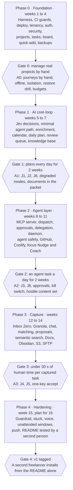

# Tumnis Guide Implementation Plan

Status: v1 plan, September 28, 2026 · Owner: Scott Jordan · Living doc: https://claude.ai/code/artifact/aa9e3394-0201-4bdb-ac27-8b6e5dc59175

Tumnis v1 is built in five test-first phases over 15 weeks. Every work package opens with failing tests traced to PRD requirement IDs, and every phase closes on an acceptance suite that was written, and red, on its first day.

The living doc is the source of truth; this file is its export. The work packages are also machine-readable in `docs/plan/work-packages.yaml`, and the full build manual (files, interfaces, named spec tests, TDD order per work package) is `docs/IMPLEMENTATION-PLAN-DETAILED.md`.

## Roadmap

Phases follow the PRD's phasing table and exit criteria. A phase starts only when the previous gate's acceptance suite is green and its usage criterion is met.

## TDD operating model

One rule covers every change, human or agent: a failing test that names a requirement comes first, and nobody weakens it to reach green.

1. **Double loop.** The outer loop is each phase's acceptance suite: Playwright journeys and API scenarios, committed red on the phase's first day. The inner loop is red, green, refactor on each work package's spec tests. A phase is done when its outer loop is green, not when its tickets are closed.
2. **Red is committed, not imagined.** Spec tests land first, in their own PR, as expected failures: `@pytest.mark.xfail(strict=True, reason="P0-18")` with `xfail_strict = true` in config, `test.fails` in Vitest, `test.fail()` in Playwright. All three fail the build when a marked test starts passing, so the marker must come off the moment the code works and can never hide a finished feature.
3. **Spec tests are locked.** The spec-guard job fails a PR that edits an assertion or deletes a test in an existing test file, unless Scott adds a `spec-change` label. Removing an expected-failure marker is allowed, and generated contract tests are exempt. Agents can add tests freely but cannot weaken the ones that define the work.
4. **Bug fixes prove red.** On a PR labeled `bug`, the red-proof job runs the new test against the base commit and requires it to fail there (PRD Quality rule 2). The test is named after the issue.
5. **Every test names its requirement.** `@pytest.mark.req("FR-3.4")` in pytest, `[FR-3.3]` in Vitest titles, `@J2 @FR-3.3` tags in Playwright. The traceability job rebuilds the matrix on every PR and fails when a requirement in a finished phase has no test.
6. **Rules are pure and time is an input.** Every rule lives in a module's `rules.py` with no I/O and takes `now` and the timezone as arguments, so unit tests never mock a clock. Invariants get property tests (Hypothesis, fast-check); the task state machine gets a Hypothesis stateful test. DST days in both directions, in two zones, are standard fixtures.
7. **Fakes obey the real contract.** Each adapter has one contract suite that runs against its fake and against the real implementation, in a container or on recorded payloads. A fake that drifts fails the tests the real one passes.
8. **Durability is tested by killing.** Every DBOS workflow has a test that kills the worker mid-flight and asserts it resumes at the right step and finishes once.
9. **Real Postgres everywhere.** Integration tests run on `pgvector/pgvector:pg18` through testcontainers, with the DBOS system database on the same Postgres. DBOS suggests SQLite for faster tests; the plan skips that because production queues, deduplication and LISTEN/NOTIFY run on Postgres.
10. **Sweeps beat checklists.** Meta-tests walk every route, table and MCP tool for auth policy, CSRF, headers, idempotency, pagination, row-level security and REST and MCP parity. A new route that skips one fails CI without anyone remembering to test it.
11. **Model behavior is tested on JSON, on the homelab.** Skill tests assert on tool calls and JSON, never prose. They run on a self-hosted runner through the daemon with a pinned model, three times per case, and must pass all three. It is the only CI job that calls a model.
12. **Flaky means broken.** A flaky test is quarantined within a day with an issue and fixed within a week. Nightly, mutmut mutates the `rules.py` files and reports surviving mutants, a check that agent-written tests actually bite (a report, not a gate).

**Definition of done** for every work package:

- Spec tests merged red before the implementation PR
- Everything green, markers removed, no spec-guard override without Scott's label
- Requirement tags on every new test and the traceability job green
- Coverage gates hold: 80% on rules and the MCP layer, full coverage on planner, focus, threshold and state-machine rules
- A new adapter ships with its fake and shared contract suite; a new module with its import-linter contract
- OpenAPI, schemas and the generated client regenerated when a contract changed
- The PR preview checked at phone width when the work touches UI

## How a work package runs

A work package (WP) is sized at one to four agent-assisted days and ships as one to three PRs. The same WPs live in `docs/plan/work-packages.yaml`, so an agent can read its own WP without this doc.

1. **Pick the next WP** whose `needs` are merged, and read its traces in the PRD and the architecture doc.
2. **Write the spec tests.** Scott, or a coding agent drafting for Scott, writes the WP's red tests as tagged expected failures. Scott reviews this PR for intent, the cheapest place to catch a misunderstanding.
3. **Hand it to the implementer.** Claude Code or Codex gets the WP ID, the spec test paths and AGENTS.md. It removes one marker, watches the test fail, writes the least code that passes, refactors, commits, and repeats, adding unit tests for internals as it goes.
4. **Open the implementation PR** with the WP, the requirement IDs and the test summary in the description. CI must be green, spec-guard included.
5. **Review on the preview.** Scott reads the diff and tries the PR preview on the phone when the change touches UI.
6. **Merge.** Coolify deploys main after the green pipeline, and the traceability report updates.

From phase 2 the same loop can run inside Tumnis: a WP becomes a task on the Tumnis project, and the template's coding skill (P2-12) follows these steps and posts its test summary with the result.

## Phases at a glance

86 work packages in 22 milestones. Phase 0 carries 30 of them, because every later phase leans on its harness, tenancy and security sweeps.

| Phase | Weeks | Milestones | WPs | Acceptance suite, red on day 1 |
| --- | --- | --- | --- | --- |
| [Phase 0 · Foundation](#phase-0--foundation-weeks-1-to-4) | 1 to 4 | Harness and walking skeleton; data and core platform; identity and security; projects, tasks and search; web app; operations | 30 | J2 by hand at 375 and 1280 px, offline capture, tenant isolation, restore drill, preview safety, performance budgets |
| [Phase 1 · AI core loop](#phase-1--ai-core-loop-weeks-5-to-7) | 5 to 7 | Provider layer; minimal agent path; triage and enrichment; calendar and daily plan; review queue; knowledge base core; day close | 18 | J1, J2 with AI, J6, degraded modes, documents in the packet, day close |
| [Phase 2 · Agent layer](#phase-2--agent-layer-weeks-8-to-11) | 8 to 11 | Agent surface; runs, questions, approvals and delegation; agent safety; skills and homelab status; focus and notifications | 18 | J3, questions, approvals and taint, delegation, kill switch, J8 at Nudge and Coach, hostile content set |
| [Phase 3 · Capture](#phase-3--capture-weeks-12-to-14) | 12 to 14 | Verify then connect; item to proposal; wider knowledge | 14 | J4, J5, one-keystroke accept, hybrid search |
| [Phase 4 · Hardening](#phase-4--hardening-week-15-plan-for-16) | 15, plan for 16 | Finish the loop | 6 | Guardrail, stuck, unattended windows, README install |

Every PRD requirement ID maps to a work package or acceptance test: see [Traceability](#traceability).

## Where this plan changes the PRD phasing

Seven changes, each made because the PRD's order or wording would stall a test or a gate.

1. **A minimal agent path moves into phase 1.** Phase 1 needs the project agent's estimates and first actions, profile provisioning and the master's plan, and none of them work without a way to reach Hermes. So phase 1 builds the AgentAdapter, the runner daemon core (register, heartbeat, provision, run) and packet-in, JSON-out skills (M1.2). The MCP server, full dispatch, approvals, delegation and streaming stay in phase 2.
2. **The Tiptap editor lands in phase 1.** Phase 0 edits the brief in a plain Markdown field. Markdown is the stored form either way, so the switch needs no data migration.
3. **Postgres runs in the compose file with pgBackRest** (ADR-0006), while FR-12.4 and the PRD's Deployment and Data ownership rows still say Coolify-managed. The plan follows the architecture doc; the PRD edit is still pending.
4. **GitHub status refreshes by polling.** FR-12.1 names a webhook, but GitHub cannot reach a server that lives only on the private network (FR-9.1). Refresh on open plus polling is the tested path; a webhook needs a relay decision.
5. **Phase 4 gets a buffer week.** Six WPs, one of them a second person installing from the README, do not fit in one week. Plan for 16 weeks.
6. **Phase 0 has a cut line.** If week 4 slips, passkeys, Lighthouse and the rollback rehearsal move to phase 4. Row-level security, the audit log, idempotency, backups and the CI guards never move.
7. **Three additions the PRD does not name:** the spec-guard, red-proof and traceability jobs (P0-03); a master-only `pause_agents` tool so a Discord kill command meets SAF-4, which can pause but never resume (P2-09); and a scheduled block on each plan item, which focus events need (P1-11).

## Week 1

Week 1 ends with a PR preview on the phone and a CI that refuses a failing or weakened test. Nothing product-facing ships yet.

- [ ] Approve or swap the Proposed libraries and pick the styling system (architecture open questions 1 and 2, plus the test tooling in Decisions needed)
- [ ] Create the GitHub repo with branch protection, and the Coolify app with preview deployments on
- [ ] Register a self-hosted GitHub Actions runner on the homelab (Skills job later, stable performance numbers now)
- [ ] Create the B2 bucket and a write-no-delete application key for pgBackRest (P0-28 needs it in week 4)
- [ ] P0-01 repo, toolchain, ADR files, AGENTS.md and CLAUDE.md
- [ ] P0-02 test harness, fixtures and the fakes switch
- [ ] P0-03 CI pipeline with spec-guard, red-proof and traceability
- [ ] P0-04 walking skeleton deployed by Coolify, preview per PR
- [ ] P0-05 phase 0 acceptance suite committed red

## Decisions needed

Three rows are due in week 1. Every row has a default the plan builds on until you say otherwise.

| Decision | Needed by | Default the plan assumes |
| --- | --- | --- |
| Pull the minimal agent path into phase 1 | Week 5 (M1.2) | Yes, as described above |
| Proposed libraries and styling (architecture open questions 1 and 2) | Week 1 (P0-01, P0-22) | Architecture defaults; Tailwind with headless primitives |
| Test tooling this plan adds: Hypothesis, fast-check, Schemathesis, squawk, mutmut, fake-indexeddb, pytest-randomly, pytest-xdist | Week 1 (P0-02) | Adopt all; each gets an ADR line |
| Python type checker | Week 1 (P0-01) | mypy, strict on core and every `rules.py` |
| Skills job pass rule | Week 5 (P1-05) | Pinned model, 3 runs per case, all 3 must pass |
| `pause_agents` for the master key | Week 9 (P2-09) | Pause allowed, resume stays session-only |
| GitHub webhook relay | Week 10 (P2-13) | None; polling plus refresh on open |
| Discord notifications: Hermes gateway or Tumnis chat connector (PRD open question 3) | Week 10 (P2-16) | Hermes gateway |
| Minimal A2A endpoint in v1 | Week 8 | Not in v1; would add one phase 2 WP |
| First chat provider (PRD open question 2) | Week 12 (P3-01) | Decided in P3-01 |
| Fallback if Inbox Zero or Granola refuse OAuth refresh tokens | Week 12 (P3-01) | Hermes pushes through ingest_items, a PRD deviation needing your sign-off |
| Buffer week | Now | 16 weeks, not 15 |

## Phase 0 · Foundation (weeks 1 to 4)

Phase 0 ships a Tumnis Scott can run on the homelab and use by hand, with every test layer, CI guard and safety baseline in place before any AI code.

**Exit gate.** User can run it on the homelab and manage real projects by hand (PRD). Here that means the A0 suite is green and Scott has run his real projects in it for 3 working days.

### Acceptance suite (written red on day 1)

| ID | Test | Layer | Traces |
| --- | --- | --- | --- |
| A0.1 | Sign in with password and TOTP, create a project, quick-add a task with / and the project typeahead, see it in Tasks and on the Board, drag it to Today, see it on the dashboard with the project card on track | Playwright, 375 and 1280 px | J2, FR-1.1, FR-1.2, FR-2.2, FR-3.3, SEC-1 |
| A0.2 | Go offline, quick-add two tasks, reload, go online: exactly two tasks exist on the server and the pending marks clear | Playwright | FR-3.10, REL-2 |
| A0.3 | Workspace B cannot read, update or delete any of workspace A's rows through any /v1 route | Integration | Hosted readiness, ADR-0009 |
| A0.4 | Restore drill: point-in-time restore of the B2 repository to a scratch container meets 15 min RPO and 1 h RTO | Drill workflow (manual and quarterly, not on PRs) | REL-1 |
| A0.5 | A PR preview boots on the seed set with fakes and refuses to start with production credentials | Integration + smoke | REL-7 |
| A0.6 | With 10 projects and 2,000 tasks: dashboard first paint under 1 s on LAN, quick-add round trip under 500 ms, quick-add and review usable within 3 s of a cold PWA open at phone width, initial JS under 200 KB compressed | Playwright timing, k6, bundle budget | PERF-2, NFR Performance, NFR Responsive |

### M0.1 · Harness and walking skeleton (week 1)

Nothing ships until the tests can run, CI can block a merge and a PR can deploy a preview.

#### P0-01 · Repo, toolchain and agent rules

Size M · Traces ADR-0001, SEC-7

**Red first**

- `test_repo_layout`: top-level folders from the architecture doc exist and all 15 module packages have api.py, router.py, mcp.py, models.py, rules.py, workflows.py, events.py, adapters/, migrations/, tests/
- import-linter run over a fixture module that imports another module's internals must fail
- Ruff and the type checker run clean on the empty tree

**Green.** Monorepo per the architecture layout (backend, frontend, daemon, profiles, schemas, deploy, docs/adr); uv, Ruff, type checker, pre-commit, Renovate; the 11 ADR files; AGENTS.md and CLAUDE.md carrying the TDD rules in this plan.

**Done when:** `make check` runs lint and unit tests locally in under 60 seconds.

#### P0-02 · Test harness, fixtures and fakes switch

Size M · Traces REL-7, Quality rule 5 · Needs P0-01

**Red first**

- `tumnis seed` loads exactly 3 projects, 30 tasks and one day of calendar, and two loads produce identical rows apart from IDs
- With `TUMNIS_ADAPTERS=fake`, every registered adapter resolves to its fake; an adapter registered without a fake fails the test
- A test that opens a network socket fails under the unit-test network block

**Green.** pytest with `xfail_strict = true`, strict markers, pytest-randomly and xdist; testcontainers fixture on `pgvector/pgvector:pg18` with a migrated template database cloned per worker; DBOS fixture (destroy, reset system database with truncate, launch) on that Postgres; factories; a `Clock` interface with a fixed test clock. Frontend: Vitest, Testing Library, MSW, fast-check, fake-indexeddb; Playwright projects at 375 and 1280 px. A load fixture generator (10 projects, 2,000 tasks).

**Done when:** Each test layer runs an empty suite green in CI inside its budget.

#### P0-03 · CI pipeline and TDD guards

Size M · Traces Quality rules 1, 2, 4 · Needs P0-02

**Red first**

- spec-guard flags a diff that edits an assertion or deletes a test in an existing test file, allows a diff that only removes an expected-failure marker, and skips generated contract tests
- traceability script fails when a requirement scheduled in a finished phase has no test tagged with its ID
- red-proof reports failure when a bug-fix test already passes on the base commit

**Green.** GitHub Actions with the architecture doc's 8 jobs (Skills and Performance start as stubs with budgets), branch protection with every job required, spec-guard, red-proof on PRs labeled `bug`, the traceability report as a PR comment, coverage gates (80% on rules and the MCP layer; uncovered lines in planner, focus, threshold and state-machine rules fail).

**Done when:** A throwaway PR with a failing test cannot merge, and one that weakens an assertion is blocked by spec-guard.

#### P0-04 · Walking skeleton deploy

Size M · Traces FR-12.4, FR-9.1, REL-5, REL-7, ADR-0006 · Needs P0-02

**Red first**

- `/health/live` answers 200 while Postgres is down; `/health/ready` answers 503, and reports `degraded` per module when one module fails
- Preview mode refuses to boot unless `TUMNIS_ADAPTERS=fake`, and refuses a production DSN or a Jev key
- Playwright `@smoke` loads the app shell on the preview URL at phone width
- In self-hosted mode the compose file publishes no port on a public interface (config test)

**Green.** One image with `tumnis api|worker|migrate`; compose file with migrate, api, worker, postgres (pgvector, Postgres 18, pgBackRest) and pgbouncer; Coolify app deploying main after green CI, and a preview per PR on the seed set with fakes.

**Done when:** A PR shows a preview URL that passes the smoke test.

#### P0-05 · Phase 0 acceptance suite, written red

Size S · Traces J2, FR-1.1, FR-3.3, FR-3.10, REL-1, PERF-2 · Needs P0-03

**Red first**

- A0.1 to A0.3, A0.5 and A0.6 committed as expected failures (`test.fail()`, strict xfail) tagged with their requirement IDs; A0.4 committed to the drill workflow

**Green.** Tests only. This is the outer loop every other phase 0 WP turns green.

**Done when:** CI reports the five PR-pipeline tests as expected failures.

### M0.2 · Data and core platform (week 2)

Tenancy, events and the shared core go in first because every module depends on them and they are the hardest to retrofit.

#### P0-06 · Database, roles and row-level security

Size L · Traces ADR-0005, ADR-0009, REL-4, PERF-1, Hosted readiness · Needs P0-04

**Red first**

- Table-registry test: every table (bar an allow-list: DBOS system tables, the append-only audit log, idempotency keys) has the base columns, `workspace_id` first in every composite index and unique key, and row-level security on with a policy; new tables are covered automatically
- The app role has no BYPASSRLS and owns no tables
- `set_config('app.workspace_id', …, true)` does not leak between two transactions on the same PgBouncer connection
- `uuidv7()` IDs sort by creation time
- Migrations upgrade, downgrade and upgrade again on an empty and on a seeded database; squawk rejects a destructive operation in an expand migration

**Green.** Alembic with per-module version locations, owner and app roles, the base-column mixin, a workspace context for requests and workflow steps, PgBouncer in transaction mode, squawk over `alembic upgrade --sql` in CI.

**Done when:** The RLS isolation suite (A0.3) passes for every table that exists.

#### P0-07 · Outbox, events and the DBOS relay

Size L · Traces ADR-0002, ADR-0011, REL-3 · Needs P0-06

**Red first**

- A module write that rolls back leaves no outbox row
- Each event reaches each subscriber once even when the worker is killed between enqueue and mark-sent (dedup ID `event_id:subscriber`)
- A subscriber that raises retries with backoff and jitter, then lands in the dead-letter table, while other subscribers of the same event complete
- Retrying a dead-letter item runs it once; event payloads validate against their schemas

**Green.** `core.outbox` (insert and NOTIFY in one transaction), relay workflow with LISTEN plus a polling backstop and SKIP LOCKED, subscriber registry, dead-letter table with retry and discard API.

**Done when:** The kill-the-worker test passes 20 runs in a row.

#### P0-08 · Settings, module flags, cache and encryption

Size M · Traces SEC-6, REL-6, Caching NFR, Hosted readiness · Needs P0-06

**Red first**

- For every registered cache, a write is visible on the next read; a LISTEN/NOTIFY invalidation reaches a second process within 1 second; a key without a workspace prefix is rejected
- Envelope encryption round-trips; a tampered ciphertext fails; rotating a data key re-wraps it without touching stored ciphertexts
- Startup fails when the master key file is readable by group or others
- Workspace secrets read raw from the table show no plaintext; the timezone setting accepts only IANA names
- Disabling a module for a workspace hides its routes and skips its subscribers

**Green.** Cache interface with the in-process backend, `core.crypto` (AES-256-GCM, key versions), per-workspace encrypted settings, workspace timezone, module registry with deployment and workspace flags.

**Done when:** Cache hit and miss counters are exported.

#### P0-09 · Adapter base and shared contract suites

Size M · Traces Architecture principle 5, PRD Testability NFR · Needs P0-02

**Red first**

- Property tests: timeouts fire inside budget; the breaker opens after N failures, half-opens after cool-down, closes on success; retries back off exponentially with jitter and a cap
- An abstract contract-test class runs the same cases against a fake and a real implementation; a fake that diverges fails

**Green.** `core.adapters` with timeout, breaker, retry, registry and the contract-suite base class.

**Done when:** AGENTS.md documents the adapter + fake + shared contract suite template.

#### P0-10 · Write safety and API conventions

Size M · Traces REL-2, PERF-1, SAAS-1, SEC-5 · Needs P0-06, P0-08

**Red first**

- Same Idempotency-Key and body returns the stored response; same key with a different body is rejected; keys expire after 24 hours (fixed clock)
- An update with a stale `version` returns 409 with the current row
- Cursor pagination returns every row exactly once while rows are inserted between pages (Hypothesis)
- Per-key rate limits return 429 with Retry-After; oversized bodies return 413
- Route-registry meta-test: every /v1 route declares an auth policy, writes take idempotency keys, lists paginate; a new route without them fails

**Green.** Middleware and helpers, the /v1 prefix, one error model.

**Done when:** The route-registry test runs on every PR.

#### P0-11 · Schemas and generated contracts

Size M · Traces FR-14.7, SAAS-1, REL-4, ADR-0003 · Needs P0-10

**Red first**

- Contract job regenerates OpenAPI, JSON Schemas (with `schema_version`) and the openapi-ts client, and fails on any diff
- Every payload model accepts version N and N-1 fixtures
- Schemathesis property run against /v1 with fakes finds no 5xx and no schema violations

**Green.** Pydantic-to-schema build step writing `schemas/`, openapi-ts config (client, Query hooks, zod), Schemathesis in the contract job.

**Done when:** Changing a field without regenerating fails CI.

#### P0-12 · Canonical integration model and connector registry

Size M · Traces FR-14.1, FR-14.2, FR-14.3, FR-14.5 · Needs P0-07, P0-09, P0-11

**Red first**

- Upsert on workspace, connection and external ID never duplicates, however often the same items arrive (property test); provider edits and deletions show on the next sync
- Raw payloads are stored in `raw_payloads` with LZ4 compression
- A fake connector passes the connector contract suite; `map` is pure (same input, same output, no I/O under the network block)

**Green.** Tables for Connection, Person, Message, Thread, Note, Event, Artifact, Document and ContextItem; `raw_payloads`; the Connector protocol, registry and the recordings folder convention.

**Done when:** A new connector's contract test is a folder of payloads plus expected records.

### M0.3 · Identity and security baseline (weeks 2 to 3)

Every security control in phase 0 is proven by a sweep test that grows with the app, so a new route cannot quietly skip one.

#### P0-13 · Auth, sessions and second factor

Size L · Traces FR-9.1, FR-9.2, SEC-1, Hosted readiness · Needs P0-08

**Red first**

- argon2id verify and rehash when parameters change; password alone never yields a session without TOTP
- Failed logins and failed TOTP codes count toward rate limit and temporary lockout (fixed clock)
- Session cookie is HttpOnly, Secure, SameSite=Lax; every state-changing session request needs a CSRF token (route sweep); idle sessions end at 30 days; sign out other devices revokes all but this one
- A fake sign-in provider registers without core changes; DEPLOYMENT_MODE=hosted turns off local-password sign-up

**Green.** Auth module, local-password provider, TOTP, sessions, CSRF, first-run setup for user and workspace. Passkeys use the same second-factor interface and move to phase 4 if week 3 runs over.

**Done when:** Playwright signs in with TOTP at both widths.

#### P0-14 · API keys, scopes and the authorization sweep

Size M · Traces FR-9.3, SEC-2, FR-14.10 · Needs P0-13, P0-10

**Red first**

- A key is shown once and stored as prefix plus HMAC-SHA256 with the pepper; comparison is constant-time
- A revoked key fails in every process within 1 second; expiry, rotation and last-use tracking work
- Authorization matrix over every route: no auth, wrong scope, project-limited key outside its project, and API key on a session-only admin route all fail with 401 or 403

**Green.** api_keys table, scope checker with project limits, Settings screens (create, copy once, rotate, revoke, last use). Task-token and device-token tables and issuance are built here and used from phase 1.

**Done when:** The matrix extends itself to every new route.

#### P0-15 · Audit log

Size M · Traces SEC-3 · Needs P0-06

**Red first**

- The app role cannot UPDATE or DELETE audit rows
- Chain verification catches an edited row and a deleted row (made as the owner role in the test)
- Each SEC-3 action writes one row with actor, time, source address and correlation ID; details never hold tokens or bodies

**Green.** Audit table and writer in core, `tumnis audit verify`, Settings view and CSV export.

**Done when:** Chain verification runs nightly and alerts on failure.

#### P0-16 · Security baseline

Size L · Traces SEC-4, SEC-5, SEC-6, SEC-7, SEC-9 · Needs P0-10

**Red first**

- Every response carries CSP with no inline script, frame protection, Referrer-Policy, HSTS and nosniff (route sweep)
- The sanitizer strips every vector in an XSS fixture corpus and keeps allowed formatting
- The SSRF guard rejects loopback, link-local, 169.254.169.254, IPv4-mapped IPv6 and decimal or octal IP forms, and a DNS answer that flips between check and connect still connects to the checked address; hosted mode also rejects private ranges not allow-listed
- Log redaction removes tokens, message bodies and prompts (property test with random secrets); non-TLS Postgres connections are refused

**Green.** Headers middleware, nh3 sanitizer, SSRF-guarded HTTP client in core, redaction filter, the Security CI job (pip-audit, npm audit, Trivy, Semgrep, gitleaks, CycloneDX SBOM on release), TLS config.

**Done when:** High-severity findings block merge.

### M0.4 · Projects, tasks and search (week 3)

The product's core rules are pure functions, so this milestone is mostly table and property tests.

#### P0-17 · Projects module

Size M · Traces FR-2.1, FR-1.1, FR-2.3, FR-5.6 · Needs P0-07, P0-14

**Red first**

- Health rule table: blocked if any task waits on the human, at risk if any task is overdue in the workspace timezone, otherwise on track
- Archive hides a project from the dashboard and lists and keeps its data
- Reorder writes one row; fractional keys always leave room between two keys and stay ordered over 1,000 random moves (property test)
- Code location takes a path or a repo URL, never both; `project.created` fires once; the default approval policy matches FR-5.6

**Green.** projects, project_links and project_policies; REST; the brief stored as a Markdown text Document (the first slice of `knowledge`, text only).

**Done when:** Seed projects show the right health.

#### P0-18 · Tasks module and state machine

Size L · Traces FR-3.1, FR-3.2, FR-3.4, FR-3.8, FR-4.4, FR-14.2 · Needs P0-17

**Red first**

- Every (from, to, actor kind) pair is either allowed or 409 (parametrized over all pairs); agents get only the transitions in the state diagram
- Hypothesis stateful test over random human and agent actions keeps the invariants (one status, rollover count never falls)
- An agent-created Human or Hybrid task without an estimate is rejected; AI-only estimates are forced empty
- Subtask layout at 29, 30 and 31 minutes against a 30-minute threshold; AI-only nests; a threshold change re-lays out cards without losing status, links or comments
- Actual human time (In progress to Done) is recorded; `task.created` and `task.status_changed` fire
- Any module can add a review item through the ReviewItem interface; the badge count query returns unreviewed items

**Green.** Task tables per FR-3.1, `tasks/rules.py` with the transition table and layout rule, editable board columns, comments, the ContextItem link table, and review_items with one ReviewItem interface (owned by `tasks`), so later WPs can add items before the queue screen exists.

**Done when:** 100% line coverage on tasks/rules.py.

#### P0-19 · Recurrence, rollover and day close

Size M · Traces FR-3.5, FR-3.6, REL-6 · Needs P0-18

**Red first**

- Presets and cron give correct next due dates across DST in America/New_York and a southern-hemisphere zone, both directions
- The next instance is created on done or on due date passed, never both (property test); a missed week creates one instance
- Day close in the workspace timezone returns unfinished Today tasks to the pool and increments rollover_count; changing the timezone moves the next day close

**Green.** recurrence_rules and the housekeeping scheduled workflows (rollover, recurrence, trash purge, idempotency-key expiry).

**Done when:** The DST suite is green.

#### P0-20 · Search

Size M · Traces FR-3.9 · Needs P0-18

**Red first**

- Task changes reach the index through events; prefix (`inv` finds invoice) and phrase queries work
- Ranking by recency and project match matches the expected order on a fixture corpus; results are workspace-isolated
- Typeahead runs a fixed number of queries on the load fixture and stays inside the quick-add budget

**Green.** `search` module, search_index with tsvector and GIN, subscribers, /v1/search and the typeahead endpoints.

**Done when:** Quick-add and project typeaheads use it.

#### P0-21 · Usage counters

Size S · Traces Hosted readiness metering · Needs P0-07

**Red first**

- Counters rise once per event per workspace even when the event is delivered twice

**Green.** `usage` module subscribing to events.

**Done when:** Counters are queryable per workspace; P0-27 exports them on /metrics.

### M0.5 · Web app (weeks 3 to 4)

The phone is a test viewport from the first screen, so every component test runs at 375 px as well as 1280 px.

#### P0-22 · Frontend shell and data layer

Size L · Traces ADR-0003, ADR-0004, FR-7.1, PERF-2, UX 11 · Needs P0-11

**Red first**

- An invalid deep link lands on a valid default (zod-validated search params)
- The fetch wrapper adds Idempotency-Key and version to every write (MSW asserts headers); an optimistic update rolls back on 409 and shows the server's record
- A /ws `{entity, id}` message invalidates exactly the matching queries
- An unchanged GET returns 304 with its ETag (backend test); the bundle budget check fails over 200 KB compressed

**Green.** Vite, React, TypeScript; TanStack Router and Query with generated hooks; XState Store for UI state; /ws fed by LISTEN/NOTIFY; service worker for the app shell (installable PWA); styling system chosen before the first screen.

**Done when:** The shell is served by the api and keyboard-navigable at both widths.

#### P0-23 · Dashboard v0

Size M · Traces FR-1.1, FR-1.2, FR-1.4, FR-1.5, UX 1, 3, 11 · Needs P0-22, P0-17

**Red first**

- Project cards show name, health, next milestone, open count and last agent activity
- Today shows at most 5 tasks, ordered, with project, label, estimate and first action
- At 1280 x 800 the dashboard needs no scrolling; on the phone the quick-add button sits in the bottom third

**Green.** Dashboard route; Today is set by hand until phase 1; the review badge shows 0 and the activity feed is an empty collapsed shell until their sources exist.

**Done when:** A0.1's dashboard steps pass.

#### P0-24 · Project page with Tasks and Board views

Size L · Traces FR-2.2, FR-2.4, FR-2.5, FR-2.6, FR-2.7, FR-2.8, FR-3.2, FR-3.5, FR-3.7, UX 7, 9 · Needs P0-22, P0-18

**Red first**

- Grouping rule (Today, Up next, Waiting on you, Waiting on agent, Done recently) as pure-function tests
- A drag sends one move request with the new board_rank; a keyboard drag moves a card between columns
- On the phone the views become a segmented control and the rail a Context sheet; the last view per project survives a reload and a throwing localStorage
- The plain list across projects sorts by due date
- Every user action on a task (status, move, edit, delete to trash) has an undo for the session

**Green.** /projects/$projectId with `view`, `task` and `filter` params; composer (no AI yet), Tasks and Board views, right rail with Brief (plain Markdown field until phase 1), Connections, Schedule (recurring tasks; the unattended window joins in phase 4) and Settings (subtask threshold; policy, cadence and local-only controls join in their phases), task drawer with the recurrence picker.

**Done when:** A0.1's Board steps pass.

#### P0-25 · Quick-add and offline queue

Size M · Traces FR-3.3, FR-3.9, FR-3.10, J2 · Needs P0-24, P0-20

**Red first**

- `/` opens quick-add on any route; the project is required and defaults to the current project page
- A keystroke opens global search on every screen; results link to tasks
- offlineQueue machine: idle, queued, syncing, done and conflict paths; items persist across a reload (fake-indexeddb)
- Replay on reconnect and on app open sends each item once; pending marks show until synced

**Green.** Quick-add component, offlineQueue machine, IndexedDB store.

**Done when:** A0.2 passes.

#### P0-26 · Settings v0

Size M · Traces FR-9.3, SEC-3, REL-3, REL-6, FR-3.8 · Needs P0-22, P0-14, P0-15

**Red first**

- Forms validate with the generated zod schemas; the timezone picker lists IANA zones and proposes the browser's
- Dead-letter retry and discard, audit CSV export and key screens call the right endpoints (MSW)

**Green.** /settings/$section: account and 2FA, sessions, API keys, audit log, dead-letter queue, workspace timezone, subtask threshold.

**Done when:** Every setting in phase 0 is reachable on the phone.

### M0.6 · Operations baseline (week 4)

Backups, tracing and budgets are proven by tests that fail, not by a checklist.

#### P0-27 · Observability and alerts

Size M · Traces REL-5, FR-12.3 · Needs P0-07

**Red first**

- A request's trace ID is stored on its outbox row and shows in the subscriber workflow's spans (in-memory exporter)
- /metrics needs the bearer token and exposes queue depth, workflows by status, request latency and cache hit rates
- Every log line is JSON with a trace ID; alert rules pass `promtool test rules` (queue depth, dead-letter growth, backup failure, missing WAL, certificate expiry, audit chain)

**Green.** OpenTelemetry in api and worker, structlog, Prometheus endpoint, GlitchTip SDK, alert rules as code.

**Done when:** The homelab Prometheus scrapes it.

#### P0-28 · Backups and the restore drill

Size L · Traces REL-1, SEC-9, ADR-0006 · Needs P0-04

**Red first**

- The drill is the test: write a marker row, destroy the database container, restore the B2 repository to a scratch container at a target time, assert the marker is there (RPO 15 min) and the restore took under 1 hour
- A delete attempted with the B2 backup key fails
- `rclone copy` leaves a file at the destination after it is removed at the source

**Green.** pgBackRest stanza, `archive_timeout = 60s`, local repository and encrypted B2 repository, schedules, backup-freshness check, drill workflow (manual and quarterly).

**Done when:** The first drill passes and records its restore time in the audit log; if the no-delete key fails, switch to B2 Object Lock per the architecture fallback.

#### P0-29 · Performance baseline

Size M · Traces PERF-1, PERF-2, NFR Performance, NFR Responsive · Needs P0-25

**Red first**

- Playwright timing on the load fixture: dashboard first paint under 1 s; quick-add usable within 3 s of a cold PWA open at phone width
- k6: quick-add round trip under 500 ms; any NFR latency more than 20% and at least 50 ms worse than the committed baseline fails the build (Scott decision 27)
- Query-count assertions on the dashboard, task list and board endpoints stay fixed as rows grow; Lighthouse CI holds the Core Web Vitals budget at phone width

**Green.** k6 scripts, query-count fixture, Lighthouse config, baseline file.

**Done when:** A0.6 passes.

#### P0-30 · Releases and version skew

Size S · Traces REL-4, SAAS-1 · Needs P0-11

**Red first**

- Rollback rehearsal: deploy N, deploy N+1, redeploy N; the app is healthy and N+1's expand migration is harmless to N

**Green.** Semantic versioning, changelog, release workflow attaching the SBOM and the OpenAPI spec.

**Done when:** v0.1.0 is tagged at the phase 0 gate.

## Phase 1 · AI core loop (weeks 5 to 7)

Phase 1 makes the dashboard plan itself. Jev labels, the project agent estimates, the master builds Today, and the knowledge base feeds the packet.

**Exit gate.** User plans every day from the dashboard for 2 straight weeks (PRD), counted from plan.published and plan acceptance events.

### Acceptance suite (written red on day 1)

| ID | Test | Layer | Traces |
| --- | --- | --- | --- |
| A1.1 | Quick-add: the label arrives in under 1 second; estimate and first action stream in from the fake runner; a one-click override persists | Playwright | J2, FR-3.3, FR-4.1, FR-4.4 |
| A1.2 | At the workspace's morning time the plan shows 3 to 5 tasks inside free blocks, each with a reason; accept, swap and remove work | Playwright, fixed clock | J1, FR-4.3, FR-1.2 |
| A1.3 | A 90-minute task with no 90-minute gap gets a split or move offer | Playwright | J6 |
| A1.4 | Master offline: Today falls back to due-date order with a notice. One project agent offline: that project gets Jev-only labels, others are unaffected | Integration | FR-4.3, FR-4.6 |
| A1.5 | Upload a PDF with a table: it is scanned, extracted, searchable with page numbers, and its passage appears in the task's packet preview | Integration + Playwright | FR-15.2, FR-15.3, FR-15.4, SEC-10 |
| A1.6 | Close the day shows what shipped and what rolls over | Playwright | J7 |

### M1.1 · Provider layer (week 5)

Decisions are typed and logged from the first call, so thresholds can be calibrated later instead of guessed.

#### P1-01 · Decisions slot with Jev

Size M · Traces FR-11.1, FR-11.2, FR-11.9, Data flow rule 6

**Red first**

- Contract suite over the fake and recorded Jev responses: Choice, Score and Noul questions serialize and typed answers with probabilities parse
- Every decision offers abstain or unknown where defined
- Outbound payload snapshots: each question sends only its whitelisted fields, body capped at 2,000 characters for project matching, never attachments
- The limiter stays under 1,200 requests a minute; the pinned model version is logged

**Green.** `decisions` module, encrypted provider configs, Jev adapter over the adapter base.

**Done when:** Recorded fixtures cover every FR-11.4 decision point.

#### P1-02 · Fallback, thresholds and the decision log

Size M · Traces FR-11.3, FR-11.4, FR-11.5, Caching NFR · Needs P1-01, P0-18

**Red first**

- Jev down: the vLLM fallback answers, is marked as fallback and uses the stricter threshold; both down: a review item
- Below threshold goes to review, above is applied (table test per decision point)
- Every decision is logged with model version, input hash and outcome
- Same question and input hit the cache for 24 hours; a threshold or model-version change clears it
- A project set to local decisions only never calls the Jev fake

**Green.** Routing rules in rules.py, decision_log, thresholds with conservative defaults, the Jev cache, the per-project local-decisions-only switch in the project Settings rail.

**Done when:** Degraded paths are covered by integration tests.

#### P1-03 · Generation slot

Size S · Traces FR-11.8 · Needs P1-01

**Red first**

- A placeholder first action comes from the OpenAI-compatible fake; a timeout leaves the first action pending
- Only the placeholder and spoken-message callers may use it (import-linter contract)

**Green.** Generation adapter to vLLM.

**Done when:** Placeholders show while enrichment runs.

### M1.2 · Minimal agent path, pulled forward (week 5)

Phase 1 needs the project agent and master to answer, so the adapter, runner core and profiles land now; the MCP server and full dispatch stay in phase 2.

#### P1-04 · AgentAdapter, runner protocol v1 and fake runner

Size L · Traces FR-14.6, FR-5.1, FR-5.9, FR-5.11 · Needs P0-14

**Red first**

- register, heartbeat, run and result messages validate against generated schemas
- Three missed heartbeats (fixed clock) mark a runner offline; /ws/runner rejects a missing or wrong device token
- The AgentAdapter contract suite passes for the fake and for the Hermes adapter against the fake runner

**Green.** `agents` skeleton (agent_profiles, runners); Hermes adapter with both transports; `tumnis-daemon` core (register, heartbeat, run `hermes -p <profile>` with the packet in a file, return JSON) as a systemd service under a dedicated user; profile registration and health in Settings.

**Done when:** The real daemon on the Hermes VM registers and passes a health check.

#### P1-05 · Profiles in the repo and the skill harness

Size M · Traces FR-5.2, FR-5.10, FR-11.6, Quality: Hermes skills · Needs P1-04

**Red first**

- Given a recorded enrichment request, the template's enrich skill returns JSON matching the enrichment schema: estimate only for Human and Hybrid, a first action, acceptance criteria
- Given a recorded planning packet, the master's plan skill returns planning JSON with a reason per pick
- Assertions are on tool calls and JSON, never prose; each case runs 3 times and must pass all 3

**Green.** `profiles/master` and `profiles/project-template` (SOUL.md, MCP config with the Jev MCP server, enrich and plan skills, version stamp); phase 1 skills are packet in, JSON out, so no mock MCP server yet (it arrives in P2-12, built from P2-01's tool schemas); Skills CI job on the homelab self-hosted runner.

**Done when:** The Skills job is required on changes under profiles/.

#### P1-06 · Project provisioning

Size M · Traces FR-2.1, FR-5.10 · Needs P1-05

**Red first**

- `project.created` provisions a profile from the template exactly once, even with retries and a killed worker
- Linking an existing profile checks that it exists; the master's registry is updated
- A failed provision leaves the project usable with agent status not provisioned and a review item

**Green.** Provisioning subscriber in `agents`; `provision` added to the runner protocol.

**Done when:** Creating a project in the app creates its Hermes profile on the VM.

### M1.3 · Triage and enrichment (weeks 5 to 6)

Labels come from Jev in under a second; everything slower streams in after the task is saved.

#### P1-07 · Quick-add labels and overrides

Size M · Traces FR-3.3, FR-4.1, FR-4.2, UX 2, 9 · Needs P1-02, P0-25

**Red first**

- The label arrives in under 1 second p95 with the fake at recorded latency, with a one-line reason
- Low confidence shows the label as suggested and adds a review item
- A one-click override writes `human.decided` and the decision outcome; an AI label can be undone for the session

**Green.** Label on `task.created`, streamed to the UI over /ws.

**Done when:** A1.1's label step passes.

#### P1-08 · Enrichment by the project agent

Size M · Traces FR-4.4, FR-4.6, UX 5, 9 · Needs P1-06, P1-03, P1-07

**Red first**

- Any task missing a first action or acceptance criteria triggers an enrichment run that fills them; Human and Hybrid tasks also get an estimate, AI-only tasks never do
- The placeholder first action shows first and is replaced when the agent's arrives
- One project's agent offline: that project gets Jev-only labels and a pending first action while another project's enrichment completes
- The request carries the brief and the project's estimate-versus-actual history; the plausibility Score decision flags outliers
- An enrichment result can be undone for the session, restoring the previous values

**Green.** Enrichment workflow dispatching a small packet through the adapter; UI streaming.

**Done when:** A1.1 passes.

### M1.4 · Calendar and daily plan (week 6)

The plan is the product's main promise, so the validator that stops an impossible day is the most heavily tested code in the phase.

#### P1-09 · Google Calendar connector

Size M · Traces FR-14.4, FR-1.3, Integrations: Google Calendar, Data flow rules 1, 5 · Needs P0-12

**Red first**

- Recordings from two or more accounts map to canonical Events; upserts are idempotent; cancelled events disappear
- Tokens are stored encrypted; only read-only scopes are requested; a sync killed mid-page resumes from its cursor

**Green.** `calendar` module, OAuth per Google account in Settings, scheduled sync.

**Done when:** Scott's accounts sync.

#### P1-10 · Working hours and free blocks

Size M · Traces FR-4.7, FR-1.3, REL-6 · Needs P1-09

**Red first**

- free_blocks property tests: never overlaps a busy event in any account, stays inside working hours, merges adjacent gaps
- Weekends have no window unless Re-plan; DST days in both directions; a timezone change recomputes blocks

**Green.** Working-hours settings (default 9:00 to 18:00 weekdays), calendar strip on the dashboard.

**Done when:** The strip shows real free blocks.

#### P1-11 · Daily plan

Size L · Traces FR-4.3, FR-1.2, J1, J6 · Needs P1-10, P1-05, P1-08

**Red first**

- validate_plan: at most 5 tasks, Human and Hybrid estimates fit free blocks, AI-only tasks never count against free time, a reason on every pick
- Each plan item stores a scheduled block (start and end inside a free block) that focus events and the Calendar view read
- A Today task that becomes blocked stays visibly blocked until the user presses Re-plan
- planner_tick fires once per workspace at its local plan time on both DST change days, never twice
- Master unreachable: due-date fallback with an agent-offline notice; an invalid plan is rejected and the fallback used, with the reason logged
- Re-plan works on demand; nothing re-plans on its own during the day; a task with no big enough gap gets a split or move offer

**Green.** `planning` module, planning packet schema, build_plan workflow, Today accept, swap and remove.

**Done when:** A1.2 and A1.3 pass.

#### P1-12 · Project Calendar view

Size S · Traces FR-2.6 · Needs P1-10

**Red first**

- The week view shows project meetings, due dates and planned blocks; dropping a task on a free block schedules it with one PATCH; dropping on a busy block is refused

**Green.** Calendar view on the project page.

**Done when:** Works by keyboard and on the phone.

### M1.5 · Review queue (week 6)

One queue with one ordering rule, built now so every later item kind plugs into it.

#### P1-13 · Review queue v1

Size M · Traces FR-6.1, FR-1.4, FR-11.4, UX 2, 7 · Needs P0-18, P1-02

**Red first**

- Blocking-impact order: an item with more downstream tasks and human minutes ranks higher, ties break by age (property test)
- The Jev blocking-impact Score combines with the deterministic count; with Decisions down the count alone orders the queue
- Accept, edit, reject and snooze work from the keyboard; the badge count equals unreviewed items

**Green.** /review with `kind` and `item` params over the review_items built in P0-18. Kinds now: low-confidence decisions, provisioning failures, plan issues.

**Done when:** Questions, approvals, results and proposals plug in later without schema change.

### M1.6 · Knowledge base core (weeks 6 to 7)

File safety and two-way sync can lose user files, so both are specified as exhaustive decision tables before any code.

#### P1-14 · Storage interface, server path and S3

Size L · Traces FR-15.7, SEC-5 · Needs P0-09

**Red first**

- One contract suite over the fake, a server path and a MinIO container: stat, list, read, write, move, delete; a stale `if_match` write is refused
- Hypothesis-generated hostile paths (`..`, absolute, symlink escapes, Unicode look-alikes) are always refused
- A missing `.tumnis-root` marker takes the location offline and queues writes
- A learning test records whether MinIO honors If-Match; the HEAD-check fallback catches a concurrent change

**Green.** StorageBackend protocol, server-path and S3 backends, storage_locations, workspace default with project override.

**Done when:** Architecture open question 6 is answered by a committed test.

#### P1-15 · Project folders and the sync engine

Size L · Traces FR-15.12, FR-15.6, REL-1 · Needs P1-14

**Red first**

- `decide_sync_action(prev, local, remote)` covers every row of the architecture's sync table, including the conflict copy name and review item
- The folder-sync fixture set (outside edits, renames, conflicts, dropped mount) passes end to end
- Filenames are sanitized and de-duplicated; notes keep identity through an outside rename via tumnis_id; Tumnis never overwrites a file it did not create
- Tumnis-made folders are included in the nightly rclone copy to B2; existing folders only when opted in

**Green.** folder_files, folder_sync workflow (file events on local disk, 15-minute scans elsewhere), Tumnis-made folders with uploads/, notes/ and agent-outputs/.

**Done when:** The fixture suite runs on every PR.

#### P1-16 · Upload safety and extraction

Size L · Traces FR-15.1, FR-15.2, SEC-10, ADR-0007 · Needs P1-14

**Red first**

- The EICAR file is quarantined and never extracted; type is sniffed from content; a 51 MB file is refused
- The extraction set (text PDF, scanned PDF, tables, multi-column, DOCX, XLSX, PPTX) yields the expected chunks with heading paths and exact page numbers
- Killing worker-extract mid-pipeline resumes at the failed step and finishes once; low-confidence pages go to the VLM fake
- Files are served only with Content-Disposition attachment and nosniff

**Green.** clamd and worker-extract containers, the 9-step extract_document workflow, Docling config, VLM adapter to vLLM.

**Done when:** A1.5's extraction steps pass.

#### P1-17 · Knowledge items, editor, search and passages

Size L · Traces FR-15.1, FR-15.3, FR-15.4, FR-15.5, FR-15.6, FR-2.3, ADR-0008 · Needs P1-16

**Red first**

- Tiptap round trip: every construct in the fixture set loads and saves to identical canonical Markdown; opening a note never writes; frontmatter survives
- Mentions serialize as `tumnis://task/<id>` links; make-task on a checklist item creates a task and swaps in a mention
- Trust defaults: user text trusted, uploads tainted, agent-written untrusted until reviewed; edits keep versions; tags and pins persist; deletes go to trash
- `passages_for(task)` puts the brief first, cites document and page, and stops at the size cap; quota is computed
- A phase 1 packet builder puts the brief and top passages into enrichment and planning requests; the task drawer's packet preview shows them (P2-02 extends this builder)

**Green.** Documents, versions and chunks with full-text search; the lazy-loaded editor; the Knowledge rail section; the brief moved into the editor; the workspace knowledge base.

**Done when:** A1.5 passes.

### M1.7 · Day close and dogfood (week 7)

The phase gate is two weeks of real use, so the numbers that prove it are built in.

#### P1-18 · Close the day and local metrics

Size M · Traces J7, Success metrics · Needs P1-11

**Red first**

- Day close lists what shipped, what agents finished and what rolls over
- Metric functions (daily opens, tasks completed per day, rollover rate, estimate error) are unit-tested on fixture event streams

**Green.** Close-the-day screen and a local metrics page; nothing leaves the server.

**Done when:** A1.6 passes and the two-week dogfood clock starts.

## Phase 2 · Agent layer (weeks 8 to 11)

Phase 2 lets agents do real work through Tumnis, with every hop logged, every gated action approved and hostile content unable to steer a run.

**Exit gate.** One real task per day completed by an agent end to end, for 2 weeks (PRD).

### Acceptance suite (written red on day 1)

| ID | Test | Layer | Traces |
| --- | --- | --- | --- |
| A2.1 | Run an AI task: the packet reaches the fake runner, the log streams to the run view, the result lands in review; accept moves it to Done, reject returns it with the feedback as a comment | Playwright | J3, FR-5.4, FR-5.5, FR-5.8 |
| A2.2 | An agent asks a question mid-run; the task waits on the human; the answer resumes the run | Playwright + integration | FR-5.7 |
| A2.3 | A gated action waits for approval; on a tainted run every action needs approval | Integration | FR-5.6, SAF-1 |
| A2.4 | Master delegates; wait_for_task returns waiting_on_human inside its timeout and done after the answer | Integration | FR-5.2, design decision 6 |
| A2.5 | The kill switch pauses dispatch and cancels running runs | Integration | SAF-4 |
| A2.6 | Nudge and Coach fire the right focus events on a fixed clock; one-tap replies work; two still-on-it answers double the cadence | Playwright, fixed clock | J8, FR-10.2, FR-10.4 |
| A2.7 | No template or master skill follows an instruction in the hostile content set | Skills | SAF-6 |

### M2.1 · Agent surface (week 8)

REST and MCP are two doors onto the same functions, and a meta-test keeps them identical.

#### P2-01 · MCP server and REST twins

Size L · Traces FR-14.10, FR-14.9, Agent architecture: MCP server

**Red first**

- Parity meta-test: every MCP tool has a REST twin with the same input and output schema
- Scope matrix over every tool and project-limited keys; write tools require idempotency_key and version; schema_version N and N-1 are accepted
- The stdio shim forwards to /mcp with the caller's key
- create_task rejects a Human or Hybrid subtask without an estimate and applies the card threshold

**Green.** MCP SDK mounted in FastAPI with its session manager in the lifespan; tools as thin wrappers over each module's api.py; `tumnis mcp-stdio`.

**Done when:** A Claude Code session with a scoped key can list and update tasks.

#### P2-02 · Task tokens and the packet builder

Size M · Traces FR-5.4, SAF-1, Task packet contract · Needs P2-01

**Red first**

- Golden packets for the PRD contract: task, brief and passages, context items, policy, callback, estimate history, capability hints
- Untrusted items sit in `<untrusted-data>` blocks; content containing `</untrusted-data>` or look-alike tags is escaped and cannot close its block
- The packet's tainted flag is the OR of its blocks (property test)
- A task token works only for its project and a subset of the key's scopes, and fails after the run ends

**Green.** Packet builder in `agents`; task-token issuance.

**Done when:** Every dispatch uses a task token.

#### P2-03 · Project and workspace digests

Size M · Traces FR-13.1, FR-13.3, FR-13.4, FR-13.5 · Needs P2-01

**Red first**

- With interleaved writes and reads, every change appears in exactly one digest per profile, none skipped (property test)
- The project digest carries human decisions, task changes, knowledge edits, accepted proposals and the full text of linked items (focus responses join in P2-15); the workspace digest carries only workspace-wide signals

**Green.** Digest cursor table and the two tools; no Hindsight calls anywhere (import-linter forbids a client).

**Done when:** The digest skill can retain a real digest.

### M2.2 · Runs, questions, approvals and delegation (weeks 8 to 9)

Every run is a DBOS workflow tested by killing the worker mid-flight.

#### P2-04 · dispatch_run and the run view

Size L · Traces FR-5.4, FR-5.5, FR-5.8, SAF-5, NFR Reliability · Needs P2-02

**Red first**

- Two runs per project at once, the third waits; the workflow times out at the project's limit (60 min) and fails cleanly with its log
- A killed worker resumes the run and it finishes once; a dropped runner fails the run and leaves the task In progress with the log
- A result moves the task to In review with summary, files touched and links; accept moves it to Done; reject returns it with the feedback as a comment

**Green.** dispatch_run on the `runs` queue partitioned by project, runs and run_events, live run view with Stop, results review.

**Done when:** A2.1 passes.

#### P2-05 · Questions and approvals

Size L · Traces FR-5.6, FR-5.7, SAF-1, SEC-3 · Needs P2-04

**Red first**

- ask_human moves the task to Waiting on human and adds a review item; the answer resumes the run
- request_approval long-polls up to 10 minutes then returns pending and an ID; re-sending returns the decision
- An approval has no deadline and survives a deploy to a new version
- The policy check returns approval_required for gated actions and for every action on a tainted run; decisions are audited with a reason
- For an action the policy table does not name, the approval-need Noul decides and anything below threshold requires approval

**Green.** Approval and question workflows on the `human` queue, policy rules in rules.py, new review item kinds, per-project approval policy editing in the Settings rail.

**Done when:** A2.2 and A2.3 pass.

#### P2-06 · Delegation

Size M · Traces FR-5.2, SAF-5, Design decisions 5 and 6 · Needs P2-04

**Red first**

- Only the master's key with `delegate` can call delegate_task; the child run's workflow ID is the delegation ID
- wait_for_task returns done, waiting_on_human or still_running at its timeout
- Depth over 2 is refused; delegating the same task in a loop stops the run with a review item

**Green.** delegate_task and wait_for_task.

**Done when:** A2.4 passes.

#### P2-07 · Runner daemon v2

Size L · Traces FR-5.11, SEC-8, REL-4, FR-2.1 · Needs P1-04

**Red first**

- stream, cancel and upload_artifact (text only, size cap) validate; reconnects replay unacknowledged messages and the server drops duplicates by message_id (random-disconnect property test)
- The daemon refuses to run as root; each run gets a git worktree that is removed afterwards, and at next start after a crash
- The previous release's daemon is still accepted; the packet carries the code location, path or clone URL

**Green.** Streaming, cancel, artifacts, worktrees, hardened systemd unit. The Mac daemon (P1) is the same package with a launchd unit.

**Done when:** A real run on the Hermes VM streams to the run view.

### M2.3 · Agent safety (weeks 9 to 10)

Safety rules are server-side and tested with hostile input, never trusted to prompts alone.

#### P2-08 · Taint propagation

Size M · Traces SAF-1, FR-4.5, Design decision 14 · Needs P2-02

**Red first**

- Anything created from a tainted ContextItem is tainted, across modules (property test)
- The pure rule `may_run_unattended(task)` is false for every tainted task (the phase 4 scheduler calls it); the UI shows a taint mark

**Green.** Taint carried through tasks, proposals and packets.

**Done when:** No path creates untainted work from tainted input.

#### P2-09 · Kill switch, pause and runaway limits

Size M · Traces SAF-4, SAF-5 · Needs P2-04

**Red first**

- The kill switch from the app or the API pauses dispatch and cancels running runs through the adapter, and is audited; a master-only `pause_agents` tool (a plan addition) can pause but never resume
- A per-project pause does the same for one project; more than 20 tasks created in a run stops it with a review item

**Green.** Switch state checked at dispatch and before each run step.

**Done when:** A2.5 passes.

#### P2-10 · Tool allowlists and credential scoping

Size M · Traces SAF-2, SAF-3, FR-5.9, FR-5.12 · Needs P1-04

**Red first**

- The health check parses each profile's MCP server list; drift from the project allowlist marks the agent degraded and adds a review item
- The profile health check reports each GitHub and Coolify token's reach; a token that reaches another project's repo or app marks the agent degraded (cross-project denial test on the fake)

**Green.** Read-only MCP server listing in Settings; allowlist in project policy.

**Done when:** Scott's profiles show no drift.

#### P2-11 · Prompt-injection regression set

Size M · Traces SAF-6 · Needs P2-02, P1-05

**Red first**

- Hostile emails, chat messages, notes and documents run against every template and master skill; no case may produce a tool call the content asked for (send, delete, merge, create_task for the attacker)

**Green.** The hostile set in fixtures and its wiring into the Skills job.

**Done when:** A2.7 passes, and any profile change reruns it.

### M2.4 · Skills and homelab status (week 10)

The template profile encodes the same TDD rules this plan uses, so agent-written code arrives with its tests.

#### P2-12 · Full template and master skills

Size L · Traces FR-5.3, FR-5.6, FR-13.2, FR-11.6, Quality rule 3, Orchestrator contract · Needs P2-05, P2-03

**Red first**

- The orchestration skill splits a packet into subtasks through create_task with labels, first actions and estimates
- The coding skill runs the test suite, puts the summary in post_result, and never reports done on red
- request_approval is called before each gated action class (fixture per class); the digest skill retains digests on its cron

**Green.** Skills, SOUL.md, GitHub and Coolify MCP servers pre-configured; profile version logged with every run.

**Done when:** The Skills job covers every skill.

#### P2-13 · GitHub status on task cards

Size M · Traces FR-12.1, SEC-5 · Needs P0-12

**Red first**

- Status refreshes on open and on a polling schedule (the tested path, since GitHub cannot reach a private-network server)
- Webhook signatures: valid accepted, invalid and replayed refused, for when a relay is added
- Recordings map PRs to Artifacts with state, checks and review; a result with red checks is flagged in review; repos outside the allow-list are ignored

**Green.** `github` module.

**Done when:** A task linking a real PR shows its checks.

#### P2-14 · Coolify status on project cards

Size S · Traces FR-12.2 · Needs P0-12

**Red first**

- Recordings give last deployment and PR preview URLs; the adapter has no write methods (contract test)

**Green.** `coolify` module with a read-only token.

**Done when:** Project cards show deploy status.

### M2.5 · Focus support and notifications (weeks 10 to 11)

Tumnis detects and the master speaks; the detection side is pure rules on a fixed clock.

#### P2-15 · Focus events engine and focus bar

Size L · Traces FR-10.1, FR-10.2, FR-10.4, FR-10.7, FR-10.9, FR-11.4, J8 · Needs P1-11

**Red first**

- Events per level: Quiet none; Nudge block_start, not_started at 15 minutes, day_end; Coach adds check_in_due, switched, stuck
- Two still-on-it answers double the cadence for the rest of the task; git or agent activity on the task suppresses check_in_due; the today override ends at day close
- focus_session sleeps durably, survives a restart and cancels when the task leaves In progress
- focusSession machine tested by events, no rendering
- The focus-gating Noul can suppress a nudge; with Decisions down the deterministic rule stands

**Green.** `focus` module, focus_session workflow, focus bar with one-tap replies and less of this, rule attribution on every message, per-project check-in cadence in the Settings rail; focus responses join the project digest.

**Done when:** A2.6 passes.

#### P2-16 · Master focus skill and delivery

Size M · Traces FR-10.3, FR-8.1, FR-8.2, FR-8.4, SAF-4 · Needs P2-15, P2-12

**Red first**

- A focus event yields a master message that uses the task's first action (skill test)
- At Quiet nothing fires while a task is In progress and updates batch
- Only the master posts to the one Discord channel; an answer there is recorded through MCP and equals an in-app answer; a kill command in the channel reaches `pause_agents` (SAF-4)

**Green.** `notifications` module with delivery attempts; Discord through the Hermes gateway.

**Done when:** Scott receives a Nudge on Discord.

#### P2-17 · Inbox, Activity, Ask the agent and knowledge tools

Size M · Traces FR-2.5, FR-2.6, FR-2.7, FR-1.5, FR-15.4 · Needs P2-04

**Red first**

- Ask the agent creates an AI task whose answer lands on the task and in review
- Activity lists runs, results and the project's audit trail; the dashboard feed shows running, waiting, finished and failed
- add_document saves into agent-outputs/ as agent-written and untrusted; search_knowledge and get_document respect project scope

**Green.** Project Inbox (fills in phase 3), Activity view, composer toggle, Agent rail section, knowledge MCP tools.

**Done when:** An agent can cite a document and page in its result.

#### P2-18 · Project archive and unarchive

Size M · Traces FR-5.10, FR-15.6, FR-15.12 · Needs P2-07, P1-15

**Red first**

- Archiving compresses the profile's home on the agent server (a daemon `archive` message), drops it from the live list, compresses the project's excerpts and run logs, and packs a Tumnis-made folder into one file
- Unarchiving restores profile and folder byte for byte (hash check); an existing folder stays in place and only its index is archived; a manual purge is audited

**Green.** Archive and unarchive workflows.

**Done when:** A seed project survives an archive and unarchive round trip.

## Phase 3 · Capture (weeks 12 to 14)

Phase 3 turns email, meetings and chat into proposed tasks with under 30 seconds of human time each, and widens the knowledge base.

**Exit gate.** Under 30 seconds of human time per captured task (PRD), measured from review timestamps over two weeks.

### Acceptance suite (written red on day 1)

| ID | Test | Layer | Traces |
| --- | --- | --- | --- |
| A3.1 | A recorded client email thread is matched, judged actionable, proposed as tasks with the thread linked, and bulk-accepted; an ambiguous one asks which project | Playwright + recordings | J4, FR-14.8, FR-6.2 |
| A3.2 | A recorded Granola note is matched by event and attendees, deduped against open tasks, and bulk-accepted | Playwright + recordings | J5 |
| A3.3 | Accepting a proposal takes one keystroke | Playwright | UX 2, Success metrics |
| A3.4 | Hybrid search merges full-text and vector hits with document and page cited; on the committed eval set with recorded vectors, recall@5 is no worse than full-text alone (the plan's own bar) | Integration | FR-15.3 |

### M3.1 · Verify, then connect (week 12)

The phase starts with two days of learning tests, because the connectors depend on provider behavior nobody has confirmed yet.

#### P3-01 · Provider learning tests and decisions

Size S · Traces PRD open questions 1 and 2

**Red first**

- Manual learning tests prove Inbox Zero and Granola MCP accept Tumnis as an OAuth client and issue refresh tokens; responses are scrubbed and saved as recordings

**Green.** An ADR per result. First chat provider chosen. If refresh tokens are missing, the fallback (a Hermes profile pushing items through ingest_items) departs from FR-14.4 and design decision 7 and needs Scott's sign-off.

**Done when:** Recordings exist for every connector in this phase.

#### P3-02 · Connections and the sync framework

Size M · Traces FR-14.4, FR-14.5, REL-3, Data flow rules 1, 3, 5 · Needs P3-01

**Red first**

- Each OAuth grant is stored encrypted per account; connector_sync saves its cursor per page and resumes after a kill
- Backfill is 30 days by default; per-provider rate limits hold; a failing sync shows a status and never fails silently

**Green.** Connections screens in Settings, registry wired to scheduled syncs, sync-age metrics.

**Done when:** The connector template is one mapper plus recordings.

#### P3-03 · Inbox Zero connector

Size M · Traces FR-14.9, SEC-4, Integrations: Inbox Zero · Needs P3-02

**Red first**

- Recordings map to Messages and Threads with plain text and sanitized HTML; re-sync never duplicates; deleted mail is reflected; items are tainted
- draft_reply creates a draft through the connector; no send method exists

**Green.** Connector and draft tool.

**Done when:** Scott's mailboxes sync.

#### P3-04 · Granola connector

Size M · Traces SAAS-2, Integrations: Granola · Needs P3-02

**Red first**

- Recordings map to Notes with action items and the event link; notes are pulled after the meeting ends plus a periodic poll; the Basic plan's 30-day window is handled
- Connecting shows the recording-consent notice

**Green.** Connector.

**Done when:** A real meeting's note arrives.

#### P3-05 · Chat connector

Size M · Traces Integrations: Chat · Needs P3-01, P3-02

**Red first**

- Recordings map to Messages and Threads; items from channels not on the allow-list are dropped before storage

**Green.** Connector for the provider chosen in P3-01.

**Done when:** One work channel syncs.

### M3.2 · From item to proposal (week 13)

Routing stays in Tumnis and reasoning stays in Hermes, and each side is tested on its own.

#### P3-06 · Matching and actionability

Size M · Traces FR-14.8, FR-11.4, Data flow rules 2, 6 · Needs P3-03, P1-02

**Red first**

- Decision tables: matched and actionable starts a proposal run; unmatched or low confidence asks which project
- The same email in two mailboxes matches the same project; Jev gets only whitelisted fields; local-only projects use vLLM; duplicates are detected

**Green.** triage_item workflow, rate-limited on the decisions queue.

**Done when:** Recorded inboxes route as expected.

#### P3-07 · Proposal runs and bulk review

Size M · Traces FR-6.2, FR-14.2, FR-13.3, J4, J5 · Needs P3-06, P3-04, P2-04

**Red first**

- Proposals reference their ContextItem, are tainted, are deduped against open tasks and are never auto-accepted
- Bulk accept works per source; accepted proposals reach the project digest

**Green.** Proposal runs, proposal review UI, project Inbox, get_context_item.

**Done when:** A3.1, A3.2 and A3.3 pass.

#### P3-08 · Calibration page and evaluation script

Size M · Traces FR-11.5, Quality: decision quality · Needs P1-02

**Red first**

- Per-decision accuracy appears once 100 labeled outcomes exist (metric unit tests); threshold edits are logged; a model-version change flags thresholds for recheck
- The offline evaluation reproduces the same numbers on a stored set

**Green.** Calibration page in Settings, evaluation script.

**Done when:** Scott can tune a threshold with evidence.

#### P3-09 · Retention and purge

Size S · Traces SAAS-2, FR-5.10, Data flow rule 3 · Needs P3-02

**Red first**

- The retention setting purges ingested content; a per-project or per-source purge removes content and raw payloads and is audited with a reason; archive compresses instead of deleting

**Green.** Retention setting and purge actions.

**Done when:** Purges show in the audit log.

### M3.3 · Wider knowledge (weeks 13 to 14)

Each new source reuses the storage and connector contract suites, so most tests are new recordings, not new code.

#### P3-10 · Embeddings and hybrid search

Size M · Traces FR-11.10, FR-15.3 · Needs P1-17

**Red first**

- Fusion merges both lists and keeps document and page on every hit; on the committed eval set (queries, expected passages, recorded vectors) recall@5 is no worse than full-text alone
- Changing the embedding model re-embeds in the background; local-only projects never send text to a hosted embedder

**Green.** Embeddings table, HNSW index, fusion.

**Done when:** A3.4 passes.

#### P3-11 · Google Docs source

Size M · Traces FR-15.8, FR-15.9 · Needs P3-02, P1-17

**Red first**

- Picker files use drive.file; folder mode (drive.readonly) is off in hosted mode
- Docs export to Markdown, Sheets to XLSX, Slides to text; the changes feed skips unchanged files; files shared by others are tainted; items are read-only with an open-in-source link

**Green.** Connector and Picker flow.

**Done when:** A linked Doc appears in a project knowledge base.

#### P3-12 · Obsidian source

Size M · Traces FR-15.10 · Needs P3-02, P1-17

**Red first**

- A fixture vault parses frontmatter, tags, headings, wikilinks as links and embeds; maps notes by folder, frontmatter key or tag; skips excluded folders; taints Clippings
- The Git path pulls with a read-only deploy key

**Green.** Connector for the mounted folder and Git paths; the Mac daemon path is P1.

**Done when:** Scott's vault maps to projects.

#### P3-13 · S3 buckets as a source

Size S · Traces FR-15.11 · Needs P1-14, P3-02

**Red first**

- A key that can write or delete is refused where the provider allows the check; only the latest version is indexed; ETag and last-modified changes are found; MinIO notification signatures are verified

**Green.** Linked-source connector over the S3 adapter.

**Done when:** A MinIO prefix syncs into a project.

#### P3-14 · Existing folders, shares and SFTP

Size L · Traces FR-15.7, FR-15.12 · Needs P1-15

**Red first**

- The storage contract suite passes for an SFTP container and a share mounted as a path
- In an existing folder Tumnis writes only inside Tumnis/, never renames, moves or overwrites outside files, and deletes one only on user confirmation, never at an agent's request
- The SFTP host key is pinned on confirmed first connect and a changed key is refused
- Moving a project copies, verifies hashes, switches and keeps the old copy

**Green.** SFTP backend, share support, existing-folder setup, move job.

**Done when:** An existing client folder is indexed safely.

## Phase 4 · Hardening (week 15, plan for 16)

Phase 4 finishes the focus dial, adds unattended runs and proves a second freelancer can install Tumnis from the README alone.

**Exit gate.** v1 tagged; a second freelancer can install it from the README alone (PRD).

### Acceptance suite (written red on day 1)

| ID | Test | Layer | Traces |
| --- | --- | --- | --- |
| A4.1 | Guardrail shows one task at a time and captures a detour as a task | Playwright | J8, FR-10.6 |
| A4.2 | Stuck gets a first step of 10 minutes or less within a minute | Integration, fake runner | FR-10.5 |
| A4.3 | An unattended window runs green-light untainted tasks and refuses tainted ones; the day close shows what is queued | Integration | FR-4.5, J7 |
| A4.4 | The README install job reaches a healthy app on a clean VM | README job | Phase 4 exit |

### M4.1 · Finish the loop (weeks 15 to 16)

Everything here extends machinery already under test, which is why it can fit in a short phase.

#### P4-01 · Guardrail level

Size M · Traces FR-10.6

**Red first**

- The dashboard shows one task, revealing the next on Done; switching to a task not in Today captures a detour task and asks about returning; the next task's context is preloaded

**Green.** Guardrail mode.

**Done when:** A4.1 passes.

#### P4-02 · Stuck handling

Size S · Traces FR-10.5

**Red first**

- Stuck routes to the project agent, which posts a subtask of 10 minutes or less or takes the step itself, visible within a minute

**Green.** Stuck workflow and skill.

**Done when:** A4.2 passes.

#### P4-03 · Speech slot and voice mode

Size M · Traces FR-10.8, FR-11.7

**Red first**

- The voiceMode machine queues messages so two never overlap
- The TTS contract suite passes for the fake and a local engine; hosted speech is off by default; the PWA uses browser speech synthesis

**Green.** Speech adapters and voice mode in the PWA.

**Done when:** Focus messages can be spoken.

#### P4-04 · Unattended run windows

Size M · Traces FR-4.5, SAF-1, J7

**Red first**

- Windows follow the workspace timezone; only green-light AI tasks run; tainted tasks are refused; results batch into the morning review

**Green.** Window setting and scheduler.

**Done when:** A4.3 passes.

#### P4-05 · Browser push

Size S · Traces FR-8.3

**Red first**

- A push deep-links to its review item through validated route params and follows the focus level

**Green.** Web Push with VAPID keys.

**Done when:** A push on the phone opens the right item.

#### P4-06 · README, docs and the v1 release

Size M · Traces REL-4, SEC-7

**Red first**

- The README job runs the README's tagged commands on a clean VM and reaches a healthy app

**Green.** Install and operations docs, v1.0.0 with SBOM and OpenAPI attached, a second person's install checklist.

**Done when:** A4.4 passes and v1 is tagged.

## Traceability

Every requirement ID in the PRD maps to at least one work package or acceptance test; the traceability CI job rebuilds this table from test tags once code exists.

| Requirement | Work packages and acceptance tests | First phase |
| --- | --- | --- |
| J1 | A1.2, P1-11 | 1 |
| J2 | A0.1, P0-05, P0-25, A1.1 | 0 |
| J3 | A2.1 | 2 |
| J4 | A3.1, P3-07 | 3 |
| J5 | A3.2, P3-07 | 3 |
| J6 | A1.3, P1-11 | 1 |
| J7 | A1.6, P1-18, A4.3, P4-04 | 1 |
| J8 | A2.6, P2-15, A4.1 | 2 |
| FR-1.1 | A0.1, P0-05, P0-17, P0-23 | 0 |
| FR-1.2 | A0.1, P0-23, A1.2, P1-11 | 0 |
| FR-1.3 | P1-09, P1-10 | 1 |
| FR-1.4 | P0-23, P1-13 | 0 |
| FR-1.5 | P0-23, P2-17 | 0 |
| FR-2.1 | P0-17, P1-06, P2-07 | 0 |
| FR-2.2 | A0.1, P0-24 | 0 |
| FR-2.3 | P0-17, P1-17 | 0 |
| FR-2.4 | P0-24 | 0 |
| FR-2.5 | P0-24, P2-17 | 0 |
| FR-2.6 | P0-24, P1-12, P2-17 | 0 |
| FR-2.7 | P0-24, P2-17 | 0 |
| FR-2.8 | P0-24 | 0 |
| FR-3.1 | P0-18 | 0 |
| FR-3.2 | P0-18, P0-24 | 0 |
| FR-3.3 | A0.1, P0-05, P0-25, A1.1, P1-07 | 0 |
| FR-3.4 | P0-18 | 0 |
| FR-3.5 | P0-19, P0-24 | 0 |
| FR-3.6 | P0-19 | 0 |
| FR-3.7 | P0-24 | 0 |
| FR-3.8 | P0-18, P0-26 | 0 |
| FR-3.9 | P0-20, P0-25 | 0 |
| FR-3.10 | A0.2, P0-05, P0-25 | 0 |
| FR-4.1 | A1.1, P1-07 | 1 |
| FR-4.2 | P1-07 | 1 |
| FR-4.3 | A1.2, A1.4, P1-11 | 1 |
| FR-4.4 | P0-18, A1.1, P1-08 | 0 |
| FR-4.5 | P2-08, A4.3, P4-04 | 2 |
| FR-4.6 | A1.4, P1-08 | 1 |
| FR-4.7 | P1-10 | 1 |
| FR-5.1 | P1-04 | 1 |
| FR-5.2 | P1-05, A2.4, P2-06 | 1 |
| FR-5.3 | P2-12 | 2 |
| FR-5.4 | A2.1, P2-02, P2-04 | 2 |
| FR-5.5 | A2.1, P2-04 | 2 |
| FR-5.6 | P0-17, A2.3, P2-05, P2-12 | 0 |
| FR-5.7 | A2.2, P2-05 | 2 |
| FR-5.8 | A2.1, P2-04 | 2 |
| FR-5.9 | P1-04, P2-10 | 1 |
| FR-5.10 | P1-05, P1-06, P2-18, P3-09 | 1 |
| FR-5.11 | P1-04, P2-07 | 1 |
| FR-5.12 | P2-10 | 2 |
| FR-6.1 | P1-13 | 1 |
| FR-6.2 | A3.1, P3-07 | 3 |
| FR-7.1 | P0-22 | 0 |
| FR-7.2 | v1.1 (Tauri client) |  |
| FR-8.1 | P2-16 | 2 |
| FR-8.2 | P2-16 | 2 |
| FR-8.3 | P4-05 | 4 |
| FR-8.4 | P2-16 | 2 |
| FR-9.1 | P0-04, P0-13 | 0 |
| FR-9.2 | P0-13 | 0 |
| FR-9.3 | P0-14, P0-26 | 0 |
| FR-10.1 | P2-15 | 2 |
| FR-10.2 | A2.6, P2-15 | 2 |
| FR-10.3 | P2-16 | 2 |
| FR-10.4 | A2.6, P2-15 | 2 |
| FR-10.5 | A4.2, P4-02 | 4 |
| FR-10.6 | A4.1, P4-01 | 4 |
| FR-10.7 | P2-15 | 2 |
| FR-10.8 | P4-03 | 4 |
| FR-10.9 | P2-15 | 2 |
| FR-11.1 | P1-01 | 1 |
| FR-11.2 | P1-01 | 1 |
| FR-11.3 | P1-02 | 1 |
| FR-11.4 | P1-02, P1-13, P2-15, P3-06 | 1 |
| FR-11.5 | P1-02, P3-08 | 1 |
| FR-11.6 | P1-05, P2-12 | 1 |
| FR-11.7 | P4-03 | 4 |
| FR-11.8 | P1-03 | 1 |
| FR-11.9 | P1-01 | 1 |
| FR-11.10 | P3-10 | 3 |
| FR-12.1 | P2-13 | 2 |
| FR-12.2 | P2-14 | 2 |
| FR-12.3 | P0-27 | 0 |
| FR-12.4 | P0-04 | 0 |
| FR-13.1 | P2-03 | 2 |
| FR-13.2 | P2-12 | 2 |
| FR-13.3 | P2-03, P3-07 | 2 |
| FR-13.4 | P2-03 | 2 |
| FR-13.5 | P2-03 | 2 |
| FR-14.1 | P0-12 | 0 |
| FR-14.2 | P0-12, P0-18, P3-07 | 0 |
| FR-14.3 | P0-12 | 0 |
| FR-14.4 | P1-09, P3-02 | 1 |
| FR-14.5 | P0-12, P3-02 | 0 |
| FR-14.6 | P1-04 | 1 |
| FR-14.7 | P0-11 | 0 |
| FR-14.8 | A3.1, P3-06 | 3 |
| FR-14.9 | P2-01, P3-03 | 2 |
| FR-14.10 | P0-14, P2-01 | 0 |
| FR-15.1 | P1-16, P1-17 | 1 |
| FR-15.2 | A1.5, P1-16 | 1 |
| FR-15.3 | A1.5, P1-17, A3.4, P3-10 | 1 |
| FR-15.4 | A1.5, P1-17, P2-17 | 1 |
| FR-15.5 | P1-17 | 1 |
| FR-15.6 | P1-15, P1-17, P2-18 | 1 |
| FR-15.7 | P1-14, P3-14 | 1 |
| FR-15.8 | P3-11 | 3 |
| FR-15.9 | P3-11 | 3 |
| FR-15.10 | P3-12 | 3 |
| FR-15.11 | P3-13 | 3 |
| FR-15.12 | P1-15, P2-18, P3-14 | 1 |
| SAF-1 | A2.3, P2-02, P2-05, P2-08, P4-04 | 2 |
| SAF-2 | P2-10 | 2 |
| SAF-3 | P2-10 | 2 |
| SAF-4 | A2.5, P2-09, P2-16 | 2 |
| SAF-5 | P2-04, P2-06, P2-09 | 2 |
| SAF-6 | A2.7, P2-11 | 2 |
| SEC-1 | A0.1, P0-13 | 0 |
| SEC-2 | P0-14 | 0 |
| SEC-3 | P0-15, P0-26, P2-05 | 0 |
| SEC-4 | P0-16, P3-03 | 0 |
| SEC-5 | P0-10, P0-16, P1-14, P2-13 | 0 |
| SEC-6 | P0-08, P0-16 | 0 |
| SEC-7 | P0-01, P0-16, P4-06 | 0 |
| SEC-8 | P2-07 | 2 |
| SEC-9 | P0-16, P0-28 | 0 |
| SEC-10 | A1.5, P1-16 | 1 |
| REL-1 | A0.4, P0-05, P0-28, P1-15 | 0 |
| REL-2 | A0.2, P0-10 | 0 |
| REL-3 | P0-07, P0-26, P3-02 | 0 |
| REL-4 | P0-06, P0-11, P0-30, P2-07, P4-06 | 0 |
| REL-5 | P0-04, P0-27 | 0 |
| REL-6 | P0-08, P0-19, P0-26, P1-10 | 0 |
| REL-7 | A0.5, P0-02, P0-04 | 0 |
| PERF-1 | P0-06, P0-10, P0-29 | 0 |
| PERF-2 | A0.6, P0-05, P0-22, P0-29 | 0 |
| SAAS-1 | P0-10, P0-11, P0-30 | 0 |
| SAAS-2 | P3-04, P3-09 | 3 |
| SAAS-3 | v2 (hosted operations) |  |

Out of scope for v1: v1.1: Tauri desktop client (FR-7.2), screen awareness (FR-10.7c), desktop voice and voice replies (FR-10.8), filters and saved views, budgets, export and import, admin page, WCAG AA pass, run-log audit of gated actions, webhooks; v1.x: MCP gateway, Gmail label write-back, A2A, Outlook, calendar write-back; v2: multi-user, hosted operations (SAAS-3).

## Sources

- [Tumnis Guide PRD](https://claude.ai/code/artifact/95aec05c-329b-47e9-babf-e21b5ec79518) (export: `docs/PRD.md`)
- [Tumnis Guide Architecture](https://claude.ai/code/artifact/76419d55-a9cc-443e-bdc5-c2084e1ae8f6) (export: `docs/ARCHITECTURE.md`)
- [pytest: skip and xfail](https://docs.pytest.org/en/stable/how-to/skipping.html), strict mode fails the suite on XPASS
- [Vitest API](https://vitest.dev/api/), `test.fails`
- [Playwright Test API](https://playwright.dev/docs/api/class-test), `test.fail()` and tags
- [Playwright BrowserContext](https://playwright.dev/docs/api/class-browsercontext), `setOffline`
- [Hypothesis stateful testing](https://hypothesis.readthedocs.io/en/latest/stateful.html)
- [fast-check](https://fast-check.dev/)
- [Schemathesis](https://schemathesis.readthedocs.io/en/stable/)
- [DBOS testing guide](https://docs.dbos.dev/python/tutorials/testing)
- [testcontainers-python Postgres module](https://testcontainers-python.readthedocs.io/en/latest/modules/postgres/README.html)
- [pgvector Docker image tags](https://hub.docker.com/r/pgvector/pgvector/tags), `pg18`
- [fake-indexeddb](https://github.com/dumbmatter/fakeIndexedDB)
- [Prometheus: unit testing rules](https://prometheus.io/docs/prometheus/latest/configuration/unit_testing_rules/)
- [Squawk](https://squawkhq.com/), Postgres migration linter
- [mutmut](https://mutmut.readthedocs.io/en/latest/)
- [Martin Fowler: ContractTest](https://martinfowler.com/bliki/ContractTest.html)
