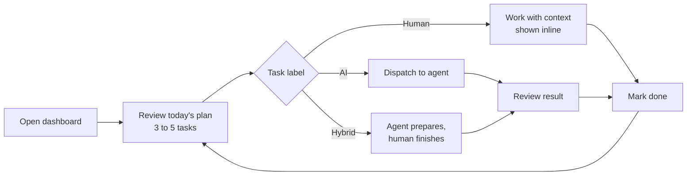
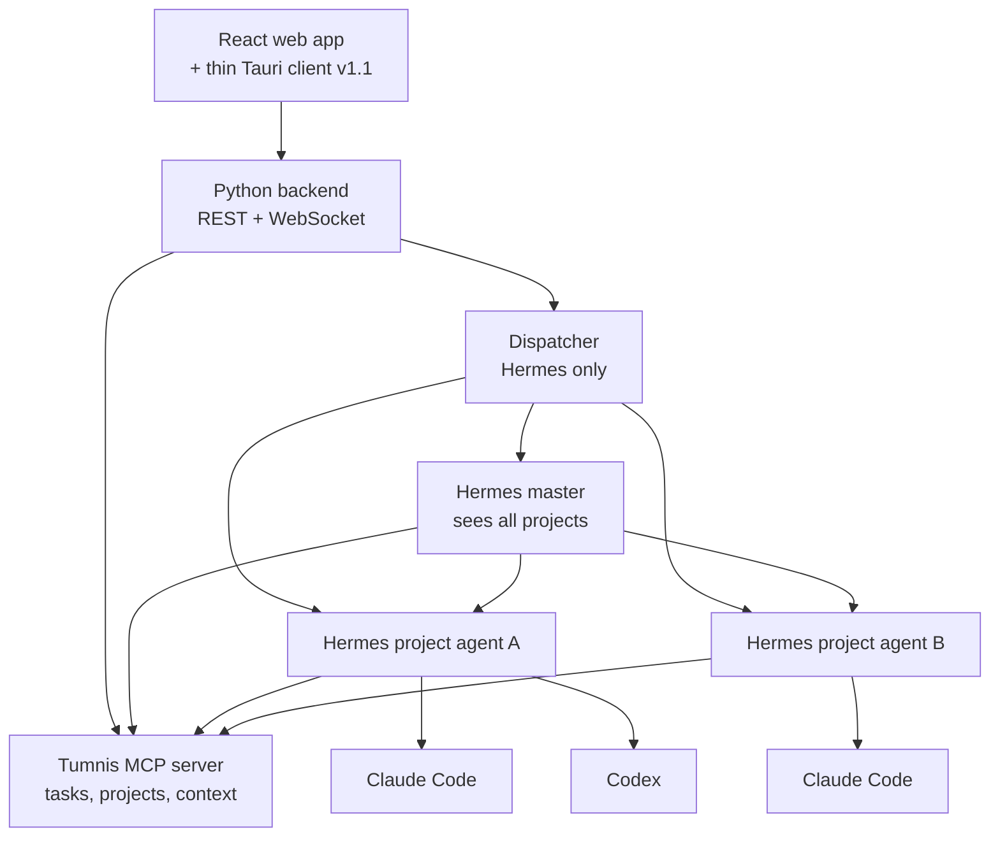

# Tumnis Guide PRD

Status: v1 requirements, revised September 26, 2026 · Owner: Scott Jordan

## Overview

Tumnis Guide is a daily task organizer for freelancers and solopreneurs that turns every project into a plan a human and a team of AI agents execute together. The user opens one dashboard each morning, sees where every project stands, and starts on the work they can realistically finish that day. AI handles what AI can do alone, prepares what needs a human, and stays out of the way otherwise.

**Problem.** A solo operator juggles 3 to 10 projects, each with its own client emails, calendar events, meeting notes and to-do list, spread across five or more tools. The cost is not the work itself; it is the re-orientation tax of figuring out what to do next. For people with ADHD that tax is the difference between a productive day and a lost one.

**Thesis.** One dashboard, zero re-entry of data, and an agent layer that does the work it can and hands the rest to the human with context attached. Success means the user finishes materially more per day on each project without maintaining another tool.

**Product type.** Personal productivity application with an agent orchestration layer. Single user per workspace in v1.

## Goals and non-goals

v1 commits to the daily core loop plus a working agent layer, self-hosted, as a web app with full phone parity; the thin desktop client follows in v1.1. Everything else waits.

**Goals (v1)**

1. The user can see the state of every active project and the day's recommended tasks within 5 seconds of opening the app, with no manual prep.
2. Every task carries an execution label: **Human**, **AI**, or **Hybrid**, assigned by AI and overridable by the user in one click.
3. Tasks labeled AI can be dispatched to a connected agent and come back with a result, a log, and a status the user can review without leaving the dashboard.
4. Every project has its own Hermes profile as its agent, with its own context, memory and history. The project agent connects to its workers (Claude Code, Codex) itself and dispatches whatever a task needs. Tumnis dispatches work only to Hermes in v1, while any MCP-capable agent can read and write through its MCP server and API.
5. Google Calendar events show on the dashboard and feed the daily plan.
6. The user adds a task in under 3 seconds from anywhere in the app (global quick-add).
7. Runs on the user's own hardware via Docker; all task, project and agent data is stored there, and hosted providers receive only the minimum text a call needs (Data flow rule 6).

**Non-goals (v1)**

- Multi-user teams, sharing, permissions, billing or public sign-up. One workspace, one human, on a data model that is multi-tenant from day one (see Hosted readiness).
- Building an email client. Tumnis Guide reads and links email; it does not replace Inbox Zero.
- Hosting or training models. The app talks to agents; it does not run inference itself.
- Native mobile apps. The installable web app has full phone parity instead (UX principle 11).
- Time tracking, invoicing or CRM features.
- A general chat interface. Conversations with agents happen inside a task's context, not a free-floating chat window.
- Windows support. The desktop app targets macOS and Linux in v1.
- Public internet exposure in v1. The self-hosted deployment runs on the private network (VPN or Tailscale) only; a hosted mode is prepared for but not shipped (Hosted readiness).

## Target users

The primary user is a solo operator running several businesses or client engagements at once, who already uses AI coding agents and wants them working on real project tasks, not just answering questions.

| Persona | Situation | Job to be done | What breaks today |
| --- | --- | --- | --- |
| Multi-entity solopreneur (primary; the founder is user zero) | Runs an agency, a SaaS product and side ventures; 5 to 10 live projects; already runs Claude Code and other agents locally | Know what to do today across all projects and hand the mechanical work to agents | Context lives in email threads, calendar, meeting notes and chat logs; switching costs eat the morning |
| Freelance developer or designer | 3 to 6 client projects with deadlines and revision cycles | Keep every client moving without dropping one | Kanban tools do not know about email or the calendar; agents do not know about the kanban |
| Consultant or fractional operator | Meeting-heavy weeks; commitments made verbally | Turn meeting notes into tracked work before they are forgotten | Notes sit in Granola; action items never become tasks |

**ADHD-specific needs the design must serve**

- Decision fatigue is the enemy. The dashboard proposes a short list (3 to 5 tasks) for today, not a backlog of 80.
- Working memory is limited. Every task shows its context (linked emails, notes, calendar event) inline; the user never has to go find it.
- Task initiation is the hardest step. Each task has an explicit, concrete first action, generated by AI if the user did not write one.
- Time blindness is common. Tasks carry an estimated duration and the plan fits inside the free time the calendar actually shows.
- Hyperfocus happens. The app must not interrupt a working session with notifications; it batches updates for the next check-in.
- Novelty wears off. The app earns its daily open by being useful in the first 10 seconds, not by streaks or gamification.

## Core user journeys

The product lives or dies on one loop: open the dashboard, pick from today's plan, work or delegate, close the day. Every other journey feeds that loop.

The loop repeats until the day's list is empty or the user closes the day; unfinished tasks roll into tomorrow's plan with their context intact.

**J1. Morning start (daily, 2 minutes).** The user opens the app. The dashboard shows each project's status card, today's calendar, and a plan of 3 to 5 tasks chosen by AI from free time and deadlines. The user accepts, swaps, or removes items.

**J2. Capture (many times a day, 3 seconds).** From any screen, the desktop hotkey (v1.1), or the phone, the user types a task and picks its project from a typeahead (or adds the task from inside the project page, where the project is implied). Jev labels it Human/AI/Hybrid in under a second; the project's agent then estimates duration where the label calls for it and proposes a first action, streaming in after the task is saved. The user confirms with Enter or fixes with one click. Only agents create tasks without a human choosing the project, and only for themselves.

**J3. Delegate to an agent (several times a day).** The user picks an AI or Hybrid task and clicks Run. The app builds a task packet (goal, acceptance criteria, linked emails, notes, files, repo path) and sends it to the project's agent. Progress streams to the task card. The result arrives as a review item: diff, document, summary, or a question the agent needs answered.

**J4. Inbox and chat to tasks (background, continuous).** Tumnis's email and chat connectors sync every connected mailbox and chat workspace, store new items as canonical Messages and Threads (FR-14), and match each one to a project through Jev on sender, domain, thread and keywords. When an item asks for something, Tumnis hands it to that project's agent, which drafts proposed tasks with the item linked. Ambiguous matches go to the review queue as unassigned. The user sees a small "3 new from inbox" badge, never a flood.

**J5. Meeting to tasks (after each meeting).** Tumnis's meeting-notes connector pulls the new Granola note, matches it to a project by calendar event and attendees, and hands it to that project's agent, which extracts commitments, dedupes against existing tasks and posts proposed tasks with the note linked. The user approves in bulk.

**J6. Calendar-aware planning (daily).** The plan respects real free blocks. If a 90-minute task has no 90-minute gap, the app says so and offers to split it or move it.

**J7. Close the day (optional, 1 minute).** The user sees what shipped, what agents finished, which tasks are queued to run unattended overnight, and what rolls over. Nothing is required; skipping it costs nothing.

**J8. Staying on task (all day, at the level the user chose).** At Quiet, nothing happens. At Nudge, the app tells the user when a planned block starts and what the first action is, and checks in once if the task has not been started 15 minutes later. At Coach, a focus timer runs on the current task and the master checks in at the project's cadence ("still on the Acme invoice?") with one-tap answers: still on it, switched, stuck, snooze. "Stuck" hands the task to the project agent, which splits off a 10-minute first step or takes the next step itself. At Guardrail, the dashboard shows one task at a time, anything that pulled the user away is captured as a task instead of becoming a detour, and the next task's context is pre-loaded so starting costs nothing. With voice on, the nudges are spoken.

## Functional requirements

Requirements are numbered for traceability. Priority: **P0** ships in v1, **P1** is v1 if time allows, **P2** is later.

**FR-1 Dashboard (P0)**

| ID | Requirement |
| --- | --- |
| FR-1.1 | Dashboard is the default screen on every open. One project card per active project: name, health, next milestone date, open task count, last agent activity. Health is a rule, not an agent judgment: **blocked** if any task is waiting on the human, **at risk** if any task is overdue, otherwise **on track**. |
| FR-1.2 | Today panel: 3 to 5 planned tasks, ordered; each shows project, label (Human/AI/Hybrid), estimated duration, first action. |
| FR-1.3 | Calendar strip for today with free blocks highlighted. |
| FR-1.4 | Inbox badge: count of unreviewed proposed tasks from email, chat and meeting notes; opens a review queue. |
| FR-1.5 | Agent activity feed: running, waiting for human, finished, failed. Collapsible; collapsed by default. |

**FR-2 Projects (P0)**

| ID | Requirement |
| --- | --- |
| FR-2.1 | Create, archive, and reorder projects. Fields: name, client, goal, deadline, status, code location (either a fixed path on the agent server or a repo URL the project agent clones per run; one or the other), linked email addresses and domains, Hermes profile (provisioned from the template on project create by default, or linked to an existing profile), declared workers. |
| FR-2.2 | **Project page, task-first.** Three zones: a header, a centre column for doing the work, and a right rail for context. The centre column is about tasks; everything else supports them (FR-2.4 to FR-2.8). |
| FR-2.3 | **Project brief.** A markdown document describing the project's goal, client, constraints and standing instructions, pinned as the first knowledge-base entry (FR-15) and shown as Brief at the top of the right rail. Editable in place by the user; the project agent proposes updates through the review queue. Every task packet includes it. |
| FR-2.4 | Header: project name, one-line goal, health (FR-1.1), next milestone date, this project's tasks planned for today with their estimates, and agent status (idle, running, waiting on you, paused). |
| FR-2.5 | Composer: one input at the top of the centre column. Typing creates a task in this project (natural language, Enter to save, FR-3.3), with the label, estimate and first action streaming in. A toggle switches it to Ask the agent, which creates an AI task whose result is the answer, delivered to the task and the review queue, so every conversation stays inside a task and there is still no free-floating chat. Files dropped on the composer go to the knowledge base and link to the new task. |
| FR-2.6 | Views under the composer: Tasks (the default; the to-do list grouped as Today, Up next, Waiting on you, Waiting on agent, Done recently), Board (the kanban, FR-3.2), Calendar (a week view of this project's meetings, task due dates and planned work blocks; drag a task onto a free block to schedule it), Inbox (proposals from this project's email, chat and notes) and Activity (agent runs, results and this project's audit trail). The last view used is remembered per project. |
| FR-2.7 | Right rail, each section a one-line summary that opens in place: Brief (FR-2.3), Knowledge (item count, storage used against the quota, add; FR-15), Agent (Hermes profile, health, declared workers and tools, pause), Connections (linked people and domains, code location, Coolify apps, mailboxes and chat channels feeding the project), Schedule (recurring tasks and the unattended run window) and Settings (focus cadence, subtask threshold, approval policy, local decisions only). |
| FR-2.8 | Phone layout: header and composer stay at the top, the views become a segmented control, and the right rail becomes a single Context sheet. Same functions, usable one-handed. |

**FR-3 Tasks and kanban (P0)**

| ID | Requirement |
| --- | --- |
| FR-3.1 | Task fields: title, project, label (Human / AI / Hybrid), status, priority, due date, estimate (minutes of human time; Human and Hybrid only, absent on AI-only tasks), first action, acceptance criteria, linked context items (FR-14.2: messages, notes, events, artifacts, files, URLs), assigned agent, parent task. |
| FR-3.2 | Kanban columns default to Backlog, Today, In progress, Waiting on human, In review, Done. Columns are per-project editable. |
| FR-3.3 | Global quick-add: `/` in the web app, a hotkey in the desktop client (v1.1), and a thumb-reachable button on the phone. Natural-language title in, project chosen by the user from a typeahead (required; defaults to the current project when adding from a project page). On save, the label arrives from Jev in under a second (FR-11.4); the project agent's estimate and first action stream in after. Enter confirms. |
| FR-3.4 | Subtasks with their own labels; a Hybrid parent can have AI subtasks and Human subtasks. How a Human or Hybrid subtask is displayed depends on its estimate against the **subtask card threshold** (FR-3.8): at or above the threshold it becomes its own kanban card, linked to the parent and moving through columns independently; below it, it is nested as a checklist item on the parent card. AI-only subtasks carry no estimate and nest under the parent, since they need no human attention. Default threshold is 30 minutes. When an estimate changes, the subtask is re-laid-out on the next board render. |
| FR-3.5 | Recurring tasks: presets (daily, weekdays, weekly on a day, monthly on a date) plus a raw cron expression for odd schedules. The next instance is created when the previous one is done or its due date passes, never both at once, so a missed week does not pile up. |
| FR-3.6 | Rollover: unfinished Today tasks return to the plan pool at day close with a rollover count visible. |
| FR-3.7 | Plain list view per project and across projects, sorted by due date. Filters and saved views are v1.1. |
| FR-3.8 | Subtask card threshold setting: a duration in minutes, workspace default 30, overridable per project. Changing it re-lays-out existing subtasks on that board (cards become checklist items or the reverse) without losing status, links or history. |
| FR-3.9 | Search. Postgres full-text search (tsvector with a GIN index, no extra service) over task titles, first actions, acceptance criteria, comments, results, and linked email and note excerpts. Powers the quick-add and project typeaheads, a global search box reachable with a keystroke on every screen, and a search tool on the MCP server and REST API so agents can find prior work. Results rank by recency and project match; phrase and prefix queries supported. |
| FR-3.10 | Offline quick-add. When the phone or laptop is offline or the VPN drops, quick-add still accepts the task and queues it in the PWA; the queue syncs on reconnect using idempotency keys (REL-2), so no capture is lost and none is duplicated. Queued items show a small pending mark until they sync. |

**FR-4 AI triage and planning (P0)**

| ID | Requirement |
| --- | --- |
| FR-4.1 | On task create or edit, Jev assigns Human / AI / Hybrid with a one-line reason (FR-11.4), and the project agent can revise it with more context. Rules: needs a decision, a relationship, a signature, physical presence, or judgment the user has reserved → Human. Fully specified, verifiable by tests or artifact, in an agent's competence → AI. Otherwise Hybrid, with the AI portion and the human portion stated. |
| FR-4.2 | User overrides persist in Tumnis and reach the Hermes profiles through the project and workspace digests (FR-13): a label override, a rejection with feedback, an approval decision, an estimate versus actual. Hermes's own Hindsight integration retains them, so every agent recalls them before its next run. |
| FR-4.3 | Daily planner is one step and runs twice a day at most: on a morning cron before working hours, and whenever the user presses Re-plan. It does not re-plan on its own during the day; a Today task that becomes blocked stays visibly blocked until the user rebuilds. The master profile, which sees every project through the Tumnis MCP server, builds the Today list from the task pool, free blocks inside the configured working hours (FR-4.7) across all connected calendars, due dates, project health, rollover age and each project's context document, and returns a reason per pick. The app validates the result against hard constraints (free time, max 5 tasks) before showing it. If the master is unreachable, Today falls back to a due-date sort with an agent-offline notice. |
| FR-4.4 | The project agent generates a first action and acceptance criteria for any task or subtask missing them, and an estimate in minutes of human time for every Human and Hybrid task (for Hybrid, the human portion only). AI-only tasks carry no estimate; the app records the agent's run time after the fact for cost and reporting, but it never counts against the calendar. Estimates are required where they apply: the subtask layout (FR-3.4) and the daily plan's fit against free calendar blocks (FR-4.3) depend on them. When a task completes, the actual human duration (In progress to Done) is recorded next to the estimate so the project agent can calibrate; the task packet includes the project's recent estimate-versus-actual history. |
| FR-4.5 | AI-eligible tasks with a green light (see FR-5.6) may be queued to run unattended in a user-defined window (for example overnight). Tasks derived from external content (tainted, SAF-1) never run unattended. |
| FR-4.6 | The label comes from Jev (FR-4.1); estimates, first actions and acceptance criteria are generated by the project's own Hermes profile; the daily plan is executed by the master profile. The only model calls Tumnis makes itself go through the provider layer in FR-11: typed decisions through Jev (with local fallback), speech, and short placeholder strings. If a project's profile is unreachable, that project degrades to Jev-only labels with no first action; other projects are unaffected. |
| FR-4.7 | Working hours setting: a start and end time per weekday, Monday to Friday, default 9:00 to 18:00 in the workspace timezone, which is selectable in Settings from the full IANA list (proposed from the browser at setup; America/New\_York for the founder) and can be changed at any time, re-computing working hours, schedules and the plan in the new zone (REL-6). Only free blocks inside these hours are plannable. Saturday and Sunday have no window and get a plan only when the user presses Re-plan, which then uses the weekday default for that day. |

**FR-5 Agent connections (P0)**

| ID | Requirement |
| --- | --- |
| FR-5.1 | Register Hermes profiles in Settings: name, role (master or project agent), profile name, runner (see FR-5.11), transport, endpoint or command, credentials. One registered agent maps to exactly one Hermes profile. Workers (Claude Code, Codex) and any third-party MCP servers a profile uses are not registered as connections; the app records them as **declared capabilities** of that profile (name, type, capability tags) for display and for capability hints in the task packet. |
| FR-5.2 | Two Hermes roles. One **master orchestrator** profile per workspace sees every project, builds the daily plan, and can delegate across projects. Each project has exactly one **project agent** profile that handles estimates, first actions, proposals and orchestration for that project. Workers (many) are attached to a project and routed by its project agent. |
| FR-5.3 | Routing to workers is the project agent's job, not the app's. Which worker handles code, browser or computer-use work is configured inside the Hermes profile (its MCP servers, skills and `SOUL.md`); the project agent reaches Claude Code and Codex through Hermes's own integrations for them. The app shows the workers a project agent reports having and lets the user attach capability hints to a task ("needs browser"), but never routes to a worker itself. |
| FR-5.4 | Run a task: the app assembles a task packet and dispatches it to the project's Hermes agent. The project agent decides which workers to use and invokes them itself. The app never talks to a worker. |
| FR-5.5 | Live run view: streamed log, tool calls, files touched, elapsed time, Stop button. |
| FR-5.6 | Approval gates. Default policy, editable per project: **gated** actions are sending email, merging or pushing to main or master, force-pushing, deploying to a production-tagged Coolify application, destructive Proxmox operations (deleting a VM or LXC, rolling back a snapshot, storage or network changes), spending money and deleting files; **allowed** without approval are pushing a feature branch, opening a pull request, triggering a preview deployment, creating or starting a Proxmox guest, creating drafts, and reading anything. The gate is a `request_approval` tool on the Tumnis MCP server that the project agent must call and wait on before a gated action; the policy is delivered in every task packet and encoded in the template profile's skills. Because workers are invoked by Hermes, not by the app, this is enforcement by contract; a run-log audit for unapproved gated actions is v1.1. |
| FR-5.7 | Agents can ask the human a question mid-run; the task moves to Waiting on human and the question appears on the dashboard. |
| FR-5.8 | Results land in In review and are always accepted by the human in v1; no auto-completion. A result is a structured summary, a list of files touched, and links to where the artifacts live (branch, pull request, document URL, draft in the mailbox). Tumnis stores text and links only, never the artifacts themselves. Accept moves the task to Done; Reject returns it to the project agent with the human's feedback attached as a task comment. |
| FR-5.9 | Health check per agent (reachable, authenticated, version) shown in Settings and on the project card. |
| FR-5.10 | Hermes profiles are first-class: one master orchestrator profile for the workspace, and one profile per project. A profile is a separate Hermes home directory with its own `config.yaml`, `.env`, `SOUL.md`, memories, sessions, skills, cron jobs and state database, invoked with `hermes -p <profile>` (or `HERMES_HOME=~/.hermes/profiles/<profile>`). Because each profile keeps its own memory and session history (Hindsight banks per profile plus a shared workspace bank, FR-13), project agents accumulate project knowledge and the master accumulates workspace-level knowledge, without the app storing any of it. Creating a project creates a profile from the Tumnis template (or links an existing one) and registers it with the master. Archiving a project keeps everything but stores it efficiently: the profile's home directory is compressed to an archive on the agent server and removed from the live profile list, and the project's excerpts, run logs and results are compressed in Postgres; unarchiving restores both. A manual purge per project remains available. Profiles run concurrently as separate processes. Settings shows each profile's health, and the app never writes into a profile's home directory. |
| FR-5.11 | Tumnis connects only to Hermes profiles, and a runner is where a Hermes profile executes. Two runner types: (a) remote endpoint, a Hermes profile running in MCP-server mode, which the backend connects to outbound; (b) runner daemon, a small headless Tumnis process installed beside Hermes as a systemd service, which dials out to the backend and invokes `hermes -p <profile>` on that host. The primary daemon runs in the Proxmox VM or LXC that hosts Hermes; a second instance of the same daemon on the user's Mac (P1) registers as a runner named after the machine, and a project's profile can be pinned to it for work that must happen locally. Workers need no runner: the project agent reaches them itself. The desktop client is not a runner (FR-7). |
| FR-5.12 | Two kinds of integration, split by who owns them. **Communication and context sources** (email, chat, meeting notes, calendar) are Tumnis connectors (FR-14): Tumnis holds the credentials, and agents read them through Tumnis's MCP tools, which work for any MCP-capable agent (FR-14.9, FR-14.10). A direct integration inside an agent is optional and never required. **Tools agents use to do work** (GitHub, Coolify, Linear, a client's own tools) are MCP servers the user adds to a Hermes profile's config; the template profile ships with the GitHub MCP server and the official Coolify MCP server pre-configured (credentials supplied by the user), so project agents can open pull requests, trigger preview deployments and read deploy logs without any Tumnis code. Tumnis reads each profile's MCP server list from its health check and shows it read-only in Settings. A Tumnis-side gateway for agent tools is a v1.x candidate, not v1. |

**FR-6 Review queue (P0)**

| ID | Requirement |
| --- | --- |
| FR-6.1 | One queue for everything that needs a human decision: proposed tasks from email, chat and meeting notes, agent questions, approval requests, agent results. Ordered by blocking impact: items computed from how many tasks and how much estimated human time sit downstream of them, highest first, so a question holding up a whole project outranks one holding up a single subtask; ties break by age. Keyboard-driven: accept, edit, reject, snooze. |
| FR-6.2 | Bulk accept for proposed tasks from a single source (one meeting, one email thread). |

**FR-7 Desktop companion app (v1.1)**

| ID | Requirement |
| --- | --- |
| FR-7.1 | The web app is the product. It is served by the backend, installable as a PWA on macOS and Linux, and uses the same REST API and WebSocket as every other client. |
| FR-7.2 | The desktop app is a thin Tauri client that loads the same React bundle and calls the same API with the same auth token. It adds only what a browser cannot: a global quick-add hotkey, a tray or menu bar item, native notifications, the opt-in screen awareness signal (FR-10.7) and desktop voice mode (FR-10.8). It has no backend logic, no local database, no agent bridge and no runner; if it is removed, nothing about Tumnis changes except those signals. Ships in v1.1 with no API work, because the API it needs exists on day one. |

**FR-8 Notifications (P0 unless marked)**

| ID | Requirement |
| --- | --- |
| FR-8.1 | In-app: the review badge on the dashboard is the source of truth for everything needing the human (proposals, questions, approvals, results). |
| FR-8.2 | Discord through the Hermes gateway: only the master profile talks on Discord, in one dedicated Tumnis channel; project agents never message the user directly. When a task needs the human, the master posts a short message there. The user can answer in the channel; the master records the answer in Tumnis through the MCP server, so an answer on Discord and an answer in the app are the same thing. |
| FR-8.3 | Browser push from the PWA for the same events, each deep-linking to the item in the review queue (P1 within v1; needs a push service and a permission prompt). |
| FR-8.4 | Notification volume follows the focus support level (FR-10.1). At Quiet nothing fires while a task is In progress and everything batches until the next natural break; higher levels add the focus events in FR-10.2 and nothing else. |

**FR-9 Access and authentication (P0)**

| ID | Requirement |
| --- | --- |
| FR-9.1 | In self-hosted mode, Tumnis is reachable only on the private network (VPN or Tailscale), including from the phone. No public exposure. |
| FR-9.2 | One user in v1, signing in with a local password, which is the first of the auth module's pluggable providers (see Hosted readiness). The data model is multi-tenant from the first migration. Sessions per device with a long-lived cookie so the phone and laptop stay signed in. |
| FR-9.3 | API keys, created and revoked in Settings, for every tool that calls the REST API or MCP server (Hermes profiles, scripts, the desktop client). Each key is named, carries scopes (FR-14.10) and shows its last use. |

**FR-10 Focus support (P0 unless marked)**

Staying on task is the hardest part of the day for the target user, so proactivity is a first-class feature with a dial, not a notification setting. Tumnis detects (timers, state, calendar); the master speaks (what to say, with project context).

| ID | Requirement |
| --- | --- |
| FR-10.1 | **Focus support level** setting with four levels: **Quiet** (default), **Nudge**, **Coach**, **Guardrail**. Set at workspace level, overridable for today with one tap on the dashboard. Check-in cadence at Coach and above is configurable per project (default 25 minutes) so deep-work projects get longer intervals than admin projects. |
| FR-10.2 | Tumnis emits **focus events** deterministically: `block_start` (a planned task's calendar block begins), `not_started` (15 minutes into a block with the task still not In progress), `check_in_due` (cadence elapsed on an In progress task with no activity signal), `switched` (a different task moved to In progress), `stuck` (user answered stuck), `block_end`, `day_end`. Which events fire depends on the level: Nudge fires `block_start`, `not_started`, `day_end`; Coach adds `check_in_due`, `switched`, `stuck`; Guardrail adds `block_end` and detour capture. Quiet fires none. |
| FR-10.3 | The master profile turns focus events into messages through a focus skill, using the task's first action and project context, and delivers them on the channels enabled in FR-8 plus the in-app **focus bar**: a persistent strip on every screen showing the current task, its timer and the one-tap responses. |
| FR-10.4 | One-tap responses on every check-in: **still on it**, **switched to** (pick a task), **stuck**, **snooze** (15 min). Responses are recorded in Tumnis. Back-off: after two consecutive "still on it" answers the cadence doubles for the rest of that task, so hyperfocus is protected. |
| FR-10.5 | **Stuck** routes to the project agent, which either splits off a first step of 10 minutes or less and posts it as a subtask, or takes the next AI-able step itself and reports back. The user sees the new step within a minute. |
| FR-10.6 | **Guardrail** mode: the dashboard collapses to one task at a time (next task revealed on Done); when the user marks switched to something not in Today, the master captures the detour as a task with the project the user picks and asks whether to return; agents pre-load the next task's linked context so the first action is one click. |
| FR-10.7 | **Activity signals** used to suppress false check-ins, each an opt-in setting: (a) Tumnis and calendar state (always on); (b) git and agent activity on the task's branch or runs (v1, on by default); (c) **screen awareness** through the desktop client (v1.1, off by default): the Tauri client compares the foreground app and window title against the task's context (repo path, linked URLs, app names) locally on the laptop and sends the server only on-task / off-task and the matched app name, never screenshots, window contents or keystrokes. Off-task for longer than the cadence triggers `check_in_due`; the setting can be turned off per project. |
| FR-10.8 | **Voice mode**, opt-in per level: focus messages are spoken aloud. v1 uses the browser's speech synthesis in the PWA (P1); v1.1 adds higher-quality text-to-speech in the desktop client and voice replies (speech-to-text), so "still on it" and "stuck" can be said rather than tapped. Voice content is generated by the master and is the same text as the in-app message. |
| FR-10.9 | Every proactive message shows which level and rule produced it, and a one-tap "less of this" that lowers today's level. Nothing at any level blocks the UI or requires an answer. |

**FR-11 Model provider layer (P0 unless marked)**

Hermes does all open-ended reasoning. Tumnis itself needs four narrow model capabilities, each behind a provider abstraction with a configured primary and fallback, so that fast decisions do not wait seconds on an agent and voice does not depend on a browser.

| ID | Requirement |
| --- | --- |
| FR-11.1 | Four capability slots, each with a primary and a fallback provider set in Settings: **Decisions** (typed classification and scoring), **Speech** (text-to-speech and speech-to-text), **Generation** (short text), **Embeddings** (vectors for semantic knowledge search, FR-15.3). Provider credentials are encrypted at rest; each provider has a health check and a usage counter. |
| FR-11.2 | **Decisions primary: Jev by TypeSafe AI** (`api.typesafe.ai/v1/systemone`, Python SDK `typesafe-sdk`, model version pinned, for example `jev-1.13.0`). Tumnis sends state plus typed questions and receives typed answers with probabilities and confidence in 70 to 500 ms. Question primitives used: Choice (one of up to 255 options), Score (2 to 10 ordered levels), Noul (0 to 1 probability). Every decision includes an explicit `unknown` or abstain option where one makes sense ([TypeSafe docs](https://docs.typesafe.ai/introduction), [Jev announcement](https://typesafe.ai/blog/introducing-system-one-models-and-jev)). |
| FR-11.3 | **Decisions fallback: the local vLLM cluster** through an OpenAI-compatible endpoint with constrained JSON output, using the same question definitions. Fallback results are marked as such in the log and use a stricter confidence threshold. If both are down, every gated decision becomes a review-queue item. |
| FR-11.4 | **Decision points** routed through the Decisions slot, each with its own confidence threshold; below threshold the item goes to the review queue instead of being auto-applied: quick-add label Human / AI / Hybrid (Choice); project match for an ingested email, chat message or meeting note (Choice over projects plus unknown); actionability of an ingested item (Noul, FR-14.8); duplicate detection for proposals (Noul, "same work as task X?"); approval need for an agent action against the project policy (Noul); blocking-impact score for the review queue, combined with the deterministic downstream count (Score); focus-event gating, "is this activity on-task?" and "is a nudge warranted now?" (Noul); estimate plausibility (Score). |
| FR-11.5 | **Thresholds are calibrated, not guessed.** Every decision and its outcome (auto-applied, sent to review, overridden by the human) is logged with the model version. Settings shows per-decision accuracy once 100 labeled outcomes exist, and the threshold is editable there. Thresholds are re-checked when the model version changes. |
| FR-11.6 | **Jev is also available to Hermes.** A Jev MCP server is added to the master and template profiles so triage and orchestration skills can ask the same typed questions. Same API key, two consumers; Tumnis-side decisions stay in Tumnis where they are logged and calibrated. |
| FR-11.7 | **Speech slot.** TTS and STT for voice mode (FR-10.8). Local first: Piper or Kokoro for TTS and whisper.cpp for STT on the agent server or the laptop; third-party optional per voice setting (ElevenLabs, OpenAI, Deepgram) for voice quality. The browser's built-in speech synthesis remains the zero-config default in the PWA (P1). |
| FR-11.8 | **Generation slot.** An OpenAI-compatible endpoint (local vLLM by default, a hosted provider optional) for the few Tumnis-side strings that must not wait on Hermes: a placeholder first action shown while the project agent's real one is pending, and the spoken form of a focus message when the master has not supplied one. Never used for planning, triage reasoning or orchestration. |
| FR-11.9 | Jev limits to design around: hosted API only (no self-hosting), text only, 64k tokens of state plus questions per call, 1,200 requests per minute. Pricing at launch: $0.042 per million input tokens, output free ([practical guide](https://dev.to/valyuai/how-to-use-jev-a-practical-guide-to-typesafes-system-one-model-g5e)). |
| FR-11.10 | Embeddings slot (phase 3). A local embedding model served from the vLLM cluster by default; a hosted provider is optional and subject to data flow rule 6 and the per-project local decisions only switch. Vectors are stored in Postgres with pgvector and re-computed in the background when the embedding model changes. |

**FR-12 Homelab integrations (P0 unless marked)**

The user already runs GitHub, Coolify on Proxmox, and Hermes on that server. Tumnis should surface what those systems know rather than duplicate them; each integration below is read-only and small.

| ID | Requirement |
| --- | --- |
| FR-12.1 | **GitHub status on task cards.** A task that links a pull request shows the PR state (open, merged, closed), the combined check status (pending, green, red) and the review state, refreshed on open and on a GitHub webhook. Read-only fine-grained token, repos allow-listed in Settings. A result whose linked PR has red checks is flagged in the review queue. |
| FR-12.2 | **Coolify status on project cards.** A project can be linked to one or more Coolify applications by UUID. The project card shows the last deployment (status, time, commit) and the preview URLs of open pull requests. Read-only Coolify API token; Tumnis never triggers deployments itself, agents do through the Coolify MCP server under the approval policy. ([Coolify docs](https://coolify.io/docs/llms.txt)) |
| FR-12.3 | **Prometheus metrics.** `/metrics` on the backend with queue depth, runs by status, decisions by outcome, integration sync ages, focus events fired, and request latency, so Tumnis appears in the homelab's existing monitoring. Bearer-protected like the rest of the API. |
| FR-12.4 | **Tumnis deploys through Coolify.** The repo carries the compose file Coolify deploys; the GitHub App auto-deploys `main` after CI is green; every pull request gets a Coolify preview deployment so UI changes can be tried on the phone before merge; Postgres is a Coolify-managed database with its scheduled backups; secrets are Coolify shared variables. |

**FR-13 Context to Hermes memory (P0 unless marked)**

The user already self-hosts Hindsight as the memory provider for Hermes, and Hermes retains what passes through each profile's turns. Tumnis does not talk to Hindsight and builds no memory of its own. Its only job here is to make sure everything that lives in Tumnis, including what the human does in the UI and every email and note linked to a project, passes through the right Hermes profile so it lands in that profile's memory.

| ID | Requirement |
| --- | --- |
| FR-13.1 | **Project digest.** A Tumnis MCP tool `get_project_digest(since)` returns everything new for one project since the calling profile's last digest: human decisions (label overrides, rejections with their feedback, approvals and their reasons, estimate versus actual on completion, focus responses), task changes and comments, knowledge-base additions and edits, accepted proposals, and the full text of the email, chat and meeting-note context items linked to the project. Tumnis keeps a digest cursor per profile so nothing is sent twice or missed. |
| FR-13.2 | **Digest skill in the template.** The project template profile ships a `project-digest` skill that runs on a Hermes cron (default hourly inside working hours) and at the start of every run. It reads the digest and retains it, so it lands in the project profile's bank through the user's existing Hermes and Hindsight setup. Bank layout (one bank per project profile, a shared workspace bank) follows what the user already has configured. |
| FR-13.3 | **Emails, chat and notes reach the right bank.** Tumnis ingests them through its own connectors and matches each item to a project; the item then reaches that project's agent through the project digest and, when it is actionable, a proposal run (FR-14.8), so client email, chat and meeting context end up in the project's memory. |
| FR-13.4 | **Workspace digest.** `get_workspace_digest(since)` returns workspace-wide human signals (standing rules, preferences expressed through overrides across projects, focus settings changes) and is read by the master's digest skill, which retains them where every agent recalls them. |
| FR-13.5 | Tumnis never calls Hindsight, stores no memory, and has no memory module. Settings links to Hindsight's own interface for anyone who wants to inspect what an agent knows. |

**FR-14 Integration data model (P0)**

Every integration, whether a Tumnis connector pulls it or a tool pushes it through ingest\_items, lands in the same small set of canonical records. Matching, dedupe, search, digests, the task drawer and Jev decisions only ever see canonical types, so adding a provider means writing one mapper and nothing downstream changes.

| ID | Requirement |
| --- | --- |
| FR-14.1 | **Canonical entities.** `Connection` (a configured provider: kind email, notes, calendar, code, deploy or agent; provider name; owner Tumnis or a named Hermes profile; status; sync cursor). `Person` (one identity with emails, names and domains, used for project matching). `Message` and `Thread` (email and chat: participants, subject, sent time, body text, labels, provider URL). `Note` (meeting notes: title, start and end, attendees, body text, extracted action items, linked calendar event, provider URL). `Event` (calendar: start, end, attendees, busy state, title). `Artifact` (pull request, deployment, external document link: kind, URL, state, checks). Document (a knowledge-base item: title, kind text, file or link, body text, chunks with page numbers, trust, version; FR-15). Every record carries workspace ID, connection ID, external ID, provider URL and fetched time, and keeps the raw provider payload compressed so records can be re-normalized when a mapper improves. |
| FR-14.2 | **ContextItem.** One polymorphic link record pointing at any canonical entity. Tasks, proposals, digests and results link to ContextItems, never to provider-specific rows, so a task carries an email, a meeting note, a pull request and an event through the same UI and API. |
| FR-14.3 | **Idempotent ingestion.** Records are upserted on workspace, connection and external ID; re-sending an item never duplicates it, and edits or deletions at the provider are reflected on the next sync. |
| FR-14.4 | **Tumnis owns the connections; one schema.** Tumnis-side connectors pull and map in the worker for every communication and context source: email (Inbox Zero, through its MCP server with Tumnis as the client), meeting notes (Granola, through its MCP server with Tumnis as the client), chat, calendar (Google Calendar), code (GitHub) and deployments (Coolify). Tumnis holds every OAuth grant. `ingest_items(kind, items)` stays on the MCP server for any other tool or script that wants to push context in, but no v1 source depends on it. |
| FR-14.5 | **Connector contract.** A Tumnis-side connector declares its kind and capabilities (poll, webhook, read, write) and implements `sync(cursor)` returning items and the next cursor, `map(raw)` returning canonical records, and `health()`. Connectors live in one registry, are enabled per workspace, and ship with recorded-fixture contract tests. Adding Gmail directly, Outlook, Fathom, Otter, Notion or Linear later is a new connector, never a schema change. |
| FR-14.6 | **Agent contract.** Agents sit behind one `AgentAdapter` interface: `capabilities()`, `dispatch(packet)` returning a run, `stream(run)`, `cancel(run)`, `health()`. Hermes is the only v1 adapter; A2A agents or other orchestrators later are new adapters behind the same run and result model. |
| FR-14.7 | **Versioned schemas.** Canonical entities, the task packet, the result and the digest payloads are published as versioned JSON Schemas in the repo, with `schema_version` on every payload. Contract tests are generated from them, and a breaking change needs a new version with the previous one supported for one release. |
| FR-14.8 | From item to proposal. For every ingested Message, Thread or Note, Tumnis matches the project through Jev (Choice over projects plus unknown) and decides whether it is actionable (Noul), in under a second and without an agent. An actionable item on a matched project triggers a short proposal run on that project's agent, which reads the item, dedupes against open tasks and posts proposals with create\_task referencing the ContextItem. Unmatched or low-confidence items go to the review queue asking which project. Routing stays in Tumnis; reasoning stays in Hermes. |
| FR-14.9 | **Communication tools for agents.** Agents read email, chat and meeting notes through Tumnis's MCP tools: `search` over ingested items, `get_context_item` for full text and metadata, and `draft_reply`, which creates a draft in the source system through its connector. Drafts are allowed; sending is approval-gated (and not possible through Inbox Zero at all). This is the supported path and works for Hermes and for any other MCP-capable agent. A user may also give an agent a direct integration of its own (for example Inbox Zero's MCP server in a Hermes profile); that is allowed, but no Tumnis feature depends on it. |
| FR-14.10 | Agent-agnostic surface. The MCP server and REST API are the whole agent surface, and neither assumes Hermes: no tool names, payloads or behaviors are Hermes-specific, and every tool has a REST equivalent for agents without MCP. Each API key carries scopes (read tasks, write tasks, read context, write drafts, delegate, ingest) so any agent (Hermes, Claude Code, Codex, a future orchestrator) can be given exactly the access it needs. Outbound dispatch is the only agent-specific part and sits behind the AgentAdapter (FR-14.6). Swapping or adding an agent is a new API key or a new adapter, never a change to the tools. |

**FR-15 Project knowledge base (P0 unless marked)**

Every project has a knowledge base: the context a human or an agent needs that is not a task, an email or a meeting. It is what the agent reads before it acts, and it goes wherever the project's agent goes.

| ID | Requirement |
| --- | --- |
| FR-15.1 | **Items.** Three kinds: text entries written in the app (markdown with a title), uploaded documents (PDF, DOCX, Markdown, plain text, CSV and images, up to 50 MB each), and saved links, plus items synced from linked sources (Google Docs, Obsidian and S3-compatible buckets, FR-15.8 to FR-15.11) and files already in the project's folder (FR-15.12). The project brief (FR-2.3) is the pinned first entry. A workspace-level knowledge base holds context every project shares: standing rules, company boilerplate, rate cards. |
| FR-15.2 | **Processing.** The worker extracts text from every upload (PDF and DOCX parsing, OCR for scans and images through the local model stack), splits it into chunks that keep their headings and page numbers, and indexes them. Items are canonical `Document` records in the FR-14 model, linked to tasks through ContextItems, so a task can cite a specific document and page. |
| FR-15.3 | **Search.** Postgres full-text search from day one; semantic search over pgvector embeddings from the Embeddings slot (FR-11.10) is added in phase 3, and the two are combined. Results show the document, the passage and the page. |
| FR-15.4 | **Agents use it automatically.** Every task packet includes the brief and the most relevant knowledge-base passages for that task, capped by size. Agents can also query and add to it through the MCP tools `search_knowledge`, `get_document` and `add_document` (write scope required). New and edited items reach the project agent's memory through the project digest (FR-13). |
| FR-15.5 | **Trust.** Text the user writes is trusted. Uploaded documents are tainted by default (SAF-1), because they often come from outside people, and the user can mark one trusted. Items an agent adds are labeled as agent-written and stay untrusted until the user reviews them. |
| FR-15.6 | **Management.** Items can be edited (previous versions kept), tagged, pinned, and deleted to trash first. The right rail shows the item count and storage used against the quota. Archiving the project compresses its knowledge base with everything else (FR-5.10), including its project folder (FR-15.12). |
| FR-15.7 | **Storage.** Knowledge-base files live behind one storage interface with three backends: a server path (the Tumnis server's own disk, or an SMB or NFS share mounted on it), any S3-compatible endpoint (MinIO, Backblaze B2, AWS S3 or similar, configured by endpoint URL, region, bucket, access key and path-style addressing), and SFTP (host, port and user, key authentication only, with the host key pinned on first connect after the user confirms it). The workspace sets a default location and each project can override it (FR-15.12). Self-hosted mode can use all three, with MinIO on the homelab as the recommended default; hosted mode offers S3-compatible and SFTP only, because a hosted server cannot mount a customer's share, and the SSRF guard (SEC-5) applies to every S3 and SFTP host. Objects use server-side encryption where the provider supports it (for example SSE-B2); files on server disks, shares and SFTP hosts are kept readable on purpose and rely on that target's disk encryption. Files reach the browser only through the API so the SEC-10 headers always apply. Postgres holds metadata, extracted text, chunks and embeddings, so search and agent context keep working while a location is briefly unreachable. Files Tumnis creates are part of every backup (REL-1). |
| FR-15.8 | Linked sources. Some knowledge lives in other tools. A linked source is a connector (FR-14.5) that keeps knowledge-base items in sync with their origin: items show a source badge and an Open in source link, are read-only in Tumnis (edit where they live), are re-indexed when they change, keep the source's revision ID as their version, and move to trash in Tumnis when deleted at the source. v1 sources are Google Docs (FR-15.9), Obsidian (FR-15.10) and S3-compatible buckets (FR-15.11); write-back is v1.x and goes through the approval policy. |
| FR-15.9 | Google Docs. Uses the same Google accounts already connected for Calendar. Default mode: the user picks Docs, Sheets and Slides with the Google Picker and assigns each to a project, using the non-sensitive drive.file scope (access only to what was picked, no Google security assessment). Optional folder mode links a whole Drive folder to a project using the restricted drive.readonly scope: fine in self-hosted mode on the user's own OAuth client, but a hosted deployment must pass Google's security assessment before offering it. Export formats: Docs as Markdown (text/markdown), Sheets as XLSX so every tab is kept (CSV export covers only the first sheet), Slides as plain text. Changes are picked up through the Drive changes feed (default every 10 minutes) and unchanged files are skipped. Trust: files owned by a connected account are trusted; files shared by someone else are tainted (SAF-1). |
| FR-15.10 | Obsidian. A vault is a folder of Markdown files, so the connector reads the files and needs no Obsidian process running. Three ways to reach a vault, one connector: (a) a folder synced to the homelab (Syncthing, or a similar sync tool) and mounted read-only into Tumnis, watched for changes (the default for self-hosted); (b) a Git remote kept current by the Obsidian Git plugin, pulled on a schedule (works in hosted mode too); (c) the runner daemon on the Mac (P1) indexing a vault that lives only there and pushing items through ingest\_items. The connector parses YAML frontmatter, tags, headings, wikilinks (kept as links between Documents so agents can follow them) and embeds, and processes attachments in the vault like uploads. Notes map to projects by vault folder, by a tumnis\_project frontmatter key, or by a #tumnis/\<project> tag; unmapped notes go to the workspace knowledge base or are ignored, per setting; .obsidian, .trash and template folders are excluded by default. Trust: vault notes are trusted, except a configurable clippings folder (default Clippings) whose web-clipped content is tainted. The Obsidian Local REST API plugin, which only listens on localhost and needs Obsidian running, is not the sync path; an agent on the Mac may still use its MCP server as an optional direct integration. |
| FR-15.11 | S3-compatible buckets as a linked source. Documents that already live in a bucket (MinIO, Backblaze B2, AWS S3 or any S3-compatible service) can be synced into a knowledge base without re-uploading. A connection takes the endpoint URL, region, bucket, access key and secret, and path-style addressing where needed (Backblaze B2 uses https://s3.\<region>.backblazeb2.com with an application key, never the master key, and Signature V4). Each bucket prefix maps to a project or to the workspace knowledge base. Changes are found by listing the prefix and comparing ETag and last-modified (default every 15 minutes); MinIO can also push bucket notifications to a signed Tumnis webhook for near-real-time updates. On versioned buckets (B2 versions by default) only the latest version is indexed. Credentials must be read-only and scoped to the bucket or prefix; Tumnis refuses a key that can write or delete when the provider lets it check. Files are processed like uploads (type allow-list, size limit, ClamAV, extraction; SEC-10) and are tainted by default unless the connection is marked trusted. |
| FR-15.12 | Project folders. Every project has a folder that holds its files under readable names, so they can be browsed, backed up or edited outside Tumnis. Two setups, chosen per project at creation and changeable later: (a) Tumnis-made (the default): Tumnis creates a folder named after the project under the workspace default location, with uploads/, notes/ (text entries saved as Markdown with a tumnis\_id frontmatter key) and agent-outputs/ subfolders; (b) existing folder: the project points at a folder the user already keeps (a server path or mounted share, an S3 bucket prefix, or an SFTP path), Tumnis indexes what is already there and writes its own files into a Tumnis/ subfolder, so it never renames, moves or overwrites a file it did not create, and deletes one only when the user confirms it in the app, never at an agent's request. Sync runs both ways. Changes made outside Tumnis are re-indexed with the previous version kept: through file-system events on the server's own disk, and by scanning size, modified time and then content hash every 15 minutes on shares, S3 and SFTP, because change events are unreliable over SMB and NFS. Edits made in Tumnis write through with an ETag or hash check; when a file changed in both places since the last sync, Tumnis keeps both (the second saved as name (conflict YYYY-MM-DD).ext) and adds a review-queue item. Safety: paths are confined to the folder root (no .. segments, no symlinks followed outside it); filenames are sanitized and de-duplicated with a numeric suffix; every file found is processed like an upload (type allow-list, size limit, ClamAV, extraction; SEC-10). A mounted share must contain a .tumnis-root marker file; if the marker is missing (for example the share dropped and the empty mount point shows), the location is marked offline and writes are queued instead of filling the server's own disk. Credentials can write but are scoped to the folder or prefix (a chrooted SFTP user, a bucket policy on the prefix). Trust follows FR-15.5: files the user adds outside the app are tainted until marked trusted (per file or per folder), and agent outputs stay untrusted until reviewed. Agents: the task packet carries the folder location, add\_document saves into agent-outputs/, and an agent on a host that mounts the same folder (the Hermes VM, for example) may work in it directly, which Tumnis picks up like any outside edit. Moving a project to another location is a background job that copies, verifies hashes, switches over and keeps the old copy until the user removes it. Archiving (FR-5.10) packs a Tumnis-made folder into one compressed file; an existing folder stays in place and only its index is archived. Tumnis-made folders are in every backup (REL-1); existing folders are opt-in per project, since they may be large and already backed up elsewhere. Folders on the Mac are P1, through the runner daemon: two-way sync while the Mac is online, changes queued while it is offline. A linked source (FR-15.8 to FR-15.11) is read-only and belongs to another tool; the project folder is the project's own read-write home. |

## Agent architecture

Tumnis Guide is both an MCP server plus REST API (any tool reads and writes tasks through them) and an MCP client to Hermes (it dispatches work to Hermes profiles). That two-way design is what lets an orchestrator own a project without the app becoming a chat window.

One master orchestrator profile sees every project: it builds the daily plan, answers cross-project questions, and can hand work to any project agent. Each project has one Hermes profile that is that project's agent: it estimates the project's tasks and writes their first actions, turns actionable email, chat and notes into proposals, receives task packets, splits them, delegates to workers and reports back, and carries the project's context, memory and history between runs because Hermes keeps those per profile. Hermes profiles read context from and write results to the Tumnis MCP server, which is open to any MCP-capable agent with a scoped API key (FR-14.10). Workers, Claude Code and Codex, are connected to and invoked by the project agent on the agent server through Hermes's integrations for them, and never see Tumnis directly.

**Connection surfaces**

| Surface | Direction | Use | v1 |
| --- | --- | --- | --- |
| MCP server (Streamable HTTP + stdio) | Any tool → Tumnis | Tools: `list_tasks`, `get_task_packet`, `update_task_status`, `post_result`, `ask_human`, `request_approval`, `get_project_context`, `create_task` (requires `estimate_minutes` for Human and Hybrid tasks; subtasks are created with `parent_id` and the server applies the card threshold), `update_estimate`, `search` (tasks and ingested items), `search_knowledge`, `get_document` and `add_document` (FR-15.4), `get_context_item` and `draft_reply` (email, chat and notes, FR-14.9), `ingest_items` (FR-14.4), `get_project_digest` and `get_workspace_digest` (FR-13), `delegate_task` (master only), `wait_for_task` (master only; see design decision 6). All payloads carry `schema_version` (FR-14.7). Open to any MCP client with an API key: Hermes profiles, a Claude Code session, a script | P0 |
| REST API | Any tool → Tumnis | Everything the UI can do, authenticated by API key; the web app and the desktop client are just two more consumers. Webhooks (Tumnis calling out on events) are v1.1 | P0 |
| MCP client | Tumnis → Hermes | Dispatch to Hermes profiles running in MCP-server mode ([Hermes MCP docs](https://hermes-agent.nousresearch.com/docs/user-guide/features/mcp)). How a project agent reaches its workers (Claude Code via `claude mcp serve`, Codex via `codex mcp`) is configured in the Hermes profile, not in Tumnis ([Claude Code MCP docs](https://code.claude.com/docs/en/mcp), [Codex CLI reference](https://developers.openai.com/codex/cli/reference)) | P0 |
| CLI runner | Tumnis → Hermes | Headless invocation of a Hermes profile through the runner daemon: `hermes -p <profile> chat -q "..."` with the packet on stdin or in a file. Used for profiles not kept running as servers | P0 |

**Where agents run (runners)**

Tumnis connects only to Hermes profiles; workers are Hermes's concern. A runner is where a Hermes profile executes. User zero runs Hermes and all workers in a VM on a Proxmox homelab server, with Coolify deploying applications on the same server, and occasionally runs agents on a Mac; the server is the primary runner and the Mac is a second instance of the same daemon.

| Runner type | What it is | How it connects | Use for | v1 |
| --- | --- | --- | --- | --- |
| Remote endpoint | A Hermes profile running in MCP-server mode on the agent server | Backend connects outbound to the profile's URL with its auth (OAuth, bearer, mTLS) | The master and long-running project agents | P0 |
| Runner daemon (server) | A small headless Tumnis process installed as a systemd service in the Proxmox VM or LXC that hosts Hermes | Dials out to the backend over WebSocket with a device token; invokes `hermes -p <profile>` on that host and streams output and files back | Project agents not kept running as servers; health checks; profile provisioning from the template | P0 |
| Runner daemon (Mac) | The same daemon installed on the user's Mac | Same protocol, over the VPN; registers as a runner named after the machine | Profiles pinned to the Mac for work that must happen locally | P1 |

Workers (Claude Code, Codex) have no runner in Tumnis. The project agent connects to them on the agent server through its own MCP and CLI configuration and dispatches whatever the task needs.

The daemon speaks one protocol (register, heartbeat, run, stream, cancel, upload artifact), so the Mac, or a second agent server later, is another daemon, not new code. Runners hold no task state; if a runner drops, the run fails cleanly and the task stays In progress with the log so far attached.

**Supported agents and what each is for**

| Agent | Role in Tumnis | Verified capabilities | Source |
| --- | --- | --- | --- |
| Hermes Agent (Nous Research) | Master orchestrator (one profile per workspace, sees everything, builds the daily plan) and project agent (one profile per project, doing triage and orchestration with its own memory and history) | Profiles: separate home directories under `~/.hermes/profiles/<name>/`, each with its own config, `.env`, `SOUL.md`, memory, sessions, skills, cron and state DB; \`hermes profile create | list |
| Claude Code (Anthropic) | Coding worker, connected to and invoked by the project agent | Runs as a stdio MCP server (`claude mcp serve`); connects to HTTP MCP servers; headless `claude -p`; Agent SDK for programmatic sessions | [Claude Code MCP docs](https://code.claude.com/docs/en/mcp) |
| Codex CLI (OpenAI) | Computer-use and coding worker, connected to and invoked by the project agent | `codex exec --json` for non-interactive JSONL runs; `codex mcp` to manage MCP servers; `codex app-server` with stdio or WebSocket transports | [Codex CLI reference](https://developers.openai.com/codex/cli/reference) |

**Hermes profile roles**

One profile per project is how Tumnis gets a specialised agent for each project without building agent personalities or project memory into the app. Hermes already keeps context, memory and session history per profile, so the project agent learns the project over time. Each profile's `SOUL.md`, skills and memory are tuned for one job; the app only decides which profile gets which packet.

| Profile (example name) | Scope | Handles | Delegates to | Notes |
| --- | --- | --- | --- | --- |
| `tumnis-master` | Whole workspace | Daily plan across projects fitted to the calendar, cross-project questions ("what is blocked everywhere?"), rebalancing when one project slips | Every project agent | Reads all projects through the Tumnis MCP server. Never routes to workers directly; it goes through the project agent so project memory stays with the project. |
| `spaceship-<client>` | One per agency client project | Estimates, first actions, proposals from matched client email, chat and notes, orchestration | Claude Code for code, Codex for browser and computer tasks | Profile memory holds client preferences, tone, past decisions |
| `authenticity-leads` | SaaS product | Estimates, first actions, proposals, orchestration; release and bug work | Claude Code for code, Codex for computer use | Long-lived profile; accumulates product and codebase knowledge |
| `us-polling` | Political advertising work | Estimates, first actions, proposals, orchestration; campaign deliverables | Codex for computer use, Claude Code for tooling | Seasonal; profile can sit idle between cycles without losing history |
| `<project>` | Any new project | Same | Set at project creation | Created from the Tumnis template profile: a `SOUL.md`, the Tumnis MCP server config, and the triage, proposal, digest, focus and orchestration skills |

Exactly one master per workspace and one profile per project. Profile names above are examples for user zero, not fixed. Both the master and the project template are versioned in the Tumnis repo so every agent starts from a known-good baseline. Master-to-project delegation goes through Tumnis, not through Hermes: the master calls delegate\_task and wait\_for\_task on the Tumnis MCP server, the dispatcher invokes the project agent through its runner with the standard task packet, and the result lands in Tumnis before the master sees it. Every hop is a run with a log, cost, cancel and approval gates, and it works the same whether profiles share a server or not. The master may still shell out to a project profile for read-only questions, but nothing that changes state bypasses Tumnis.

**Task packet (the contract every agent receives)**

- Task: id, title, goal, acceptance criteria, first action, label, estimate
- Project context: the brief (FR-2.3), the most relevant knowledge-base passages (FR-15.4), repo paths, client and domain list
- Linked context items (FR-14.2): message and thread text, meeting notes, event details, artifacts, file paths, URLs
- Policy: allowed actions, approval-gated actions, time cap (a budget cap arrives with budgets in v1.1)
- Callback: MCP endpoint and task token so the agent posts progress, questions and results back
- Metadata: schema version (FR-14.7), the project's recent estimate-versus-actual history (FR-4.4) and any capability hints (FR-5.1)

**Orchestrator contract.** A project agent must: accept a packet; break it into subtasks through `create_task`, each with a label and a first action, plus an estimate in minutes of human time for Human and Hybrid subtasks (the server rejects a Human or Hybrid subtask without an estimate and applies the card threshold from FR-3.8; AI-only subtasks carry none and nest under the parent); route to workers according to its own profile configuration; update estimates through `update_estimate` as it learns more; stop on policy violations; and post a final result with a structured summary. The master follows the same contract when it delegates across projects.

**Design decisions**

1. Agents run where they already live. The backend connects to Hermes profiles on the agent server through their own endpoints or a runner daemon that dials out. The server never needs SSH or shell access to any machine.
2. Agents are stateless from Tumnis's point of view. All durable state (status, results, questions) lives in Tumnis; an agent crash loses at most one run.
3. Two levels of Hermes, no more: the master delegates to project agents, project agents delegate to workers. Workers never orchestrate. Profiles shared across projects are out of scope.
4. Tumnis dispatches only to Hermes in v1, behind the AgentAdapter (FR-14.6). Workers are connected to and dispatched by the project agent on the agent server; the app records them as declared capabilities, never as connections.
5. Delegation is mediated. The master delegates to project agents only through `delegate_task` on the Tumnis MCP server; direct Hermes-to-Hermes calls are allowed for read-only questions and nothing else. Rationale: worker actions are already enforced by contract rather than sandbox, so the master-to-project hop is the one layer where Tumnis can keep a complete, auditable run record.
6. The master never parks on a human. `wait_for_task` returns as soon as the delegated task posts a result, calls `ask_human` or `request_approval`, or a configurable timeout elapses (default 10 minutes), with a status of `done`, `waiting_on_human` or `still_running`. On `waiting_on_human` the master is released with the question, marks the task blocked, re-plans around it and moves on; when the human answers, the project agent resumes and the master picks up the result on its next pass. The human's side of this is the review queue ordered by blocking impact (FR-6.1).
7. Tumnis owns communication; Hermes owns tools. Email, chat, meeting notes and calendar are Tumnis connectors, their credentials live in Tumnis, and agents read them through Tumnis's MCP tools, which work with any MCP-capable agent (FR-14.9, FR-14.10); a direct integration in an agent is optional. MCP servers agents use to do work (GitHub, Coolify, a client's own tools) live in Hermes profiles, and Tumnis lists them read-only. Jev is called by both (FR-11.6).
8. Reasoning belongs to Hermes; decisions belong to Jev. Tumnis makes no open-ended LLM calls. Its own model use is typed decisions with calibrated confidence (Jev, local fallback), speech, and placeholder strings, all behind the provider layer in FR-11. Anything below a decision's confidence threshold goes to the human, never to a guess.
9. Modular monolith, not microservices. Three processes (`api`, `worker`, `daemon`) and one module per subsystem (`tasks`, `projects`, `planning`, `agents`, `focus`, `decisions`, `search`, `knowledge`, `integrations`, `calendar`, `github`, `coolify`, `notifications`, `usage`, `auth`), each owning its tables, router, jobs and tests, talking to the others only through a small public interface and events on a Postgres-backed outbox. The API process makes no outbound calls inside a request; it enqueues. Every external dependency sits behind an adapter with a timeout, a circuit breaker and a test fake. A module can be disabled by config, per deployment or per workspace, and a module failing loses only its own feature. Adding a feature means adding a module, registered in one place.
10. Postgres for everything: tables, the job queue and event outbox (`SELECT ... FOR UPDATE SKIP LOCKED`), full-text search, and `LISTEN/NOTIFY` feeding the WebSocket. No message broker, no graph database, no GraphQL layer, and no required Redis: caching is designed in behind one cache interface (see the Caching requirement), with in-process memory as the v1 backend and Redis as an optional backend switched on by config. One datastore to back up, fake and reason about, with one exception: knowledge-base files live in project folders behind a storage interface (server disk or mounted share, S3-compatible or SFTP), while their metadata, extracted text and pgvector embeddings stay in Postgres (FR-15.7); the outbox pattern means a broker can be put behind it later without changing any module.
11. Memory lives in Hindsight, behind Hermes, which the user already runs. Tumnis never talks to it. Tumnis's job is to feed context to Hermes (FR-13): every human decision and every linked email and note flows to the right profile through a digest, and Hermes remembers it.
12. Multi-tenant data model, single-tenant product. Every row has a workspace, row-level security is on, secrets and settings are per workspace, and hosting is a deployment mode. Cheap on the first migration, a rewrite later.
13. Integrations normalize to one canonical model. Providers map into Connection, Person, Message, Thread, Note, Event, Artifact and Document, linked to tasks through ContextItem; agents sit behind one AgentAdapter; every payload is a versioned schema. A new email provider, notes system or agent is a new mapper or adapter, never a schema change.
14. Untrusted content informs agents but never instructs them. Anything that arrives from outside people (email, chat, meeting notes) is tainted data: it is delivered as delimited data, it cannot start an unattended run, and a run that carries it cannot take a gated action without a human (SAF-1).

## Integrations

Every integration is read-mostly in v1. Tumnis connects to every communication and context source itself (email, chat, meeting notes, calendar) and passes what matters to Hermes; Hermes profiles connect only to the tools agents use to do work (GitHub, Coolify and similar, FR-5.12). Writes back, drafts aside, are gated behind approval and mostly deferred to v2.

Whatever the path, every integration normalizes into the canonical model in FR-14: emails become Messages and Threads, meeting notes become Notes, calendar entries become Events, pull requests and deployments become Artifacts, all linked to tasks through ContextItems.

| Integration | Access path | v1 scope | Notes and constraints |
| --- | --- | --- | --- |
| Google Calendar | Google Calendar API, OAuth 2.0, one grant per Google account. Several accounts (one per business entity) are connected and Tumnis merges their events and free/busy into one view | P0. Read events and free/busy across all connected accounts; write events v1.x | Tumnis connector. Each account's token is stored encrypted per workspace. |
| Inbox Zero (self-hosted) | Tumnis is an MCP client of the Inbox Zero MCP server at `https://<your-host>/mcp` (HTTP transport, OAuth only; enable with `MCP_SERVER_ENABLED=true`, `NEXT_PUBLIC_EXTERNAL_API_ENABLED=true` and `API_KEY_SALT`). Read: list inboxes, search mail, read threads, list rules. Write: create drafts (never sends) ([Inbox Zero MCP docs](https://docs.getinboxzero.com/essentials/mcp)). The user connects it once from Tumnis Settings; Tumnis refreshes the token itself | P0. Sync every connected mailbox on a schedule (default every 5 minutes), store new mail as canonical Messages and Threads, match and route per FR-14.8; `draft_reply` for agents (FR-14.9) | Cannot send or label; sending stays with the human in their mail client. Any mailbox can feed any project; the mailbox never decides the project on its own. Runs on the same homelab as Tumnis. |
| Granola | Tumnis is an MCP client of the Granola MCP server at `https://mcp.granola.ai/mcp`, browser sign-in from Tumnis Settings. Basic plan: last 30 days of notes, no transcripts; paid plans: full history plus transcripts ([Granola MCP announcement](https://www.granola.ai/blog/granola-mcp)) | P0. Pull each note after its meeting ends (calendar-triggered, plus a periodic poll), store as canonical Notes with action items, match to the project by calendar event and attendees, route per FR-14.8 | Tumnis connector; agents read notes through Tumnis's MCP tools (FR-14.9). |
| Chat | Tumnis chat connector producing canonical Messages and Threads | P0 for one provider, chosen by the user; further providers are new connectors under FR-14.5 | Channels and DMs are allow-listed per connection so only work conversations are ingested. |
| GitHub, Coolify | Read-only Tumnis connectors (FR-12) producing Artifacts; agents act on them through MCP servers in their Hermes profile | P0 | See FR-12. |
| Agent tool MCP servers | Added by the user to a Hermes profile's config (GitHub, Coolify, Linear, a client's tools); Tumnis reads the list from the profile's health check | P0 for the read-only listing in Settings | Tools for doing work. A user may also add a direct communication integration here, but no Tumnis feature depends on it; the supported path for email, chat and notes is Tumnis's MCP tools (FR-14.9). |
| Google Docs (knowledge base) | Google Drive API with the Google Picker on the connected Google accounts; drive.file by default, drive.readonly only for optional folder mode; files.export to Markdown, XLSX or text (Google export formats reference) | P0 in phase 3. Linked Docs, Sheets and Slides synced into project knowledge bases (FR-15.9) | Read-only in v1. Hosted mode offers Picker only until Google's restricted-scope assessment is passed. |
| Obsidian (knowledge base) | Vault files read directly: a synced folder mounted read-only, a Git remote, or the Mac runner daemon (P1) | P0 in phase 3 (folder and Git); Mac daemon path P1. Notes mapped to projects by folder, frontmatter or tag (FR-15.10) | Read-only in v1; write-back of agent notes into a designated vault folder is v1.x through the approval policy. Hosted mode supports the Git path only. |
| S3-compatible storage (MinIO, Backblaze B2) | S3 API with Signature V4 against a configured endpoint: MinIO on the homelab, Backblaze B2 (https://s3.\<region>.backblazeb2.com, application key), AWS S3 or similar | Three uses: a storage backend for project folders (FR-15.7 and FR-15.12, phase 1); a linked knowledge source for documents already in a bucket (FR-15.11, phase 3); and the off-site backup target (REL-1, phase 0) | One S3 adapter serves all three. Linked-source keys are read-only; the storage-backend key is limited to Tumnis's bucket or the project folder's prefix; the backup key can write but not delete (B2 application key capabilities or a MinIO policy), so a compromised server cannot wipe its own backups. |
| Network shares and SFTP (project folders) | SMB or NFS share mounted on the Tumnis server, seen as a server path; SFTP with key authentication and a pinned host key | Storage backends for project folders (FR-15.7, FR-15.12). Server disk and S3-compatible in phase 1; shares, SFTP and existing folders in phase 3; Mac folders P1 through the runner daemon | A share needs a .tumnis-root marker so a dropped mount is never written to; shares are polled because file-system events are unreliable over SMB and NFS. Hosted mode offers SFTP but not mounted shares. |

**Data flow and permissions**

1. Each connected account (every Google account, the Inbox Zero instance, Granola, each chat workspace) is a separate OAuth grant held by Tumnis, with the narrowest scope that works (Calendar read-only; Drive per-file through the Picker unless folder mode is enabled). An Obsidian Git remote uses a read-only deploy key, and S3-compatible linked buckets use read-only keys scoped to the bucket or prefix. Project-folder credentials (FR-15.12) can write but are scoped to that folder or prefix, such as a chrooted SFTP user or a prefix bucket policy.
2. Project matching is done by Tumnis through Jev (FR-14.8) on sender, domain, thread participants, calendar attendees, note titles and keywords against each project's linked people, domains and keywords; the mailbox, calendar or chat workspace something arrived in never decides the project on its own. Ambiguous matches go to the review queue instead of guessing.
3. Email, chat and meeting-note content ingested by Tumnis connectors is stored in the local database for context assembly; on first connect a connector backfills 30 days (configurable). On archive they are compressed, not deleted; they can be purged per project or per source with one action.
4. An agent sees integration content only within its scope: a project agent gets items matched to its project (task packet, digest and project-scoped search), the master sees all projects, and an API key's scopes bound everything else (FR-14.10).
5. Tumnis holds every integration token (Google Calendar, Inbox Zero, Granola, chat), encrypted per workspace (Hosted readiness); the desktop client never holds them. An agent the user connects directly to a source holds its own credential, outside Tumnis.
6. Third-party providers receive the minimum text a call needs. Jev gets only the fields a question uses (for example sender, subject and the first 2,000 characters of the body for project matching), never attachments. A per-project **local decisions only** switch routes that project's decisions to the local vLLM fallback so its content never leaves the homelab, for clients whose data must stay in-house. Granola is a hosted service by nature and is enabled per connection.

## UX principles

The app is judged by how little it asks of the user, not how much it can show. These rules are binding on every screen.

1. **One screen answers "what now?"** The dashboard must answer that without scrolling on a 13-inch laptop. If a feature needs a new top-level nav item, it probably belongs inside a project page instead.
2. **Propose, never demand.** AI output (labels, plans, extracted tasks) arrives as a proposal with a one-line reason. Accepting is one keystroke; nothing blocks until reviewed.
3. **Three to five, not thirty.** Today shows at most 5 tasks. The backlog exists but is never the first thing seen.
4. **Context comes to the task.** Linked email, note and event content renders inline in the task drawer. No "open in Gmail" as the primary path.
5. **Every task has a first action.** A task without a concrete next step ("open the repo and run the failing test") is incomplete and the app says so.
6. **Quiet by default.** Quiet is the default focus level: no notifications during a task marked In progress, agent completions batch into the review badge, sounds and badges are opt-in. Proactivity is a dial the user turns up (FR-10), never something the app decides on its own, and every level can be lowered with one tap.
7. **Keyboard first, mouse fine.** Quick-add, review queue and kanban moves all work from the keyboard with visible shortcut hints.
8. **No streaks, no confetti, no guilt.** Rollover shows a count, not a red warning. Skipping the day close costs nothing.
9. **Reversible everywhere.** Every AI action and every user action has an undo for at least the current session. Agents never delete; they move to trash.
10. **Plain words.** UI copy says "waiting on you" not "blocked on human-in-the-loop". Agent logs are collapsed behind a summary sentence.
11. **Phone parity from day one.** Every screen works one-handed on a phone over the VPN: dashboard, quick-add, review queue, kanban, task drawer, settings. Push notifications deep-link into the exact item. Responsive layout is built in phase 0, not added as polish.

## Non-functional requirements

Self-hosted means the user owns the data and the failure modes; the app must be boring to run.

| Area | Requirement |
| --- | --- |
| Deployment | Deployed by Coolify on the Proxmox homelab from the GitHub repo (FR-12.4): one compose file with backend and worker, Postgres as a Coolify-managed database, health endpoint, config by environment variables from Coolify shared variables, automatic migrations on start. A plain `docker compose up` still works for anyone without Coolify. The runner daemon is a separate systemd service in the Hermes VM or LXC, and optionally on the user's Mac. |
| Stack | Python backend (FastAPI, async); PostgreSQL for data, the job queue, the event outbox and full-text search (Redis optional as a cache backend, see the Caching requirement); React front end served by the backend and installable as a PWA. Thin Tauri desktop client in v1.1 (same React bundle, same API). |
| Data ownership | All data in one Postgres database on the user's hardware, backed up on Coolify's schedule to the user's chosen target; a `pg_dump` is the v1 export. In-app export and import are v1.1. No phone-home telemetry unless opted in. |
| Security | Private network only in self-hosted mode (FR-9). Single local password, per-device sessions, named API keys for tools. Every integration token (Google Calendar, Inbox Zero, Granola, chat) and provider key is encrypted at rest per workspace (Hosted readiness). The runner daemon authenticates to the server with a device token; Hermes profiles authenticate to the MCP server with per-task tokens that expire when the run ends. Approval-gated actions (FR-5.6) are enforced through `request_approval`, not in the UI. |
| Network | Server reachable on LAN or through the user's own reverse proxy or VPN. The runner daemon dials out to the server; no inbound port on the agent host. Remote endpoint profiles are reached outbound from the server with the profile's own auth. |
| Performance | Dashboard first paint under 1 second on LAN with 10 projects and 2,000 tasks. Quick-add round trip under 500 ms excluding AI enrichment, which streams in after. |
| Reliability | Agent runs survive a backend restart (durable queue). A failed run leaves the task in a known state with the log attached. Integrations retry with backoff and surface a status, never silent failure. |
| Cost control | Not in v1. Model and token costs are managed in Hermes and at the providers; Tumnis records run time per task. Per-project budgets and per-run cost estimates are v1.1. |
| Model flexibility | Model choice for reasoning is set by the user inside each Hermes profile's config, outside Tumnis. Tumnis's own model use is limited to the provider layer (FR-11): Jev for typed decisions, the local vLLM cluster as fallback and for short strings, and local-first speech. The app never edits profile config and reads health and version only. |
| Observability | Structured logs, a run trace per dispatch, and a Prometheus `/metrics` endpoint (FR-12.3) for the homelab's existing monitoring. An admin page for queue depth and sync times is v1.1. |
| Accessibility | Keyboard navigable and reduced-motion respected from the start; a full WCAG AA pass is v1.1. |
| Responsive | Full parity on phone (375 px wide and up), tablet and laptop. Quick-add and the review queue must be usable in under 3 seconds over the VPN from a cold PWA open. |
| Testability | Every rule in FR-3, FR-4, FR-6, FR-10, FR-11 and FR-14.8 is a pure function with no I/O so it can be unit tested; every external dependency (Hermes, Jev, vLLM, Google Calendar, Inbox Zero, Granola, the chat provider, GitHub, Coolify, the runner daemon) sits behind an interface with a fake used in CI. See Quality and testing. |
| Modularity and fault isolation | Three processes: api (HTTP, WebSocket, MCP server; no outbound calls in a request), worker (job queue, cron, all outbound calls: Hermes dispatch, connector syncs, focus timers, notifications), daemon (on the agent server and the Mac). One module per subsystem with an enforced import boundary (lint rule), its own tables and migrations, router, jobs and tests: tasks, projects, planning, agents, focus, decisions, search, integrations (canonical model, connector registry; FR-14), knowledge (FR-15), calendar, github, coolify, notifications, usage, auth. Cross-module communication through events (task.created, task.started, run.finished, proposal.posted, result.posted, human.decided, items.ingested) on a Postgres outbox drained by the worker; a failing subscriber retries its own event with backoff and affects nothing else. Every external dependency behind an adapter with timeout, circuit breaker and a fake. /health reports per module; any module can be disabled by config without a redeploy, per deployment or per workspace, and the UI degrades to the modes already specified (worker down: UI works, sync ages grow; Hermes down: agent-offline modes; Jev down: fallback then review; GitHub or Coolify down: stale badges). Microservices are explicitly not the goal: one Postgres, one deploy, one operator. |
| Caching | Caching is designed in, not bolted on. All server-side caches sit behind one cache interface (get, set, invalidate by key or tag, TTL) with two backends: in-process memory (the v1 default) and Redis (optional, selected by config; required in hosted mode with more than one API replica). The caches: (1) the PWA service worker caches the app shell and static assets, and API responses carry ETags so unchanged data returns 304, which carries most of the cold-open target on the phone; (2) connector data (calendar, email, chat, notes, GitHub, Coolify) is synced into Postgres by the worker, so the UI and agents never wait on a provider; (3) Jev decisions are cached by a hash of the question and input for 24 hours and invalidated when a threshold or the model version changes; (4) dashboard projections (project health, Today, review-queue order) are precomputed tables the worker updates on outbox events; (5) hot lookups (projects for the typeahead, settings, API-key checks) are cached and invalidated through Postgres LISTEN/NOTIFY, so every process drops a stale entry within a second and a revoked key stops working immediately. Every cache has an explicit invalidation rule and a test proving a write is visible on the next read; hit rates are exported on /metrics. |

## Hosted readiness

Tumnis ships self-hosted for one user, but its data model, auth and configuration are built so a hosted, multi-tenant version is a deployment mode rather than a rewrite. None of this adds a SaaS feature to v1; it puts the seams in the right place for about one to two days of phase 0 work.

| Seam | v1 requirement |
| --- | --- |
| Tenancy | Every tenant-owned row carries `workspace_id` from the first migration, including the canonical integration records (FR-14). Users and memberships tables exist even though v1 has one user. Postgres row-level security enforces workspace isolation in every environment, and a test proves one workspace cannot read another's rows. |
| Authentication | The auth module takes pluggable sign-in providers. Local password is the only v1 provider; OAuth, passkeys and email verification are further providers later. Sessions and API keys are scoped to a workspace. |
| Secrets and settings | Integration credentials, provider keys (Jev, speech, generation), thresholds, focus levels and working hours are stored per workspace, not in environment variables. Each workspace's secrets are encrypted with its own data key, wrapped by a deployment master key. Environment variables hold deployment-level config only. |
| Feature flags | Module and connector enablement is per workspace (FR-14.5), layered under the deployment-level kill switch. |
| Metering | Per-workspace usage counters (runs, run minutes, decisions, ingested items, storage) are recorded through the event outbox from day one. No billing in v1. |
| Deployment mode | One codebase with `DEPLOYMENT_MODE` set to self-hosted or hosted. Hosted mode requires a public sign-in provider and TLS and turns off local-password sign-up. No fork. |
| Agents | Customers bring their own agents (Hermes in v1; any MCP-capable agent can call in, FR-14.10). The runner daemon already dials out over TLS with a device token, so a customer's agent server connects to hosted Tumnis the same way the user's homelab does. |
| Data lifecycle | Workspace export and hard delete are designed now (export ships in v1.1); archive, purge and compression already exist (FR-5.10). |
| Caching | Hosted mode with more than one API replica switches the cache interface to its Redis backend so all replicas share one cache and one set of invalidations. Config only, no code change. Cache keys are prefixed with the workspace ID so one tenant can never read another's entries. |
| File storage | Knowledge-base files sit behind the storage interface (FR-15.7): server disk, mounted shares, S3-compatible or SFTP self-hosted; S3-compatible or SFTP hosted; each project's folder (FR-15.12) sits under a workspace-ID prefix and a per-workspace storage quota shown in the right rail. |
| Knowledge sources | Google Docs uses the non-sensitive drive.file scope with the Picker, so hosted mode needs no Google security assessment; folder mode (restricted drive.readonly) stays off in hosted mode until one is passed. Obsidian in hosted mode is Git-remote only, since a hosted server cannot mount a customer's folder. |

Still out of scope: billing, public sign-up, team collaboration features and hosted Hermes. Because Tumnis owns the email, chat and notes connectors, a hosted customer gets those without running anything; only agent execution needs their own Hermes, and whether to offer a managed agent option is a product decision for later.

## Security, reliability and safety

Tumnis reads untrusted content written by outside people and hands it to agents that can change code and infrastructure, so safety is designed in from the first commit rather than reviewed in later. Everything below is v1 unless marked; the Phase column says when it lands.

**Agent safety**

| ID | Requirement | Phase |
| --- | --- | --- |
| SAF-1 | **Untrusted content is data, never instructions.** Every Message, Thread and Note, and anything derived from one, carries a `tainted` flag and its source. The task packet builder delivers external text only inside clearly delimited data blocks framed as untrusted content, never inline with instructions. Tainted proposals always need human acceptance and never run unattended (FR-4.5), and a run whose packet contains tainted content cannot take a gated action even where the policy would otherwise allow it. | 2 |
| SAF-2 | **Per-project tool allowlists.** Each project's policy lists the tools and MCP servers its agent may use; the template profile enforces the list and the health check reports any drift. | 2 |
| SAF-3 | **Per-project credential scoping.** Each project profile gets its own fine-grained GitHub token limited to that project's repositories and its own Coolify token limited to that project's applications. No agent holds a credential that reaches another project. | 2 |
| SAF-4 | **Kill switch.** One control in the app, the API and the Discord channel pauses all agent dispatch and cancels running runs; a per-project pause does the same for one project. Use is written to the audit log. | 2 |
| SAF-5 | **Runaway limits.** Per project: maximum concurrent runs (default 2), maximum run duration (default 60 minutes), maximum tasks and subtasks created per run (default 20), maximum delegation depth (2, matching design decision 3), and loop detection on repeated delegation of the same task. Hitting a limit stops the run and puts it in the review queue. | 2 |
| SAF-6 | **Prompt-injection regression set.** A maintained set of hostile emails, chat messages and notes runs against the template skills in CI; a skill change that follows an injected instruction fails the build. | 2 |

**Security**

| ID | Requirement | Phase |
| --- | --- | --- |
| SEC-1 | **Authentication hardening.** Passwords hashed with argon2id; login rate limiting and temporary lockout; a TOTP or passkey second factor required even on the private network; session cookies HttpOnly, Secure and SameSite=Lax, with CSRF tokens on every state-changing request; "sign out all other devices"; sessions expire after 30 days idle. | 0 |
| SEC-2 | **API keys.** Stored hashed, shown once at creation with a visible prefix, optional expiry, one-click rotation, scopes (FR-14.10) and last-use tracking. | 0 |
| SEC-3 | **Audit log.** An append-only table (no update or delete through the app) recording sign-ins and failures, key creation and revocation, settings and policy changes, connector connects and disconnects, approvals with their reasons, every gated agent action, kill-switch use and data purges, each with actor, time, source address and correlation ID. Viewable and exportable in Settings. | 0 |
| SEC-4 | **Safe rendering.** Email and chat bodies are stored as plain text plus allow-list-sanitized HTML (no scripts, remote images proxied or blocked) and rendered only in sanitized form. Every response sets a strict Content-Security-Policy, frame protection, Referrer-Policy and HSTS. | 0 |
| SEC-5 | **Inbound verification and limits.** GitHub webhooks verified by HMAC signature; rate limits per API key and per address; request size limits; every outbound call to a user-configured URL (Inbox Zero, Coolify, Hermes endpoints) passes an SSRF guard that blocks link-local and metadata addresses and, in hosted mode, private ranges not on an allow-list. | 0 |
| SEC-6 | **Secrets.** The deployment master key lives in a root-owned file outside the database and the repository (Vault optional), never in a variable visible in the Coolify UI; per-workspace data keys are wrapped by it, and a documented rotation procedure re-wraps them without downtime. Logs are redacted: no tokens, email or chat bodies, or prompts in any log line. | 0 |
| SEC-7 | **Supply chain.** Renovate for dependency updates; pip-audit, npm audit, Trivy image scanning, Semgrep static analysis and gitleaks secret scanning on every pull request, with high-severity findings blocking merge; a CycloneDX SBOM attached to every release; Hermes, skills and MCP servers pinned by version. | 0 |
| SEC-8 | **Least privilege on agent hosts.** The runner daemon runs as a dedicated unprivileged user, never root; coding work happens in a per-run git worktree or container that is cleaned up after the run. | 2 |
| SEC-9 | **Encryption.** TLS on every hop, including the LAN and the VPN; Postgres connections over TLS; disk encryption on the database volume; backups encrypted before they leave the host. | 0 |
| SEC-10 | Upload safety. File-type allow-list checked by content, not extension; 50 MB per-file limit; every upload scanned with ClamAV before processing; files stored outside the web root under random names and served only with Content-Disposition: attachment and nosniff, or through a sandboxed PDF viewer; uploads are tainted by default (FR-15.5). | 1 |

**Reliability and operations**

| ID | Requirement | Phase |
| --- | --- | --- |
| REL-1 | **Backups and recovery.** Recovery point objective 15 minutes, recovery time objective 1 hour. Postgres point-in-time recovery through WAL archiving, nightly base backups, an encrypted off-site copy of both the database and the knowledge-base files on any S3-compatible target (Backblaze B2, for example) using a key that can write but not delete, and a scripted restore drill every quarter that must pass. | 0 |
| REL-2 | **Write safety.** Every write in the REST API and the MCP tools accepts an idempotency key, and a retry returns the original result for 24 hours. Every mutable record carries a version; an update must send the version it read, and a stale write returns 409 with the current state so the human or agent can merge. | 0 |
| REL-3 | **Queue semantics.** Jobs retry with exponential backoff and jitter up to a per-job limit, then move to a dead-letter queue shown in Settings with retry and discard; every handler is safe to run twice. | 0 |
| REL-4 | **Migrations and version skew.** Database changes follow expand-then-contract so no deploy needs downtime; the API accepts the previous release's daemon, schema version and MCP clients for one release; every release is semantically versioned with a changelog and a documented rollback (redeploy the previous image; migrations stay backward compatible). | 0 |
| REL-5 | **Observability.** A correlation ID travels from the API through the outbox, worker, daemon and Hermes run as OpenTelemetry traces; errors go to a self-hosted GlitchTip; Prometheus alerts fire on queue depth, dead-letter growth, failed runs, connector sync age, backup failure and certificate expiry; liveness and readiness endpoints are separate. | 0 |
| REL-6 | **Time.** Everything is stored in UTC. The workspace timezone is selectable in Settings from the full IANA list (FR-4.7); working hours, schedules, focus events and the daily plan are computed in that zone, and tests cover daylight-saving transitions in both directions. | 0 |
| REL-7 | **Environment isolation.** Development, preview and production are separate. Coolify preview deployments run on the seeded fixture set with fake connectors and a fake Jev, and never receive the production database, production credentials, the Jev key or client content. | 0 |

**Performance**

| ID | Requirement | Phase |
| --- | --- | --- |
| PERF-1 | Cursor pagination on every list endpoint and MCP list tool; PgBouncer connection pooling; query-count assertions in integration tests to catch N+1 regressions; indexes reviewed with every migration. | 0 |
| PERF-2 | A k6 load test in CI against the seeded fixture set fails the build when an NFR latency target regresses by more than 20%. The front end has a bundle budget (initial JavaScript under 200 KB compressed) and a Core Web Vitals budget measured at phone width. | 0 |

**SaaS readiness (design now, build when hosted)**

| ID | Requirement | Phase |
| --- | --- | --- |
| SAAS-1 | **API versioning.** A `/v1` URL prefix, an OpenAPI spec generated from code and published with every release, MCP tool versions alongside `schema_version`, and a deprecation policy: announce, run both versions for one release, then remove. | 0 |
| SAAS-2 | **Data lifecycle.** A retention setting for ingested email, chat and notes (default: keep until the project is purged, configurable per workspace), per-tenant hard delete, and a recording-consent notice on each Granola connection. | 3 |
| SAAS-3 | **Hosted operations.** Per-tenant quotas and rate limits, a public status page, SSO/SAML as another sign-in provider, SOC 2-aligned controls (audit log, gated merges, quarterly access reviews), and terms of service, a DPA and a privacy policy. | v2 |

## Quality and testing

Tests exist from the first commit, run on every change, and every bug fix starts with a failing test. Since agents will write much of the code, the tests are also how the human reviews agent work: a result whose tests do not pass is not reviewable.

| Layer | What is tested | How | Runs |
| --- | --- | --- | --- |
| Unit (backend) | Deterministic rules: planner validation (free time, max 5), project health, subtask card threshold and re-layout, focus events and back-off, review-queue ordering, recurrence, working hours, decision threshold routing | pytest, no network, no database; pure functions with fixtures | Every commit, under 30 seconds |
| Contract | Every MCP tool and REST endpoint against its JSON schema; the canonical entity, task packet, planning packet, result and digest schemas (FR-14.7); runner protocol messages | Schema tests generated from the same definitions the code uses, so a schema change without a test change fails | Every commit |
| Integration | Task state machine end to end against a real Postgres; dispatch, `delegate_task` and `wait_for_task` against a fake Hermes runner; provider layer against recorded Jev and vLLM responses; each connector against recorded Inbox Zero, Granola, Google Calendar, Google Drive, chat, GitHub and Coolify responses, the Obsidian connector against a fixture vault, the S3 adapter against a disposable MinIO container, the SFTP backend against a disposable SFTP container, and project-folder sync against conflict, rename, outside-edit and dropped-mount fixtures | pytest with a disposable Postgres container; recorded fixtures, never live model calls in CI | Every pull request |
| Front end | Components (kanban, quick-add, review queue, focus bar) and the state layer | Vitest plus Testing Library; phone viewport is a test case, not an afterthought | Every commit |
| End to end | The eight journeys J1 to J8 as browser flows at laptop and phone widths, against a seeded backend with a fake Hermes | Playwright | Every pull request, and nightly against the real agent server with a test workspace |
| Hermes skills | Template and master skills against a mock Tumnis MCP server with recorded inputs; assert on the tool calls and their JSON, not on prose | Skill test harness in the `profiles/` directory, run by the daemon | Every change to a profile |
| Decision quality | Per-decision accuracy from the FR-11.5 log against labeled outcomes; a threshold change or a Jev version bump reruns the set | Offline evaluation script, results stored with the model version | On demand and on model upgrade |
| Security | Dependencies, container images, static analysis and leaked secrets (SEC-7); authorization (row-level security isolation, API-key scopes, project scoping of agent tools); CSRF, CSP and sanitization (SEC-1, SEC-4); prompt-injection regression set (SAF-6) | pip-audit, npm audit, Trivy, Semgrep, gitleaks; pytest authorization suite; hostile-content fixtures against the skill harness | Every pull request; high severity blocks merge |
| Performance | NFR latency targets, query counts per endpoint, front-end bundle and Core Web Vitals budgets (PERF-1, PERF-2) | k6 against the seeded fixture set; query-count assertions; Lighthouse CI at phone width | Every pull request |
| Recovery | Point-in-time restore to a scratch database meets the RPO and RTO (REL-1) | Scripted restore drill | Quarterly and before every major release |

**Rules**

1. Continuous integration is GitHub Actions, with a self-hosted runner on the homelab if hosted minutes become a concern; it runs the unit, contract, front-end and integration suites on every pull request, and a red build blocks merge to main. Coolify deploys main only after the workflow succeeds, and builds a preview deployment for every pull request. This is one of the approval-gated actions in FR-5.6, so an agent cannot merge around it.
2. Regression policy: a bug is fixed by first adding the test that reproduces it, then the fix. The test is named after the issue.
3. Agent tasks that touch code carry "tests pass" and "new behaviour has a test" in their acceptance criteria by default; the template profile's coding skill runs the suite before posting a result, and the result includes the test summary.
4. Coverage is tracked, not worshipped: 80% on backend rules and the MCP layer, no target on UI glue. Uncovered lines in the planner, focus, threshold and state-machine modules fail the build.
5. Test data is seeded from one fixture set (three projects, thirty tasks, one day of calendar) reused by integration, end-to-end and screenshots, so a failure is reproducible by hand. Each module's tests live with the module and run in isolation with the other modules faked, so a new module ships with its own suite and cannot break another's.
6. Tooling and the first suites are set up in phase 0 before any feature code; the user has said they need help standing this up, so the architecture doc specifies the harnesses, fixtures and CI configuration in full.

## Success metrics

The product works if the user opens it daily, finishes more, and agents carry a growing share of the load. Measure locally; nothing leaves the server.

| Metric | Target (90 days after v1) | Why it matters |
| --- | --- | --- |
| Daily open rate | 5 of 7 days | If it is not the first thing opened, it is another abandoned tool |
| Tasks completed per working day | +50% vs a 2-week baseline logged before launch | The core promise |
| Share of completed tasks done by agents (AI or the AI half of Hybrid) | 30% | Proves the agent layer is doing real work |
| Agent result acceptance rate | 70% accepted without rework | Low acceptance means bad packets or bad routing |
| Median time from email or note arrival to task created | under 10 minutes, with under 30 seconds of human time | Capture without effort |
| Rollover rate (tasks carried more than 2 days) | under 20% of planned tasks | Plans are realistic |
| Time to "what now?" | under 10 seconds from open to first task started | The ADHD test |
| Unattended overnight runs completed | at least 3 per week | Agents work while the human sleeps |
| Estimate accuracy on Human and Hybrid tasks (median absolute error, estimate vs actual) | under 30% after 60 days | Estimates drive subtask layout and the daily plan; bad estimates make both wrong |
| Planned tasks started within 15 minutes of their block (Nudge level or above) | 70% | Task initiation is the ADHD failure point; this is the direct measure of whether focus support works |

## Phasing

v1 is the core loop plus the agent layer. Ship it to user zero, live in it for a month, then widen.

| Phase | Scope | Exit criterion |
| --- | --- | --- |
| 0. Foundation (weeks 1 to 4) | GitHub repo with compose file deployed by Coolify (auto-deploy on main, preview deployment per PR, Coolify-managed Postgres), FastAPI skeleton, multi-tenant Postgres schema (workspace\_id on every row, row-level security, users and memberships), pluggable auth module with local password, per-workspace encrypted settings, usage counters, canonical integration tables, connector registry and versioned JSON Schemas (FR-14, Hosted readiness), React shell served as a PWA with responsive layout from the first screen, API keys, projects and tasks CRUD, the task-first project page (FR-2.2 to FR-2.8) with the Tasks and Board views, plain list, quick-add with project typeahead (no AI yet), GitHub Actions CI with unit, contract, front-end and integration suites and the shared fixture set (Quality and testing), Prometheus metrics endpoint, cache interface with the in-process backend, PWA service worker and ETags, offline quick-add queue; security, reliability and performance baseline: SEC-1 to SEC-7 and SEC-9, REL-1 to REL-7, PERF-1 and PERF-2, SAAS-1 (versioned API and OpenAPI), audit log, idempotency keys and version checks on every write, dead-letter queue, tracing and alerts, preview deployments on fixture data only | User can run it on the homelab and manage real projects by hand |
| 1. AI core loop (weeks 5 to 7) | Tumnis master and project template profiles for Hermes (`SOUL.md`, MCP config including the Jev MCP server, and skills in the repo), project-create flow that provisions a profile and registers it with the master (or links an existing one), planning packet and JSON contract, provider layer with Jev decisions and local fallback, quick-add labels through Jev, triage and first-action generation through the project agent, one-step daily plan on a morning cron plus Re-plan, working hours setting, Google Calendar read across several accounts, review queue, agent-offline degraded modes, project Calendar view, knowledge base core (storage interface with server-disk and S3-compatible backends, Tumnis-made project folders with two-way sync (FR-15.12), text entries, uploads with extraction and OCR, full-text search, brief and passages in every packet; FR-15.1 to FR-15.7 except semantic search) with upload safety (SEC-10) | User plans every day from the dashboard for 2 straight weeks |
| 2. Agent layer (weeks 8 to 11) | Tumnis MCP server (including `delegate_task`, `wait_for_task`, search and the project and workspace digests), Hermes-only dispatcher, remote endpoint and runner daemon as a systemd service in the Hermes VM, master and project-agent profiles wired to Claude Code and Codex inside Hermes with the GitHub and Coolify MCP servers pre-configured and the digest skills (FR-13), per-project code location (path or clone URL), run view, approval gates via `request_approval` including production deploy and destructive Proxmox operations, results review (summary plus links), GitHub PR and check status on task cards, Coolify deploy status on project cards, Discord notifications through the Hermes gateway, read-only listing of each profile's MCP servers, focus events and the focus bar at Nudge and Coach levels with the master's focus skill, Mac runner daemon (P1), agent safety SAF-1 to SAF-6 (taint tracking, tool allowlists, per-project credentials, kill switch, runaway limits, injection regression set) and SEC-8 least-privilege daemon with per-run worktrees, knowledge-base MCP tools (search\_knowledge, get\_document, add\_document), project Inbox and Activity views, Ask the agent in the composer | One real task per day completed by an agent end to end, for 2 weeks |
| 3. Capture (weeks 12 to 14) | Email, meeting-notes and chat connectors in Tumnis (Inbox Zero and Granola with Tumnis as MCP client, OAuth from Settings, mapping to canonical Messages, Threads and Notes), project matching and actionability through Jev, proposal runs on project agents, `get_context_item` and `draft_reply` for agents, proposed-task review with bulk accept, decision logging and threshold calibration page, retention setting and Granola consent notice (SAAS-2), semantic knowledge search with local embeddings in pgvector (FR-11.10, FR-15.3), Google Docs, Obsidian and S3-compatible bucket knowledge connectors (FR-15.8 to FR-15.11; Obsidian via the Mac daemon is P1), existing-folder projects plus SMB/NFS share and SFTP storage backends (FR-15.12; Mac folders are P1) | Under 30 seconds of human time per captured task |
| 4. Hardening (week 15) | Guardrail level, stuck handling through the project agent, speech slot with local TTS and browser voice mode, unattended run windows, browser push notifications, docs, README tested by a second person | v1 tagged; a second freelancer can install it from the README alone |
| v1.1 | Thin Tauri desktop client (hotkey, tray, notifications, screen awareness signal, desktop voice mode with voice replies), list filters and saved views, per-project budgets and run cost, in-app export and import, admin page, WCAG AA pass, run-log audit of gated actions, webhooks, subtask display modes | Driven by usage data from phase 4 |
| v1.x | Tumnis-side MCP gateway, Gmail label write-back, A2A, Outlook, calendar write-back | As needed |
| v2 | Multi-user workspaces, hosted option with the hosted operations in SAAS-3 (quotas, status page, SSO/SAML, SOC 2-aligned controls, legal terms), shared projects with clients, mobile | Only if v1 retention holds |

Week counts assume one builder working with agents part-time. Treat them as sequencing, not commitments.

## Risks and open questions

The biggest risk is building an agent platform instead of a daily tool. The second is that the agent ecosystem moves faster than the integrations.

| Risk | Likelihood | Mitigation |
| --- | --- | --- |
| Scope creep into a general agent framework | High | Every feature must trace to a journey J1 to J8. Phase 0 ships with zero agent code, and phase 1 adds only triage and planning. |
| Agent CLIs and protocols change under us (Codex flags, Hermes config, MCP transport revisions) | High | Tumnis integrates with one thing, Hermes; worker CLIs and protocols are configured inside Hermes profiles, so a Codex flag change touches a profile, not the app. One Hermes adapter behind the dispatcher, version pinned; health check surfaces breakage. |
| AI triage labels are wrong often enough that the user stops trusting them | Medium | Show the reason; make override one click; learn from overrides (FR-4.2); measure acceptance rate from day one. |
| Email matching attaches the wrong thread to a project | Medium | Ambiguous matches go to review, never auto-attach; per-project allowlist of senders and domains. |
| Agents take destructive actions | Medium | Server-side approval gates, per-task tokens, no delete (trash only), time caps (budgets in v1.1). |
| Self-hosting friction stops anyone but user zero from installing it | Medium | Single compose file, setup wizard for OAuth, README tested by a second person before v1 tag. |
| Desktop shell doubles the surface area | Medium | The desktop app is a thin client on the same API, shipped in v1.1; all product logic stays in the web app. |
| Hosted model costs surprise the user | Low | Costs are managed in Hermes and at the providers, where the user already watches them; Tumnis shows run time per task. Budgets come in v1.1 if run time alone proves insufficient. |
| Project profiles drift: Hermes curates its own memory and creates skills after complex tasks, so a project agent's estimates, first actions and proposals can change without anyone editing it | Medium | Version the master and template `SOUL.md` and skills in the Tumnis repo; the app validates the master's plan against hard constraints so drift cannot produce an impossible day; log every estimate, proposal and plan with the profile version; alert when acceptance rate drops for a project or for the daily plan. |
| Focus support feels like nagging and gets switched off | Medium | Quiet by default; per-project cadence; back-off after two 'still on it' answers; one-tap 'less of this'; activity signals suppress false check-ins; measure the 'less of this' rate and the response rate per level from day one. |
| Jev thresholds drift or were never calibrated, so decisions auto-apply wrongly (independent evaluations report thresholds failing under population shift) | Medium | Ship with conservative thresholds that send most items to review; log every decision and outcome; show per-decision accuracy in Settings; always offer an abstain option; pin the model version and re-check thresholds on upgrade. |
| Client content leaves the homelab through a hosted provider (Jev for decisions, Granola by nature, optional hosted speech) | Medium | Minimum-text rule for every provider call; per-project local decisions only switch; hosted speech off by default; every provider call logged with what was sent, by field name. |
| Prompt injection: a hostile or compromised sender puts instructions in an email, chat message or meeting note that an agent follows | High | Taint tracking and delimited delivery (SAF-1); tainted work never runs unattended or takes a gated action without a human; per-project tool allowlists and credential scoping (SAF-2, SAF-3); runaway limits and kill switch (SAF-4, SAF-5); injection regression set in CI (SAF-6); everything recorded in the audit log (SEC-3). |
| Two-way project-folder sync loses or overwrites a file | Medium | Tumnis never overwrites or deletes a file it did not create, keeps both copies on a conflict, checks the ETag or hash on every write, keeps previous versions, and stops writing when a share's marker file is missing. The folder-sync fixture suite runs on every pull request. |

**Open questions**

- [ ] Confirm the Inbox Zero and Granola MCP servers accept Tumnis as an OAuth client (dynamic client registration) and issue refresh tokens, so Tumnis can sync unattended. Verify in phase 3 before building the connectors.
- [ ] Which chat system the first chat connector targets (Slack, Discord or another). Needed before phase 3, not before the architecture doc.
- [ ] Whether Discord notifications (FR-8.2) keep going through the Hermes gateway or move to Tumnis's chat connector, to match design decision 7.

## Sources

- [Hermes Agent GitHub](https://github.com/nousresearch/hermes-agent)
- [Hermes Agent MCP documentation](https://hermes-agent.nousresearch.com/docs/user-guide/features/mcp)
- [Hermes Agent profiles documentation](https://github.com/NousResearch/hermes-agent/blob/main/website/docs/user-guide/profiles.md)
- [Claude Code MCP documentation](https://code.claude.com/docs/en/mcp)
- [Codex CLI developer commands reference](https://developers.openai.com/codex/cli/reference)
- [Granola MCP announcement](https://www.granola.ai/blog/granola-mcp)
- [Inbox Zero MCP server documentation](https://docs.getinboxzero.com/essentials/mcp)
- [Inbox Zero README](https://github.com/elie222/inbox-zero/blob/main/README.md)
- [TypeSafe AI documentation, Introduction](https://docs.typesafe.ai/introduction)
- [Introducing System One Models and Jev, TypeSafe AI](https://typesafe.ai/blog/introducing-system-one-models-and-jev)
- [How to Use Jev, practical guide](https://dev.to/valyuai/how-to-use-jev-a-practical-guide-to-typesafes-system-one-model-g5e)
- [Building a harness with Jev, LangChain](https://www.langchain.com/blog/building-a-harness-with-jev)
- [awesome-typesafe-jev, community field guide and evaluations](https://github.com/AbdelStark/awesome-typesafe-jev)
- [Coolify documentation index](https://coolify.io/docs/llms.txt)
- [Coolify GitHub Auto Deploy](https://coolify.io/docs/applications/ci-cd/github/auto-deploy)
- [Coolify Preview Deployments](https://next.coolify.io/docs/applications/deployments/preview-deployments)
- [Hindsight: Hermes Agent persistent memory integration](https://hindsight.vectorize.io/sdks/integrations/hermes)
- [Hindsight: shared memory across Hermes agents](https://hindsight.vectorize.io/guides/2026/04/20/guide-hermes-shared-memory-across-agents)
- [Hindsight: self-hosting Hermes plus Hindsight](https://hindsight.vectorize.io/blog/2026/07/17/hermes-hindsight-open-stack)
- [Google Drive API scopes](https://developers.google.com/workspace/drive/api/guides/api-specific-auth)
- [Google Workspace export MIME types](https://developers.google.com/workspace/drive/api/guides/ref-export-formats)
- [Obsidian Local REST API plugin](https://github.com/coddingtonbear/obsidian-local-rest-api)
- [Backblaze B2: introduction to the S3-compatible API](https://www.backblaze.com/apidocs/introduction-to-the-s3-compatible-api)
- [MinIO bucket notifications](https://docs.min.io/aistor/administration/bucket-notifications/)
